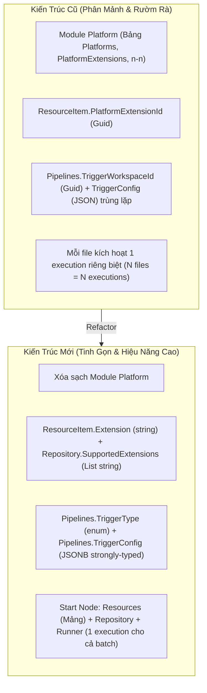

# Kế Hoạch Triển Khai (Implementation Plan)
# Tái Cấu Trúc: Loại Bỏ Module Platform, Gom Gọn Pipeline Trigger & Batch Resources

- **Ngày lập**: 02/10/2026
- **Trạng thái**: Sẵn sàng triển khai (Ready for Execution)
- **Mục tiêu chính**:
  1. **Loại bỏ hoàn toàn Module Platform**: Giải phóng hệ thống khỏi quan hệ n-n rườm rà; chuyển `PlatformExtensionId` thành chuỗi `Extension` trực tiếp trên `ResourceItem`.
  2. **Đơn giản hóa quản lý Extension ở Repository**: Thêm `SupportedExtensions` trực tiếp vào `Repository`, phục vụ scan cục bộ mà không qua trung gian.
  3. **Gom gọn Pipeline Trigger Config (Bỏ cột `TriggerWorkspaceId`)**: Loại bỏ sự trùng lặp và phân mảnh giữa các cột; toàn bộ cấu hình trigger (gồm `RepositoryId`, `Extensions`, v.v.) được đóng gói vào một cột JSONB duy nhất `TriggerConfig` thông qua strongly-typed C# POCO `ResourceTriggerConfig`.
  4. **Thống nhất Batch Trigger & Bổ sung RunnerId**: Output pin của Start Node hỗ trợ mảng `Resources`, `Repository`, và `Runner`. Handler gom nhóm toàn bộ các file mới trong một lần sync để kích hoạt **duy nhất 1 Pipeline Execution**, tối ưu triệt để RAM/CPU cho các subprocess engines (Blender, Unreal).

---

## 1. Quyết Định Thiết Kế (Architectural Decisions)



---

## 2. Thiết Kế Chi Tiết Từng Module

### 2.1. Module `Automation.Repository`

#### Entity & Database
- **[`Repository.cs`](file:///d:/FullStack/Automation/api/src/Modules/Repository/Automation.Repository/Domain/Entities/Repository.cs)**:
  ```csharp
  public class Repository : BaseEntity
  {
      public Guid ProjectId { get; set; }
      public string Name { get; set; } = string.Empty;
      public string? Description { get; set; }

      // Các extension được giám sát (vd: [".blend", ".fbx", ".png"]). 
      // Rỗng hoặc chứa "*" nghĩa là nhận tất cả file.
      public List<string> SupportedExtensions { get; set; } = [];

      public ICollection<ResourceItem> Resources { get; set; } = new List<ResourceItem>();
      public ICollection<RepositoryRunner> RepositoryRunners { get; set; } = new List<RepositoryRunner>();
  }
  ```
- **[`ResourceItem.cs`](file:///d:/FullStack/Automation/api/src/Modules/Repository/Automation.Repository/Domain/Entities/ResourceItem.cs)**:
  - Xóa: `public Guid PlatformExtensionId { get; set; }`
  - Thêm: `public string Extension { get; set; } = string.Empty;` (lưu dạng không dấu chấm, lowercase: `"fbx"`, `"blend"`).

#### Handlers & Logic
- **[`CompareRepositoryResources.cs`](file:///d:/FullStack/Automation/api/src/Modules/Repository/Automation.Repository/Features/RepositoryRunners/CompareRepositoryResources.cs)**:
  - Bỏ inject `IPlatformApi`.
  - Danh sách extension quét thư mục: đọc trực tiếp từ `repository.SupportedExtensions`. Nếu danh sách rỗng, gửi `["*"]` hoặc danh sách mặc định để Runner quét toàn bộ.
- **[`SyncLocalChanges.cs`](file:///d:/FullStack/Automation/api/src/Modules/Repository/Automation.Repository/Features/RepositoryRunners/SyncLocalChanges.cs)**:
  - Bỏ ánh xạ `PlatformExtensionId`. Khi tạo hoặc cập nhật `ResourceItem`, lưu trực tiếp `Extension = Path.GetExtension(relativePath).TrimStart('.').ToLowerInvariant()`.
- **[`ResourceCreatedMessage.cs`](file:///d:/FullStack/Automation/api/src/Modules/Repository/Automation.Repository.Contracts/ResourceCreatedMessage.cs)**:
  ```csharp
  public record ResourceVersionCreatedInfo(
      Guid ResourceVersionId,
      string Extension,
      Guid? ContentId = null,
      string? RelativePath = null
  );

  public record ResourcesCreatedEvent(
      Guid ProjectId,
      Guid RepositoryId,
      Guid RunnerId,
      List<ResourceVersionCreatedInfo> ResourceVersions
  );
  ```

---

### 2.2. Module `Automation.Pipeline`

#### Entity & Database
- **[`Pipeline.cs`](file:///d:/FullStack/Automation/api/src/Modules/Pipeline/Automation.Pipeline/Domain/Entities/Pipeline.cs)**:
  - Xóa: `public Guid? TriggerWorkspaceId { get; set; }`
  - Giữ lại:
    ```csharp
    public PipelineTriggerType TriggerType { get; set; } = PipelineTriggerType.Manual;
    public JsonDocument? TriggerConfig { get; set; }
    ```
- **Tạo EF Migration**:
  - `DropColumn("TriggerWorkspaceId", "Pipelines", schema: "pipeline")`.

#### Strongly-Typed Config Class (Mới)
Tạo file `Automation.Pipeline/Domain/ValueObjects/ResourceTriggerConfig.cs`:
```csharp
namespace Automation.Pipeline.Domain.ValueObjects;

public class ResourceTriggerConfig
{
    public Guid? RepositoryId { get; set; }
    public List<string> Extensions { get; set; } = [];
}
```

#### Start Node Outputs ([`PipelineGraphDtoBuilder.cs`](file:///d:/FullStack/Automation/api/src/Modules/Pipeline/Automation.Pipeline/Features/Pipelines/Services/PipelineGraphDtoBuilder.cs))
Khi `pipeline.TriggerType` là `OnResourceCreated` hoặc `OnResourceVersionUpdated`, cấu hình 3 chân output:
1. **`Resources`**:
   - `Kind = PinKind.Data`
   - `PrimitiveType = PinPrimitiveType.EntityRef`
   - `Cardinality = PinCardinality.Multiple` (Mảng resource entity refs)
   - `Metadata = "Resource"`
2. **`Repository`**:
   - `Kind = PinKind.Data`
   - `PrimitiveType = PinPrimitiveType.EntityRef`
   - `Cardinality = PinCardinality.Single`
   - `Metadata = "Repository"`
3. **`Runner`**:
   - `Kind = PinKind.Data`
   - `PrimitiveType = PinPrimitiveType.EntityRef`
   - `Cardinality = PinCardinality.Single`
   - `Metadata = "Runner"`

#### Xử lý Event Bridge ([`ResourcesCreatedPipelineBridgeHandler.cs`](file:///d:/FullStack/Automation/api/src/Modules/Pipeline/Automation.Pipeline/Features/Pipelines/EventBridge/ResourcesCreatedPipelineBridgeHandler.cs))
```csharp
public async Task Handle(ResourcesCreatedEvent message, CancellationToken ct)
{
    var targetPipelines = await db.Pipelines
        .AsNoTracking()
        .Where(x => x.ProjectId == message.ProjectId &&
                    x.TriggerType == PipelineTriggerType.OnResourceCreated)
        .ToListAsync(ct);

    foreach (var pipeline in targetPipelines)
    {
        var config = pipeline.TriggerConfig?.Deserialize<ResourceTriggerConfig>();

        // 1. Kiểm tra filter RepositoryId nếu có cấu hình
        if (config?.RepositoryId.HasValue == true && config.RepositoryId.Value != message.RepositoryId)
        {
            continue;
        }

        // 2. Lọc các ResourceVersions khớp với Extensions (nếu có cấu hình)
        var allowedExts = config?.Extensions?
            .Select(e => e.TrimStart('.').ToLowerInvariant())
            .ToHashSet(StringComparer.OrdinalIgnoreCase);

        var matchedVersions = (allowedExts != null && allowedExts.Count > 0)
            ? message.ResourceVersions.Where(rv => allowedExts.Contains(rv.Extension)).ToList()
            : message.ResourceVersions;

        if (matchedVersions.Count == 0) continue;

        // 3. Chuẩn bị runtime inputs (Gom toàn bộ mảng resources)
        var runtimeInputs = new Dictionary<string, object?>
        {
            ["Resources"] = matchedVersions.Select(v => $"resource:{v.ResourceVersionId}").ToList(),
            ["Repository"] = $"repository:{message.RepositoryId}",
            ["Runner"] = $"runner:{message.RunnerId}"
        };

        // 4. Kích hoạt DUY NHẤT 1 Pipeline Execution cho cả lô file
        await bus.InvokeAsync<Result<PipelineExecutionDto>>(
            new RunPipelineCommand(pipeline.Id, runtimeInputs),
            ct
        );
    }
}
```

---

### 2.3. Frontend Web & Canvas

1. **Xóa bỏ Module Platform**:
   - Xóa `web/src/features/platforms/`.
   - Xóa `web/src/routes/_protected/_layout/platforms/`.
   - Gỡ menu "Platforms" khỏi navigation bar.
2. **Cập nhật Canvas Start Node Inspector ([`PipelineStartNodeInspector.tsx`](file:///d:/FullStack/Automation/web/src/features/pipelines/components/canvas/PipelineStartNodeInspector.tsx))**:
   - Bỏ prop `triggerWorkspaceId`.
   - Inspector chỉ làm việc với:
     ```ts
     interface ResourceTriggerConfig {
       repositoryId?: string | null;
       extensions?: string[];
     }
     ```
   - Thay đổi nhãn hiển thị:
     - `"Workspace: On Resource Created"` ➔ `"Repository: On Resource Created"`.
     - `"Monitored Workspace"` ➔ `"Monitored Repository"`.
   - Khi thay đổi repository hoặc extension, gọi API cập nhật `triggerConfig` trực tiếp:
     ```ts
     await updateTriggerMutation.mutateAsync({
       triggerType: currentType,
       triggerConfig: { repositoryId: selectedRepoId, extensions: parsedExtensions }
     });
     ```
3. **Cập nhật Form/Dialog Repository**:
   - Thêm trường nhập `SupportedExtensions` (ví dụ: `.blend, .fbx, .png`) để người dùng quy định loại file của từng repository.

---

## 3. Lộ Trình Triển Khai (Step-by-Step Execution Plan)

### Giai Đoạn 1: Xóa Module Platform & Nâng Cấp Module Repository (Backend)
- [x] **Bước 1.1**: Sửa entity `Repository.cs` (thêm `SupportedExtensions`) và `ResourceItem.cs` (thay `PlatformExtensionId` bằng `Extension`).
- [x] **Bước 1.2**: Sửa `CompareRepositoryResources.cs` và `SyncLocalChanges.cs` trong `Automation.Repository` để đọc/ghi trực tiếp theo `SupportedExtensions` và `Extension`.
- [x] **Bước 1.3**: Sửa `ResourceCreatedMessage.cs` trong `Automation.Repository.Contracts`.
- [x] **Bước 1.4**: Tạo và áp dụng Migration cho `Automation.Repository` (`RemovePlatformExtensionAndAddSupportedExtensions`).
- [x] **Bước 1.5**: Gỡ tham chiếu `Automation.Platform` khỏi `Automation.Repository.csproj` và `Automation.Api.csproj`.
- [x] **Bước 1.6**: Xóa thư mục `api/src/Modules/Platform`.
- [x] **Bước 1.7**: Xóa `PlatformModule` trong `ModuleRegistry.cs` và `Program.cs`.

### Giai Đoạn 2: Tái Cấu Trúc Pipeline Trigger & Batch Execution (Backend)
- [x] **Bước 2.1**: Xóa `TriggerWorkspaceId` khỏi entity `Pipeline.cs`, các DTOs (`PipelineGraphDto`, `CreatePipeline`, `UpdatePipelineTrigger`).
- [x] **Bước 2.2**: Tạo file `ResourceTriggerConfig.cs` trong `Automation.Pipeline/Domain/ValueObjects/`.
- [x] **Bước 2.3**: Tạo và áp dụng Migration cho `Automation.Pipeline` (`DropTriggerWorkspaceIdColumn`).
- [x] **Bước 2.4**: Cập nhật `PipelineGraphDtoBuilder.cs`: xuất pin `Resources` (Array), `Repository` (Single), `Runner` (Single).
- [x] **Bước 2.5**: Cập nhật `ResourcesCreatedPipelineBridgeHandler.cs`: gom mảng `Resources`, inject `Runner` và `Repository`, kích hoạt 1 execution duy nhất.
- [x] **Bước 2.6**: Build backend và chạy test xác nhận: `dotnet build api/Automation.sln` & `dotnet test`.

### Giai Đoạn 3: Dọn Dẹp Frontend & Nâng Cấp Canvas Inspector (Frontend)
- [x] **Bước 3.1**: Xóa các file routes và components của `platforms` trong `web/src/`.
- [x] **Bước 3.2**: Dọn dẹp các endpoint platforms cũ, đồng bộ API types.
- [x] **Bước 3.3**: Cập nhật `PipelineStartNodeInspector.tsx` và `NodeConfigInspector.tsx` sang mô hình `triggerConfig` thống nhất, dùng TagsInput.
- [x] **Bước 3.4**: Bổ sung trường `SupportedExtensions` vào Form Create/Edit Repository và hiển thị Badge trực quan.
- [x] **Bước 3.5**: Chạy `pnpm tsc -b` và `pnpm build` để xác nhận không còn lỗi type và build thành công 100%.
