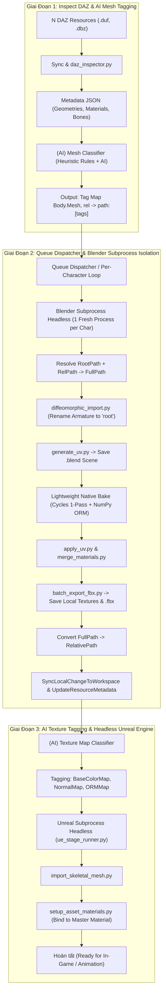

# Kế Hoạch Triển Khai (Implementation Plan)
# Nâng Cấp Pipeline: DAZ -> Blender -> Unreal Engine (Queue Isolation, AI Tagging, Lightweight Native Bake)

- **Ngày lập**: 03/10/2026
- **Trạng thái**: Dự kiến triển khai (Planned - Tiếp nối sau khi ổn định Daz Inspector)
- **Mục tiêu chính**:
  1. **AI Mesh Classification & Tagging**: Đọc metadata JSON kết hợp đường dẫn tương đối (`rel`), sử dụng AI và rules để phân loại mesh (`Body.Mesh`, `Clothing.Mesh`, `Hair.Mesh`, v.v.) và sinh ra map `rel -> (path -> [tags])`.
  2. **Cơ chế Hàng Đợi Cô Lập (Per-Character Queue & Subprocess Isolation)**: Thay vì import $N$ nhân vật vào cùng một phiên Blender (gây rò rỉ RAM, VRAM Cycles OptiX, treo Diffeo), phân rã mảng Resource thành hàng đợi tuần tự: mỗi nhân vật chạy trong 1 tiến trình Blender Subprocess độc lập, sạch 100% tài nguyên.
  3. **Chuẩn hóa đường dẫn tương đối $\leftrightarrow$ tuyệt đối**: Dùng Repository Root Path kết hợp Resource Relative Path để sinh FullPath cho Diffeomorphic (đổi tên armature thành `root`), và script ngược lại chuyển FullPath về RelativePath khi sync change.
  4. **Lightweight Native Bake Engine (Thay thế SimpleBake)**: Bóc tách mã nguồn SimpleBake có sẵn thành một script bake Python thuần tinh gọn (~180 dòng). Chạy trực tiếp qua Cycles GPU OptiX/CUDA (1 sample, bounces=0), dùng NumPy để pack channel ORM (Occlusion-Roughness-Metallic), loại bỏ hoàn toàn phụ thuộc add-on bên ngoài khi chạy trên môi trường thử nghiệm / worker production.
  5. **Post-Bake Processing & Scene Cleanup**: Áp UV đã bake, lưu texture local, gộp các sub-materials phân mảnh của DAZ thành 1 PBR Material duy nhất, unified inspect, lưu `.blend` và xuất `.fbx`.
  6. **AI Material & Texture Parameter Tag Mapping**: AI phân tích danh sách texture đã bake, ánh xạ đúng tên tham số trong Shader của Unreal Engine (`BaseColorMap`, `NormalMap`, `ORMMap`...).
  7. **Tự động hóa Unreal Engine Headless**: Import Skeletal Mesh (chuẩn root bone), tạo Material Instance từ Master Material và tự động bind toàn bộ tham số texture theo map metadata.

---

## 1. Sơ Đồ Kiến Trúc Luồng Tổng Thể (End-to-End Architecture)



---

## 2. Đặc Tả Chi Tiết Từng Giai Đoạn

### 2.1. Giai đoạn 1: DAZ Inspection & AI Mesh Tagging
- **Input:** $N$ file resource DAZ (`.duf`, `.dbz`) nằm trong Repository.
- **Inspect:** [daz_inspector.py](file:///d:/FullStack/Automation/workers/worker/scripts/inspectors/daz/daz_inspector.py) bóc tách cây phả hệ (node hierarchy), tên geometry, danh sách material group và slot.
- **AI Mesh Classification:**
  - AI đọc mapping `rel - meta`.
  - Quy tắc phân loại:
    - Node geometry chứa các material slot đặc trưng của da (`Torso`, `Head`, `Arms`, `Legs`, `Face`, `Lips`, `Fingernails`, `Toenails`...) $\rightarrow$ Tag `Body.Mesh` (hoặc `Character.Body`).
    - Các geometry gắn ngoài (`Clothing.*`, `Hair.*`, `Eyelashes.*`) $\rightarrow$ Tag tương ứng `Clothing.Mesh`, `Hair.Mesh`.
  - Kết quả lưu vào hệ thống thông qua [AssignTagTool.cs](file:///d:/FullStack/Automation/api/src/Modules/Pipeline/Automation.Pipeline/Tools/Tags/AssignTagTool.cs) hoặc [BuildTagMapFromResourceTool.cs](file:///d:/FullStack/Automation/api/src/Modules/Pipeline/Automation.Pipeline/Tools/Tags/BuildTagMapFromResourceTool.cs).

---

### 2.2. Giai đoạn 2: Hàng Đợi Tuần Tự (Queue Isolation) trong Blender
- **Vấn đề cốt lõi:**
  - Diffeomorphic sinh ra hàng trăm drivers, armature modifiers, morph shapekeys trong Blender memory.
  - Khi xử lý liên tiếp nhiều nhân vật trong cùng 1 process Blender: `orphans_purge()` không thể thu hồi hoàn toàn con trỏ C/C++ nội bộ, gây tràn VRAM OptiX khi bake và xung đột namespace giữa các nhân vật.
  - Nếu nhân vật thứ $k$ gặp lỗi mesh/texture làm crash process, toàn bộ batch sẽ chết theo.
- **Giải pháp thiết kế:**
  - Pipeline Engine nhận danh sách các nhân vật đã được tag.
  - Phân rã mảng nhân vật thành một **Hàng đợi xử lý tuần tự (Sequential Work Queue)**.
  - Mỗi nhân vật tương ứng với một `StageTask` độc lập được gửi qua RabbitMQ tới `BlenderExecutor`:
    ```bash
    blender.exe --background --python stage_runner.py
    ```
  - Khi xử lý xong 1 nhân vật: Tiến trình Blender tự thoát, trả lại 100% RAM và VRAM GPU về trạng thái sạch cho nhân vật tiếp theo.

---

### 2.3. Giai đoạn 3: Lightweight Native Bake Engine (Thay Thế SimpleBake)

#### So sánh Kiến Trúc & Lý do thay thế SimpleBake:
| Tiêu chí | SimpleBake Add-on | Lightweight Native Bake (Đề xuất) |
| :--- | :--- | :--- |
| **Phụ thuộc môi trường** | Phải cài đặt add-on vào Blender, ràng buộc bản quyền và version (Blender 4.x / 5.x) | 100% Python script thuần, không cần bất kỳ add-on nào |
| **Độ ổn định Headless** | Dễ bị treo/lỗi do phụ thuộc Macro Operators và cơ chế UI Modal | Chạy CLI ngầm tuyệt đối ổn định trong `stage_runner.py` |
| **Tốc độ Bake** | Phụ thuộc vào settings preset phức tạp | Tối ưu OptiX/CUDA (1 sample, bounces=0, margin 16px) |
| **Channel Packing** | Qua UI channel packing của addon | Sử dụng NumPy array packing trực tiếp trong bộ nhớ RAM |

#### Bóc tách logic từ SimpleBake vào Native Bake:
Tham khảo từ mã nguồn SimpleBake tại `c:\Users\congt\AppData\Roaming\Blender Foundation\Blender\5.2\scripts\addons\SimpleBake`:
1. **Target UV Setup:** Đặt bake UV làm `active`, giữ source UV làm `active_render` để Cycles sample đúng texture gốc (dựa trên hàm `set_target_uv` trong [simple_bake.py](file:///d:/FullStack/Automation/workers/worker/scripts/pipeline/blender/simple_bake.py)).
2. **Inject Image Target Nodes:** Duyệt các material slots của `Body.Mesh`, tạm thời gắn `ShaderNodeTexImage` trỏ vào file bake mục tiêu.
3. **1-Pass Cycles GPU Execution:**
   - BaseColor: `bake(type='DIFFUSE')` (`use_pass_color=True`, tắt direct/indirect).
   - Normal: `bake(type='NORMAL')` (không gian `Non-Color`).
   - Roughness: `bake(type='ROUGHNESS')`.
4. **NumPy ORM Packing:**
   - Ghép kênh RGBA: `R = AO (1.0)`, `G = Roughness (Bake)`, `B = Metallic (0.0)`.
   - Lưu trực tiếp ra file `*_ORM.png` hoặc `*_Roughness.png`.

---

### 2.4. Giai đoạn 4: Post-Bake, Cleanup & Đồng Bộ Hóa Thay Đổi
1. **Apply UV & Material Unification:**
   - [apply_uv.py](file:///d:/FullStack/Automation/workers/worker/scripts/pipeline/blender/apply_uv.py): Xóa bỏ các UV layout cũ, đổi tên UV đã bake thành `UVMap` chuẩn.
   - [merge_materials.py](file:///d:/FullStack/Automation/workers/worker/scripts/pipeline/blender/merge_materials.py): Gộp toàn bộ slot vật liệu DAZ thành 1 PBR Material duy nhất trỏ vào các texture vừa bake (`BaseColor`, `Normal`, `ORM`).
2. **Export & Path Normalization:**
   - [batch_export_fbx.py](file:///d:/FullStack/Automation/workers/worker/scripts/pipeline/blender/batch_export_fbx.py): Export Skeletal Mesh FBX với Armature `root`.
   - Script chuyển đổi đường dẫn:
     $$\text{RelativePath} = \text{MakeRelative}(\text{FullPath}, \text{RepoRootPath})$$
3. **Đồng bộ hóa Hệ thống:**
   - Gọi [SyncLocalChangeToWorkspaceTool.cs](file:///d:/FullStack/Automation/api/src/Modules/Pipeline/Automation.Pipeline/Tools/Workspaces/SyncLocalChangeToWorkspaceTool.cs) để nạp các file mới (`.fbx`, `.blend`, textures) vào database.
   - Gọi [UpdateResourceMetadataTool.cs](file:///d:/FullStack/Automation/api/src/Modules/Pipeline/Automation.Pipeline/Tools/Workspaces/UpdateResourceMetadataTool.cs) cập nhật kích thước, checksum và quan hệ phụ thuộc.
   - Gọi [AssignResourcesToContentTool.cs](file:///d:/FullStack/Automation/api/src/Modules/Pipeline/Automation.Pipeline/Tools/Workspaces/AssignResourcesToContentTool.cs) để liên kết asset vào Content Item.

---

### 2.5. Giai đoạn 5: AI Texture Tagging & Headless Unreal Engine Setup
1. **(AI) Texture Map Classification:**
   - Quét các file texture sinh ra từ bước bake:
     - `*_BaseColor.png` $\rightarrow$ gán tag `Texture.BaseColor`, ánh xạ tham số shader `BaseColorMap` / `DiffuseTexture`.
     - `*_Normal.png` $\rightarrow$ gán tag `Texture.Normal`, ánh xạ tham số shader `NormalMap`.
     - `*_ORM.png` $\rightarrow$ gán tag `Texture.ORM`, ánh xạ tham số shader `ORMMap`.
2. **Unreal Headless Execution:**
   - Thực thi thông qua `UnrealEditor-Cmd.exe` và [ue_stage_runner.py](file:///d:/FullStack/Automation/workers/worker/scripts/ue_stage_runner.py).
   - [import_skeletal_mesh.py](file:///d:/FullStack/Automation/workers/worker/scripts/pipeline/unreal/import_skeletal_mesh.py): Nạp FBX, tạo hoặc gán Skeleton tương thích (root bone), thiết lập LODs và physics asset.
   - [setup_asset_materials.py](file:///d:/FullStack/Automation/workers/worker/scripts/pipeline/unreal/setup_asset_materials.py): Tạo **Material Instance Constant (MIC)** kế thừa từ Master Material của dự án (ví dụ `M_CharacterMaster`), tự động bind các texture parameter theo đúng tag mapping từ AI.

---

## 3. Danh Mục Các Công Cụ & Script Cần Bổ Sung / Chuẩn Hóa

### 3.1. Backend Pipeline Tools (`api/`)
| Tên Tool | Thư mục | Nhiệm vụ |
| :--- | :--- | :--- |
| `FormatPathTool` / `ResolvePathTool` | `Tools/Workspaces/` | Chuyển đổi hai chiều giữa RelativePath và FullPath dựa trên Workspace Root. |
| `DispatchQueueTool` / `SplitBatchTool` | `Tools/Collections/` | Hỗ trợ phân rã danh sách $N$ nhân vật thành các task đơn lẻ chạy tuần tự. |
| `UpdateResourceMetadataTool` | `Tools/Workspaces/` | Cập nhật metadata JSON và các tag texture parameters vào Database. *(Đã có, cần hoàn thiện binding)* |

### 3.2. Worker Scripts (`workers/`)
| Script | Thư mục | Nhiệm vụ |
| :--- | :--- | :--- |
| `native_bake.py` $\rightarrow$ `native_pbr_bake.py` | `scripts/pipeline/blender/` | Hoàn thiện engine bake native không phụ thuộc SimpleBake, hỗ trợ OptiX, 1 sample, NumPy ORM packing. |
| `diffeomorphic_import.py` | `scripts/pipeline/blender/` | Đảm bảo cờ `armature_name="root"` và Silent Mode chạy trơn tru với đường dẫn FullPath đã format. *(Đã có)* |
| `resolve_material_manifest.py` | `scripts/pipeline/unreal/` | Chuẩn bị manifest file texture và mapping parameter trước khi import Unreal. *(Đã có)* |
| `setup_asset_materials.py` | `scripts/pipeline/unreal/` | Tạo Material Instance và bind texture parameters theo metadata. *(Đã có)* |

---

## 4. Lộ Trình Triển Khai (Milestones)

- [ ] **Milestone 1: Hoàn tất & Ổn Định Giai Đoạn Inspect DAZ**
  - Chạy thử nghiệm thực tế `daz_inspector.py` trên các tập file DAZ mẫu.
  - Kiểm tra độ chính xác của metadata JSON được sinh ra.
- [ ] **Milestone 2: Hiện Thực Hóa Lightweight Native Bake**
  - Viết module `native_pbr_bake.py` dựa trên logic bóc tách từ SimpleBake.
  - Test bake 1 nhân vật trong Blender Headless: kiểm tra BaseColor, Normal, ORM và thời gian chạy.
- [ ] **Milestone 3: Triển Khai Cơ Chế Hàng Đợi (Queue Isolation)**
  - Cấu hình Pipeline Engine để dispatch từng nhân vật vào một Blender Subprocess riêng.
  - Kiểm tra giải phóng RAM/VRAM giữa các lượt chạy.
- [ ] **Milestone 4: AI Tagging & FullPath/RelativePath Normalization**
  - Chuẩn hóa prompt/rule cho AI để gán `Body.Mesh` và map `Texture Parameters`.
  - Kiểm tra việc đồng bộ file mới về Repository thông qua `SyncLocalChangeToWorkspaceTool`.
- [ ] **Milestone 5: Tích Hợp Unreal Engine & E2E Validation**
  - Chạy full pipeline từ file DAZ gốc $\rightarrow$ Blender Bake/Export $\rightarrow$ Import & Setup Material trong Unreal Engine hoàn toàn tự động.
