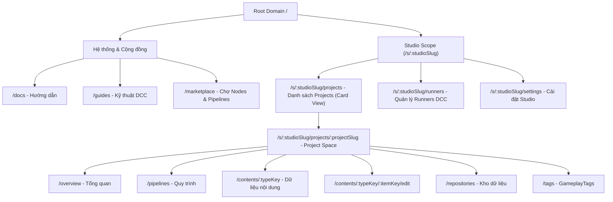

# Kế Hoạch Kỹ Thuật: Chuẩn Hóa Studio & Project Slug-Based Routing và Giao Diện Project Card Grid Layout

**Ngày lập**: 2026-10-09  
**Người đề xuất**: pair programming Agent & User  
**Trạng thái**: Đã Hoàn Thành (Completed - 2026-10-09)  
**Phạm vi**: Backend (`api/src/Modules/Studio`) & Frontend (`web/src/features/projects`, `web/src/routes`)


---

## 1. Mục Tiêu & Đặt Vấn Đề

### 1.1. Vấn đề hiện tại
1. **URL lộ GUID thô**: Đường dẫn hiện tại là `/projects/01a11b02-00c4-7685-9411-adf8335ae675/...` thiếu ngữ cảnh thương hiệu (Studio name) và tính đọc hiểu (human-readable).
2. **Nguy cơ Namespace Collision**: Nếu đặt `/:studioSlug/:projectSlug` ngay tại root domain (`/`), hệ thống sẽ xung đột với các trang mở rộng trong tương lai như `/docs`, `/guides`, `/marketplace`, `/pricing`, `/settings`.
3. **Giao diện Project dạng Bảng (Table)**: Trang quản lý Project hiện dùng Table truyền thống, trong khi trải nghiệm dự án sáng tạo (Digital Content Creation / Game Dev) phù hợp hơn với **Giao diện Card (Card Grid Layout)** dạng thumbnail/card trực quan như Figma, Vercel, Unity Dashboard.
4. **Khả năng tương thích phân trang**: Cần đảm bảo khi chuyển sang Card Grid Layout, hệ thống vẫn duy trì 100% khả năng **phân trang (Pagination)**, tìm kiếm (Search), và lọc (Filter) dựa trên API `PagedResult<ProjectDto>` hiện có của Backend.

---

## 2. Thiết Kế Kiến Trúc URL Routing Chuẩn SaaS

Áp dụng mô hình **Phân Tách Rõ Ràng Cấp Studio & Project**:

Trong một Studio, các tài nguyên cấp Studio gồm có: `projects`, `runners`, `members`, `settings`.  
Vì vậy, việc giữ rõ ràng segment `/projects/:projectSlug` giúp tránh hoàn toàn việc một dự án có slug trùng với tính năng của Studio (như `runners`, `settings`).



Cấu trúc URL cụ thể:
- **Studio Level**:
  - `/s/:studioSlug/projects` $\rightarrow$ Danh sách Projects thuộc Studio (Bố cục Card Grid)
  - `/s/:studioSlug/runners` $\rightarrow$ Quản lý cụm Runners, máy trạm DCC
  - `/s/:studioSlug/settings` $\rightarrow$ Cài đặt studio
- **Project Level**:
  - `/s/:studioSlug/projects/:projectSlug` $\rightarrow$ Dashboard / Không gian làm việc của Project
  - `/s/:studioSlug/projects/:projectSlug/pipelines`
  - `/s/:studioSlug/projects/:projectSlug/repositories`
  - `/s/:studioSlug/projects/:projectSlug/contents/:typeKey`
  - `/s/:studioSlug/projects/:projectSlug/contents/:typeKey/:itemKey/edit`
  - `/s/:studioSlug/projects/:projectSlug/tags`

---

## 3. Kiến Trúc Backend (`api/src/Modules/Studio`)

### 3.1. Entity & Database Migration
- **Thực thể `Project.cs`**:
  - Bổ sung trường:
    ```csharp
    public string Slug { get; set; } = string.Empty;
    ```
  - Bổ sung method `Update(string name, string slug)` và cập nhật constructor.
- **Ràng buộc cơ sở dữ liệu (`ProjectConfiguration.cs`)**:
  - `Slug`: MaxLength(150), `IsRequired()`.
  - Composite Unique Index: `(StudioId, Slug)` — Mỗi project slug là duy nhất trong phạm vi một Studio.
- **Migration & Data Backfill**:
  - Tạo migration `AddSlugToProject`.
  - Script SQL backfill tự động chuẩn hóa `Name` sang `Slug` (regex lowercase, bỏ ký tự đặc biệt, gạch nối) cho các project đã có trong database.

### 3.2. Dual-Resolution & API Endpoints
1. **`CreateProject`**:
   - Nhận `Slug?` (tùy chọn). Nếu không nhập, tự động sinh slug từ `Name.ToSlug()`.
   - Kiểm tra trùng lặp `(StudioId, Slug)`.
2. **`GetProjectById` $\rightarrow$ Nâng cấp Dual-Resolution**:
   - Route hỗ trợ:
     - `/api/studios/{studioSlugOrId}/projects/{keyOrId}`
     - hoặc giữ backward-compatible `/api/projects/{keyOrId}`.
   - Nếu `keyOrId` là GUID: truy vấn theo `Id`.
   - Nếu là string: truy vấn theo `StudioId` (hoặc `Studio.Slug`) và `Project.Slug`.
3. **`GetProjects` (API Phân Trang)**:
   - Hiện tại đã nhận `GetProjectsQuery : PagedQuery` (`Page`, `PageSize`, `Filter`, `OrderBy`, `StudioId`).
   - Bổ sung hỗ trợ lọc theo `StudioSlug` (resolve sang `StudioId` tự động nếu client truyền slug).

---

## 4. Thiết Kế Giao Diện Frontend: Project Card Grid Layout

### 4.1. Trả Lời Về Khả Năng Phân Trang với Card Layout
> **Câu hỏi của bạn**: *"Project chắc cần tổ chức bố cục lại card giống 1 số chỗ khác thay vì table, mà cũng ko biết api phân trang có phù hợp ko?"*

✅ **Hoàn toàn phù hợp 100%!**
- API Backend `GetProjects` đã trả về cấu trúc phân trang chuẩn:
  ```json
  {
    "items": [...],
    "page": 1,
    "pageSize": 12,
    "totalCount": 48,
    "totalPages": 4
  }
  ```
- Trên Frontend, chúng ta sử dụng `BaseCardGrid` (hoặc component `ProjectCardGrid`) kết hợp trực tiếp với TanStack Table / `useResourceQuery`:
  - **Grid Card**: Hiển thị 6 / 12 / 18 projects mỗi trang (mặc định responsive 1 cột mobile $\rightarrow$ 2 cột tablet $\rightarrow$ 3 hoặc 4 cột desktop).
  - **Phân trang (Pagination Controls)**: Nằm gọn gàng ở cuối trang với thanh chuyển trang chuẩn (Previous, Page Numbers, Next, Page Size selector).
  - **Toolbar**: Tích hợp Search box, Filter, nút chuyển chế độ xem (Switch View: Grid Cards $\leftrightarrow$ Table) để người dùng có toàn quyền lựa chọn.

### 4.2. Thiết Kế Component `ProjectCard`
Mỗi Card Dự Án sẽ mang phong cách Dark Minimalist hiện đại:
- **Card Header**:
  - Tên dự án (`Name`) & Biểu tượng Folder / Project.
  - Badge slug (`font-mono text-xs text-muted-foreground`): `slug-name`.
  - Dropdown hành động (3 chấm): Edit, Delete, Copy URL.
- **Card Body**:
  - Ngày tạo / Cập nhật gần nhất (`Updated 2 hours ago`).
  - Số lượng thành viên (Members avatar stack) hoặc số lượng Pipelines / Repositories.
- **Card Hover Effect**:
  - Hover viền sáng `hover:border-primary/50`, hiệu ứng nhấc nhẹ `hover:-translate-y-0.5 transition-all`.
  - Click vào card $\rightarrow$ Chuyển hướng ngay vào không gian làm việc của project: `/s/${studioSlug}/${projectSlug}`.

---

## 5. Lộ Trình Triển Khai Chi Tiết (Roadmap)

### Phase 1: Database & Backend Core
1. Cập nhật Entity `Project.cs` và cấu hình EF Core `ProjectConfiguration.cs`.
2. Tạo migration `AddSlugToProject` và cập nhật database qua `.\cli update-db Studio`.
3. Nâng cấp API `CreateProject`, `UpdateProject`, `GetProjectById`, `GetProjects` hỗ trợ Slug & Dual-Resolution.
4. Chạy `.\build-dotnet.ps1` kiểm tra tính toàn vẹn 100%.

### Phase 2: Frontend UI - Chuyển Đổi Project Card Grid Layout
1. Tạo component `ProjectCard.tsx` và `ProjectCardGrid.tsx`.
2. Cập nhật `ProjectPage.tsx` tích hợp bộ chuyển đổi Grid/Table mode (Grid làm mặc định).
3. Đảm bảo phân trang (Pagination), tìm kiếm từ khóa hoạt động mượt mà.

### Phase 3: Tái Cấu Trúc TanStack Router sang `/s/:studioSlug/:projectSlug`
1. Cấu hình context loader để nạp thông tin Studio & Project từ slug.
2. Di chuyển/tái cấu trúc thư mục route từ `_project/projects/$projectId` sang `s/$studioSlug/$projectSlug`.
3. Đảm bảo toàn bộ các liên kết nội bộ, breadcrumbs và sidebar navigation tự động cập nhật theo slug mới.
4. Chạy `pnpm build` (`tsc -b && vite build`) xác nhận 0 lỗi.

---

## 6. Tiêu Chí Nghiệm Thu (Acceptance Criteria)

- [ ] Project có `slug` duy nhất trong cùng Studio; tạo mới tự động sinh slug hợp lệ.
- [ ] Giao diện Projects hiển thị dạng Card Grid đẹp mắt, responsive, hỗ trợ phân trang mượt mà.
- [ ] URL chuyển sang dạng `/s/:studioSlug/:projectSlug/...` không còn lộ GUID thô.
- [ ] Không xung đột với các route hệ thống `/docs`, `/guides`, `/marketplace`.
- [ ] Build Backend (`.NET`) và Frontend (`tsc -b && vite build`) đều đạt 0 warning / 0 error.
