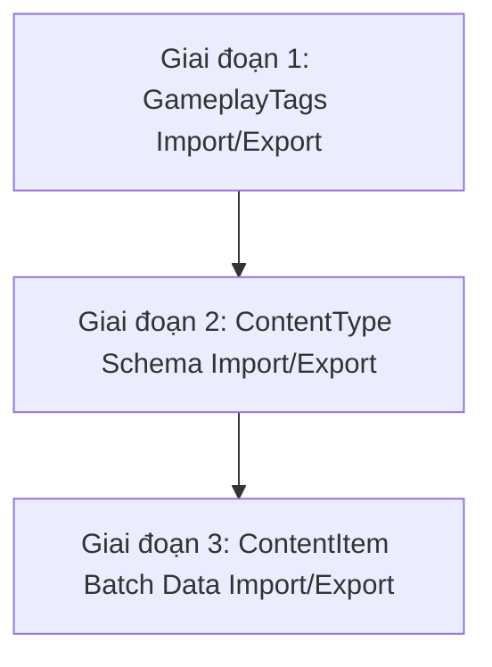

# Kế Hoạch Kỹ Thuật: Import & Export GameplayTags, Content Types và Content Items (MVP Safe-Mode)

**Ngày lập**: 2026-10-09  
**Người đề xuất**: pair programming Agent & User  
**Mục tiêu**: Xây dựng giải pháp Import / Export toàn diện cho 3 thành phần cốt lõi của hệ thống dữ liệu: **GameplayTags**, **Content Types (Khuôn mẫu Schema)**, và **Content Items (Dữ liệu bản ghi)** theo triết lý MVP an toàn hạ tầng (tạm ẩn file nhị phân đính kèm để chống lạm dụng dung lượng).

---

## 1. Bối Cảnh & Định Hướng Chiến Lược (Strategic Context)

### 1.1. Khác biệt với Pipeline Engine
* **Pipeline Engine** là đồ thị mạng trực quan (Visual Graph / DAG) với nhiều tầng phụ thuộc: dây nối (Edges), stage lồng nhau (Container coordinates), đệ quy SubPipeline, và file Python trong Object Storage (CAS SHA-256).
* Ngược lại, **GameplayTags** và **Content** là cấu trúc dữ liệu phẳng hoặc cây phân cấp thuần túy (Tree / Records). Luồng Import/Export sẽ **thẳng thớm, nhẹ nhàng và ổn định hơn rất nhiều**.

### 1.2. Chiến lược MVP Safe-Mode (Quản trị rủi ro lưu trữ)
* **Tạm hoãn File Binary trong Content Item**: Trong giai đoạn MVP / Trial tự host, hệ thống chưa có module quản lý Quota dung lượng theo User/Project (vd: giới hạn 500MB/trial, chặn file > 50MB). Nếu cho phép đính kèm file trong Content Item, người dùng trial có thể vô tình hoặc cố ý tải lên texture/mesh 4K gây tràn đĩa cứng server.
* **Tập trung vào Pure Metadata**: Toàn bộ dữ liệu của Content Item trong đợt này là **JSON Metadata** (Text, Number, Date, Select, Boolean, Tags đính kèm).
  * Dung lượng cực kỳ nhẹ (hàng nghìn item chỉ tốn vài trăm KB).
  * Tốc độ Import/Export tức thì (vài giây cho toàn bộ project).
  * Không lo lỗi mạng, lỗi presigned URL hay phình to đĩa cứng.

---

## 2. Thiết Kế Hợp Đồng Dữ Liệu (Bundle Data Contracts)

### 2.1. Định dạng GameplayTags (`.tags.json` / `.tags.csv`)

#### Dạng JSON (`.tags.json`):
```json
{
  "formatVersion": "1.0",
  "exportedAt": "2026-10-09T06:00:00Z",
  "totalTags": 3,
  "tags": [
    {
      "path": "Character",
      "name": "Character",
      "color": "#3b82f6",
      "description": "Nhóm thẻ nhân vật"
    },
    {
      "path": "Character.Hero",
      "name": "Hero",
      "color": "#10b981",
      "description": "Nhân vật chính"
    },
    {
      "path": "Character.Hero.Female",
      "name": "Female",
      "color": "#ec4899",
      "description": "Giới tính nữ"
    }
  ]
}
```

#### Dạng CSV (`.tags.csv` - Hỗ trợ cả chuẩn Unreal Engine GameplayTags):
```csv
Path,Name,Color,Description
Character,Character,#3b82f6,Nhóm thẻ nhân vật
Character.Hero,Hero,#10b981,Nhân vật chính
Character.Hero.Female,Female,#ec4899,Giới tính nữ
```

---

### 2.2. Định dạng Content Types & Content Items (`.content.json`)

```json
{
  "formatVersion": "1.0",
  "exportedAt": "2026-10-09T06:00:00Z",
  "contentTypes": [
    {
      "key": "character",
      "name": "Character",
      "displayName": "Nhân vật",
      "description": "Quản lý nhân vật trong game",
      "icon": "User",
      "color": "#8b5cf6",
      "sortOrder": 1,
      "displayConfig": {
        "titleField": "name",
        "badgeField": "class"
      },
      "formSchema": {
        "fields": [
          { "key": "name", "label": "Character Name", "type": "text", "required": true },
          { "key": "class", "label": "Class", "type": "select", "options": ["Warrior", "Mage", "Rogue"] },
          { "key": "hp", "label": "Hit Points", "type": "number", "defaultValue": 100 }
        ]
      }
    }
  ],
  "contentItems": [
    {
      "contentTypeKey": "character",
      "name": "Aria the Blade",
      "values": {
        "name": "Aria the Blade",
        "class": "Rogue",
        "hp": 95
      },
      "tags": [
        "Character.Hero.Female",
        "Combat.Melee"
      ]
    }
  ]
}
```

---

## 3. Lộ Trình Triển Khai Chi Tiết (3 Giai Đoạn)



### Giai đoạn 1: GameplayTags Import / Export (Ưu tiên số 1 - ĐÃ HOÀN THÀNH ✅)
* **Backend (`api/src/Modules/Tag`)**:
  1. `ExportTagsEndpoint` & `ExportTagsQuery` ([ExportTags.cs](file:///d:/FullStack/Automation/api/src/Modules/Tag/Automation.Tag/Features/Tags/ExportTags.cs)): Xuất cây tag của `ProjectId` thành DTO `TagExportPackageDto`.
  2. `ImportTagsEndpoint` & `ImportTagsCommand` ([ImportTags.cs](file:///d:/FullStack/Automation/api/src/Modules/Tag/Automation.Tag/Features/Tags/ImportTags.cs)):
     * Hỗ trợ parse cả payload JSON và nội dung file CSV (tương thích Unreal Engine).
     * Phân tầng depth-by-depth, tự động bù nút cha còn thiếu, liên kết `ParentId` chính xác.
     * Hỗ trợ `ConflictStrategy` (Skip hoặc Update màu sắc/mô tả).
* **Frontend (`web/src/features/tags`)**:
  1. Hook [useTagsExportImport.ts](file:///d:/FullStack/Automation/web/src/features/tags/hooks/useTagsExportImport.ts): Tải file `.tags.json` / `.tags.csv` và gọi mutation import.
  2. Dialog [ImportTagsDialog.tsx](file:///d:/FullStack/Automation/web/src/features/tags/dialogs/ImportTagsDialog.tsx): Kéo thả file, xem trước số lượng và preview 5 tag đầu tiên, chọn chiến lược Skip/Update.
  3. Cập nhật [TagPanel.tsx](file:///d:/FullStack/Automation/web/src/features/tags/components/TagPanel.tsx): Tích hợp nút Import và menu Export (JSON / CSV).

---

### Giai đoạn 2: Content Types Schema Import / Export (Ưu tiên số 2)
* **Backend (`api/src/Modules/Content`)**:
  1. `ExportContentTypesEndpoint`: Xuất danh sách Content Type (kèm `DisplayConfig` và `FormSchema` lấy từ `ISchemaApi`).
  2. `ImportContentTypesEndpoint`: 
     * Nhận danh sách Content Types.
     * Tạo hoặc cập nhật `ContentType` entity.
     * Đồng bộ `FormSchema` vào module `DynamicForms` qua `ISchemaApi.SaveSchemaAsync`.
     * Xử lý trùng `Key`: Nếu trùng `Key` trong cùng Project, cho phép bỏ qua hoặc cập nhật schema.
* **Frontend (`web/src/features/contentTypes`)**:
  1. Thêm nút **Export Schema** & **Import Schema** trên trang `ContentTypePage.tsx`.
  2. Dialog hiển thị preview các trường dữ liệu (fields) của từng ContentType trước khi xác nhận nhập.

---

### Giai đoạn 3: Content Items Batch Data Import / Export (Ưu tiên số 3)
* **Backend (`api/src/Modules/Content`)**:
  1. `ExportContentItemsEndpoint`:
     * Cho phép xuất theo từng ContentType cụ thể hoặc toàn bộ Content Items của Project.
     * Thu thập dữ liệu `Values` từ `ISchemaApi` và danh sách thẻ tags từ `ITagApi`.
  2. `ImportContentItemsEndpoint`:
     * Validate dữ liệu `Values` đối chiếu với Schema của `ContentType`.
     * Tự động liên kết các thẻ GameplayTags qua `ITagApi` (nếu tag chưa có, tự động tạo hoặc bỏ qua tùy option).
     * Chạy toàn bộ trong 1 Transaction atomic.
* **Frontend (`web/src/features/contentItems`)**:
  1. Thêm nút **Export Data** (JSON / CSV) trên toolbar bảng `ContentItemPage`.
  2. Dialog **Import Content Items** hỗ trợ kéo thả file, validate dữ liệu hàng loạt và thanh tiến trình hiển thị kết quả.

---

## 4. Kịch Bản Kiểm Thử & Tiêu Chí Nghiệm Thu (Acceptance Criteria)

1. **Kiểm thử GameplayTags**:
   * Tạo 1 cây tag 3 tầng: `A -> A.B -> A.B.C`.
   * Bấm Export ra file `.json` và `.csv`.
   * Xóa toàn bộ tags trong project (hoặc chuyển sang project mới).
   * Bấm Import file $\rightarrow$ Cây tag được khôi phục 100% nguyên vẹn cấu trúc và màu sắc.
2. **Kiểm thử Content Types Schema**:
   * Tạo ContentType "Weapons" với 5 fields (Text, Number, Select).
   * Export schema sang file `.content.json`.
   * Import vào Project mới $\rightarrow$ ContentType xuất hiện đầy đủ trên thanh điều hướng, vào builder xem schema các fields hiển thị chuẩn 100%.
3. **Kiểm thử Content Items Data**:
   * Nhập 10 items có gắn tags.
   * Export $\rightarrow$ Import lại $\rightarrow$ Dữ liệu fields và các thẻ tag gắn trên item không bị rơi rụng.

---

## 5. Quy Chuẩn Tài Liệu & Đồng Bộ Playbook
* Sau khi hoàn thành tính năng, cập nhật:
  1. [`.agents/playbooks/resource-repository-lifecycle.md`](file:///d:/FullStack/Automation/.agents/playbooks/resource-repository-lifecycle.md) (bổ sung mục Import/Export Tags).
  2. Tạo playbook mới hoặc cập nhật tài liệu kiến trúc Content DAM.
  3. Cập nhật chỉ mục trong [`.agents/AGENTS.md`](file:///d:/FullStack/Automation/.agents/AGENTS.md).
