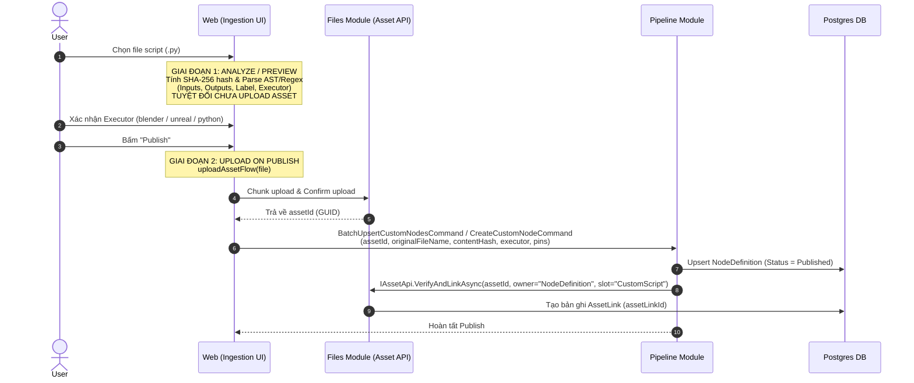

# Pipeline Playbook: Custom Nodes & Canvas Graph Sync

> **Phạm vi:** Tài liệu hướng dẫn và kỹ thuật mô tả cốt lõi cách vận hành cho:
> 1. Vòng đời Custom Script & Node Ingestion (Phân tích, Upload, Executor, Publish).
> 2. Cấu trúc Đồ thị Pipeline Canvas (Nodes, Edges, Containers/Stages, Parameters).
> 3. Cơ chế Đồng bộ Đồ thị (Autosave Debounce 600ms, Sync toàn đồ thị, File Parameter Pin).
>
> **Quy tắc bắt buộc:** Agent phải đọc tài liệu này trước khi chỉnh sửa bất kỳ tính năng nào liên quan đến Canvas hoặc Node Definition. Sau khi chỉnh sửa code, phải cập nhật lại tài liệu này.

---

## 1. Vòng Đời Custom Node & Script Ingestion

Custom Node là các node tùy biến được thực thi bởi script Python trên Worker (chạy trong môi trường Blender, Unreal Engine hoặc Python độc lập).



### 1.1. Nguyên tắc Upload Script (Upload on Publish)
- **Analyze không tạo rác:** Khi người dùng chọn file hoặc kéo thả batch script, Frontend chỉ đọc nội dung local, tính `contentHash` (SHA-256) và phân tích schema (Inputs, Outputs, Label, Docstrings). **Tuyệt đối không upload file lên Files module ở bước này** để tránh sinh asset rác khi người dùng hủy bỏ hoặc chỉ xem trước.
- **Xác định Executor:**
  - `blender`: Dành cho các script xử lý 3D, mesh, bake, import/export FBX, texture trong Blender headless.
  - `unreal`: Dành cho script tự động hóa Unreal Engine Python API.
  - `python`: Script Python tiêu chuẩn không phụ thuộc phần mềm DCC bên ngoài.
- **Upload khi Publish:** Chỉ khi người dùng bấm nút **Publish** (hoặc Batch Publish), hàm `uploadAssetFlow(file)` mới được kích hoạt để upload binary lên Files module, lấy về `assetId`.
- **Liên kết Asset Link:** Backend sau khi tạo/cập nhật `NodeDefinition` sẽ gọi `IAssetApi.VerifyAndLinkAsync` để gắn file script với `NodeDefinition.Id` tại slot `PipelineAssetSlots.CustomScript`.

---

## 2. Cấu Trúc Đồ Thị Pipeline Canvas (Graph Mental Model)

Một Pipeline thuộc về một `ProjectId` cụ thể, chứa cấu hình Parameters toàn cục và toàn bộ mạng lưới đồ thị trực quan (Graph).

```
Pipeline (Id, ProjectId, Name, Parameters, TriggerConfig)
├── Parameters (JSONB): [ { Key, Kind: Input | Variable | Output, Type, DefaultValue } ]
├── PipelineNodes (Bản ghi DB)
│   ├── Id (GUID)
│   ├── RefId: Tool Key ("make-map") HOẶC Custom Node Key ("bake-mesh")
│   ├── Kind: Standard | Container | SubPipeline
│   ├── ParentId: Trỏ đến Container Node (nếu nằm trong Container)
│   ├── Position: { X, Y } (tọa độ trên React Flow Canvas)
│   ├── Config: { pinKey: literalValue | { assetLinkId: GUID } }
│   └── Metadata: { size, label, executor, color... }
└── PipelineEdges (Bản ghi DB)
    ├── SourcePipelineNodeId + SourcePin
    └── TargetPipelineNodeId + TargetPin
```

### 2.1. Phân loại Nodes (`PipelineNodeKind`)
1. **`Standard` (Custom hoặc Tool Node):**
   - Node thực hiện một chức năng cụ thể.
   - Nhận diện định nghĩa qua `RefId`:
     - Nếu `RefId` khớp với một `ITool` trong hệ thống C# -> Chạy bằng C# Tool Resolver (ví dụ: `make-map`, `format-string`, `get-resource-relative-paths`).
     - Nếu `RefId` khớp với một `NodeDefinition` trong DB -> Chạy bằng Worker Script Resolver (ví dụ: `bake-mesh`, `apply-baked-textures`).
2. **`Container` (Stage Grouping):**
   - Node đóng vai trò là "Vỏ bọc phân đoạn thực thi" (Execution Stage).
   - Các node nằm bên trong container sẽ có `ParentId = containerNode.Id`.
   - Toàn bộ node con trong cùng một Container sẽ cùng chia sẻ một **Executor** (ví dụ: một Container có metadata `executor = "blender"`).
   - Khi chạy, Engine gom toàn bộ bước của container này thành một `StageTaskMessage` gửi sang Worker để chạy liên tục trong **cùng một phiên phần mềm**, không phải tắt/mở Blender nhiều lần.
3. **`SubPipeline`:**
   - Node lồng một Pipeline khác vào đồ thị hiện tại.

### 2.2. Dây nối (`PipelineEdge`)
- Nối từ Output Pin của node nguồn (`SourcePipelineNodeId`, `SourcePin`) sang Input Pin của node đích (`TargetPipelineNodeId`, `TargetPin`).
- Engine sử dụng danh sách Edges để xây dựng đồ thị có hướng không chu trình (DAG) và truyền kết quả đầu ra làm đầu vào cho node kế tiếp.

---

## 3. Cơ Chế Đồng Bộ Đồ Thị Canvas (Graph Sync Mechanics)

Hệ thống Canvas sử dụng kiến trúc **Full Graph Sync** kết hợp **Debounce Autosave**, hoàn toàn không sử dụng các endpoint granular thêm/sửa/xóa lẻ tẻ.

```mermaid
graph TD
    A[User thao tác trên Canvas: Kéo node / Nối dây / Nhập Form Config] --> B[usePipelineDraftState: Cập nhật Local State & Mark isDirty]
    B --> C{Debounce 600ms}
    C -->|Hết 600ms không có thao tác mới| D[Gọi API duy nhất: SavePipelineGraph]
    D --> E[POST /api/pipelines/{id}/graph]
    E --> F[Backend: Đối chiếu Nodes & Edges cũ / mới]
    F --> G[Xử lý File Pin: Draft assetId -> AssetLink]
    G --> H[Lưu DB trong 1 Transaction]
    H --> I[Trả về Hydrated PipelineGraphDto]
    I --> J[Frontend cập nhật configValues & fileAssets]
```

### 3.1. Autosave Debounce 600ms
- Hook `usePipelineDraftState.ts` theo dõi các biến động trên đồ thị.
- Khi có thay đổi, cờ `isDirty` bật lên. Sau 600ms ngừng thao tác, request `saveMutation.mutateAsync` được kích hoạt.
- Trong lúc đang gửi request (`isSaving = true`), các thao tác tiếp theo được hoãn để tránh race-condition lưu đè dữ liệu cũ.

### 3.2. Endpoint Duy Nhất: `SavePipelineGraph`
- **Route:** `POST /api/pipelines/{pipelineId:guid}/graph`
- **Payload:** Chứa toàn bộ danh sách `Nodes`, `Edges`, và `Parameters` hiện tại của đồ thị.
- **Backend xử lý:**
  1. Kiểm tra validation chu trình (Cycle Detection).
  2. Tìm các Nodes và Edges đã bị người dùng xóa khỏi Canvas để xóa khỏi Database.
  3. Upsert các Nodes và Edges mới hoặc có thay đổi tọa độ, config, metadata.
  4. Chuẩn hóa và liên kết File Pins (xem mục 3.3).
  5. Commit toàn bộ vào DB trong một Transaction duy nhất.

### 3.3. Quy ước Dữ liệu File Parameter Pin (File Pins Lifecycle)

File được truyền vào Input Pin của Node (ví dụ file FBX, preset, script mẫu) tuân theo quy ước 2 trạng thái:

1. **Trạng thái Chưa lưu (Draft tại Frontend):**
   - Khi người dùng chọn file trên `AssetPinUpload` / `FormPinAssetUpload`, file được upload lên Files module và UI lưu tạm trong config của node dưới dạng:
     ```json
     {
       "mesh_file": {
         "assetId": "3fa85f64-5717-4562-b3fc-2c963f66afa6",
         "originalName": "character_model.fbx"
       }
     }
     ```
2. **Trạng thái Đã lưu (Persisted trong Database):**
   - Khi request `SavePipelineGraph` gửi lên backend, backend phát hiện input pin này có kiểu File và đang chứa `assetId`.
   - Backend liên kết `assetId` với `PipelineNode` thông qua `IAssetApi.VerifyAndLinkAsync` và chuẩn hóa giá trị trong `Config` lưu vào DB thành:
     ```json
     {
       "mesh_file": {
         "assetLinkId": "8ca21f11-2891-4190-b112-9c963f66bbb2"
       }
     }
     ```
3. **Hiển thị trên Canvas (Hydration):**
   - Khi load đồ thị qua `GetPipelineGraph` hoặc sau khi `SavePipelineGraph` thành công, DTO trả về kèm `FileAssets` chứa metadata hiển thị (`originalName`, `sizeBytes`, `status: "Available"`).
   - UI hiển thị đúng tên file và icon trạng thái mà không cần lưu trùng lặp tên file vào cột Config của Database.

---

## 4. Tóm Tắt Quy Tắc Cho Agent Khi Chạm Vào Pipeline Canvas
1. **Không tạo lại Granular Endpoints:** Không bao giờ tạo lại các endpoint như `AddPipelineNode`, `DeletePipelineEdge`. Mọi thay đổi đồ thị đều đi qua `SavePipelineGraph`.
2. **Không upload file khi chưa Publish:** Trong trang Ingestion Script, tuyệt đối không gọi API upload binary khi người dùng chỉ mới chọn file phân tích.
3. **Giữ nguyên định dạng File Pin:** Phân biệt rõ Draft `{ assetId, originalName }` ở UI và Persisted `{ assetLinkId }` ở Backend DB.
