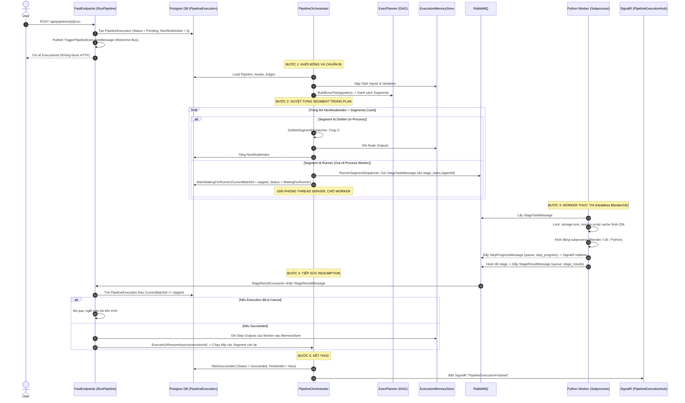
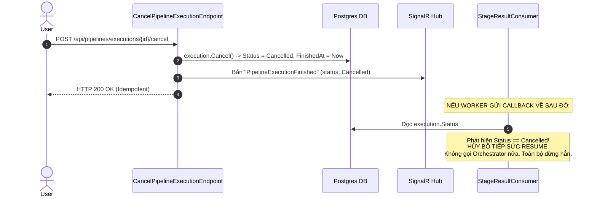

# Pipeline Playbook: Engine Lifecycle & Execution Mechanics

> **Phạm vi:** Tài liệu hướng dẫn và kỹ thuật mô tả cốt lõi cách vận hành cho:
> 1. Vòng đời kích hoạt & thực thi Pipeline (Trigger -> DAG Planner -> Segments -> Finish).
> 2. Các tầng lưu trữ và quản lý tiến trình (`PipelineExecution`, `MemoryStore`, `StateStore`, `EntityStore`).
> 3. Phân biệt các loại Stage & Dispatchers (`DotNetSegmentDispatcher` vs `RunnerSegmentDispatcher`).
> 4. Cơ chế Worker Subprocess & Vòng lặp Tiếp sức (Worker Callback Resumption Loop qua RabbitMQ).
> 5. Cơ chế Hủy Pipeline tinh gọn (Lightweight Cancellation).
>
> **Quy tắc bắt buộc:** Agent phải đọc tài liệu này trước khi can thiệp vào Orchestrator, Dispatchers, Consumers, Worker Runners hoặc Execution State.

---

## 1. Bản Đồ Vòng Đời Thực Thi (End-to-End Lifecycle)



---

## 2. Ai Nắm Giữ Tiến Trình Chạy Pipeline? (State & Storage Topology)

Hệ thống phân tách rạch ròi giữa **Dữ liệu bền vững (Durable State)** và **Dữ liệu sống/Tạm thời (Ephemeral Runtime State)**:

```
┌────────────────────────────────────────────────────────────────────────┐
│ 1. POSTGRES DATABASE (Durable Control State)                          │
│    Entity: PipelineExecution                                           │
│    - Status: Pending | Running | WaitingForRunner | Succeeded | Failed │
│    - NextNodeIndex: Con trỏ chỉ mục Segment kế tiếp cần chạy           │
│    - CurrentBatchId: StageExecutionId hiện tại đang gửi cho Worker    │
│    - FinishedAt & ErrorMessage                                         │
└────────────────────────────────────┬───────────────────────────────────┘
                                     │
┌────────────────────────────────────▼───────────────────────────────────┐
│ 2. EXECUTION MEMORY STORE (IExecutionMemoryStore - Redis / RAM)        │
│    - Start Inputs (tham số đầu vào khi trigger pipeline)               │
│    - Pipeline Variables (biến toàn cục được set qua SetVariableTool)   │
│    - Node Outputs: Kết quả trả về của từng Node sau khi chạy xong       │
│      Key pattern: "execution:{id}:node:{nodeId}:outputs"              │
└────────────────────────────────────┬───────────────────────────────────┘
                                     │
┌────────────────────────────────────▼───────────────────────────────────┐
│ 3. EXECUTION STATE STORE (IExecutionStateStore - Redis / Blob)         │
│    - PipelineExecutionState: Full Snapshot đồ thị dữ liệu tại từng     │
│      checkpoint (phục vụ Audit, Visual Debugger, Inspector)            │
└────────────────────────────────────┬───────────────────────────────────┘
                                     │
┌────────────────────────────────────▼───────────────────────────────────┐
│ 4. EXECUTION ENTITY STORE (IExecutionEntityStore)                      │
│    - In-memory prefetch cache cho các Resource Entities, Metadata      │
│    - Tránh N+1 SQL queries khi hàng chục node cùng truy xuất Resource   │
└────────────────────────────────────────────────────────────────────────┘
```

---

## 3. Phân Biệt Các Loại Stage & Dispatchers

`ExecPlanner` phân tích DAG đồ thị và gom nhóm thành các **`ExecSegment`** (Phân đoạn thực thi). Mỗi Segment được xử lý bởi một Dispatcher chuyên trách:

| Loại Segment / Dispatcher | Môi trường thực thi | Đối tượng node đảm nhiệm | Cách thức hoạt động |
| :--- | :--- | :--- | :--- |
| **`DotNetSegmentDispatcher`** | **In-Process** (RAM Backend C#) | Các built-in Tools C# (`make-map`, `format-string`, `set-variable`, `get-resource-relative-paths`...) | Chạy tức thì qua `IToolRegistry`. Đầu ra lưu ngay vào `MemoryStore`. Không qua RabbitMQ, không tốn tài nguyên worker, không context-switch. |
| **`RunnerSegmentDispatcher`** | **Out-of-Process** (Worker Daemons) | Các Custom Script nodes (`bake-mesh`, `apply-baked-textures`...) | Gom toàn bộ node trong cùng một **Container/Stage** thành một mảng `StepExecution` trong `StageTaskMessage`. Gửi sang RabbitMQ, chuyển DB sang `WaitingForRunner` và **nhả thread server**. |
| **`ForEachDispatcher`** | **Orchestrated Loop** | Node loại ForEach Loop | Tách mảng dữ liệu thành từng iteration, nạp scope index vào MemoryStore và điều phối nhánh lặp. |
| **`SubPipelineDispatcher`** | **Nested Execution** | Node loại SubPipeline | Kích hoạt một Execution độc lập cho Pipeline con, chờ hoàn tất và map outputs ngược lại Pipeline cha. |

---

## 4. Cơ Chế Worker Thực Thi & Tiếp Sức Callback (Resumption Loop)

### 4.1. Worker thực thi thế nào?
1. **Tiếp nhận:** Worker lắng nghe RabbitMQ queue `stage_tasks.{agentId}`.
2. **Khóa an toàn:** Mở context `with storage_lock():` tạo file lock `.storage.lock` để đảm bảo cronjob dọn dẹp không xóa trúng file trong lúc job đang chạy.
3. **Phân giải script:** `script_resolver.py` kiểm tra thư mục cache `worker/runtime/cache/scripts/{hash}/`. Nếu chưa có, tải từ URL và đối chiếu chính xác SHA-256 hash.
4. **Chạy Subprocess Headless:** Khởi chạy `BaseSubprocessExecutor` (gọi binary `blender.exe -b -P ...` hoặc Unreal Engine).
5. **Stream tiến độ:** Bắn `StepProgressMessage` vào queue `step_progress`. Backend `StepProgressConsumer` nhận message và phát SignalR realtime `PipelineNodeExecutionUpdated` (đổi màu node trên Canvas thành Running/Success).
6. **Báo cáo kết quả:** Khi toàn bộ bước trong Stage kết thúc, Worker bắn `StageResultMessage` vào queue `stage_results`.

### 4.2. Callback Tiếp sức (Resumption) ở Backend
1. **`StageResultConsumer`** lắng nghe queue `stage_results`:
2. Tìm `PipelineExecution` có `CurrentBatchId == message.StageExecutionId`.
3. **Kiểm tra cờ Hủy (Cancellation Check):** Nếu execution đã có status là `Cancelled` -> **Dừng ngay lập tức**, không ghi state và không resume.
4. Nếu `Succeeded`:
   - Ghi toàn bộ `step_results.outputs` vào `IExecutionMemoryStore`.
   - Cập nhật `NextNodeIndex` lên vị trí tiếp theo.
   - Gọi lại `orchestrator.ExecuteOrResumeAsync(execution.Id)`.
5. Orchestrator thức dậy, tiếp tục vòng lặp chạy Segment kế tiếp (có thể là một DotNet Tool khác hoặc một Runner Stage khác) cho tới khi kết thúc toàn bộ đồ thị.

---

## 5. Cơ Chế Hủy Pipeline Tinh Gọn (Lightweight Cancellation)

Dự án áp dụng nguyên tắc **"Dừng luôn, dứt khoát, không cần resume hay distributed saga"**:



- **Endpoint:** `POST /api/pipelines/executions/{id:guid}/cancel` ([CancelPipelineExecution.cs](file:///d:/FullStack/Automation/api/src/Modules/Pipeline/Automation.Pipeline/Features/Pipelines/CancelPipelineExecution.cs)).
- **Trạng thái:** Chuyển ngay lập tức thành `ExecutionStatus.Cancelled`, ghi nhận `FinishedAt = UtcNow`.
- **Phản hồi UI:** Bắn SignalR `PipelineExecutionFinished` để Canvas UI đổi trạng thái ngay, dừng spinner.
- **Ngắt vòng lặp:** Khi Worker gửi `StageResultMessage` về muộn, `StageResultConsumer` kiểm tra `Status == Cancelled` và từ chối gọi `ExecuteOrResumeAsync`, ngắt hoàn toàn tiến trình.

---

## 6. Tóm Tắt Quy Tắc Cho Agent Khi Chạm Vào Pipeline Engine
1. **Không tạo thêm bảng quản lý cancel:** Tuyệt đối không tái tạo `StageExecutions` hay `ExecutionCancelCommands`. Cơ chế cancel dựa trên `Status = Cancelled` và short-circuit tại `StageResultConsumer`.
2. **Tôn trọng ranh giới In-process vs Out-of-process:** C# Tools chạy qua `DotNetSegmentDispatcher`; script Python/Blender/Unreal chạy qua `RunnerSegmentDispatcher` và RabbitMQ.
3. **Không ghi output trực tiếp vào Database:** Kết quả tạm giữa các node chạy qua `IExecutionMemoryStore`. Database chỉ lưu tiến trình tổng thể (`NextNodeIndex`, `Status`).
