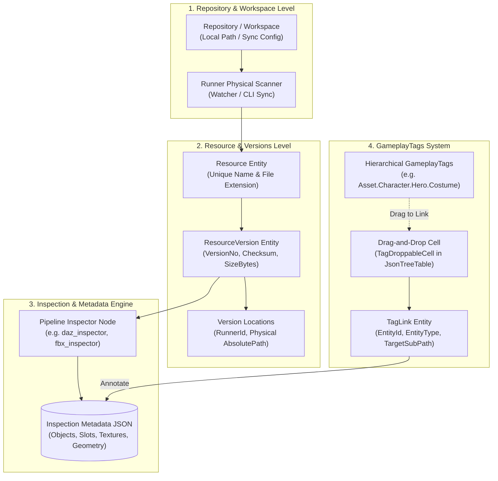

# Repository, Resource & GameplayTags Lifecycle Playbook

Tài liệu này đóng vai trò là **Kim chỉ nam vận hành (Operational Playbook)** chuẩn hóa toàn bộ vòng đời dữ liệu của phân hệ **Repository Management, Resource Tracking, Asset Slots & GameplayTags**.

---

## 1. Mental Model & Kiến Trúc Tổng Thể

Hệ thống quản lý tài nguyên số (Digital Asset Management - DAM) trong Automation Studio được thiết kế nhằm theo dõi, phiên bản hóa và gắn nhãn ngữ nghĩa (GameplayTags) cho các asset 3D (Daz `.duf`, Blender `.blend`, Unreal `.uasset`, FBX, textures) trên các máy trạm phân tán.



---

## 2. Các Thực Thể Dữ Liệu Cốt Lõi (Core Entities & Schema)

### 2.1. Repository (`Repository`)
- **Vai trò**: Đại diện cho một thư mục gốc dự án hoặc workspace trên máy trạm (local workstation / render runner).
- **Trường cốt lõi**: `Id`, `ProjectId`, `Name`, `RootPath`, `SyncIntervalSeconds`, `IsActive`.

### 2.2. Resource (`Resource`)
- **Vai trò**: Đơn vị tài nguyên logic duy nhất (ví dụ: `Laura.duf`, `Warrior_Armor.fbx`).
- **Trường cốt lõi**: `Id`, `RepositoryId`, `Name`, `FilePath` (đường dẫn tương đối từ RootPath), `Extension`.
- **Nguyên tắc**: Tên và file path trong cùng một Repository là duy nhất. Khi file bị thay đổi trên đĩa, hệ thống KHÔNG tạo Resource mới mà tạo một `ResourceVersion` mới.

### 2.3. ResourceVersion (`ResourceVersion`) & Locations
- **Vai trò**: Đại diện cho trạng thái bất biến (immutable snapshot) của file tại một thời điểm.
- **Trường cốt lõi**: `Id`, `ResourceId`, `VersionNo` (tự tăng: 1, 2, 3...), `ChecksumSha256`, `SizeBytes`, `CreatedAt`.
- **`ResourceVersionLocation`**: Bản đồ ghi nhận file phiên bản này đang hiện diện vật lý trên những Runner nào (`RunnerId`, `LocalAbsolutePath`, `LastSeenAt`).

### 2.4. Inspection Metadata (`ResourceMetadata` / JSON Report)
- Được sinh ra tự động từ các bước Pipeline Inspector (như `daz_inspector`, `blender_inspector`).
- Chứa cấu trúc chi tiết:
  ```json
  {
    "name": "Laura",
    "main_objects": ["Genesis 9"],
    "objects": {
      "Genesis 9": {
        "slots": [
          { "name": "Body", "textures": { "BASE_COLOR": "Body_diffuse.jpg", "NORMAL": "Body_normal.png" } },
          { "name": "Face", "textures": { "BASE_COLOR": "Face_diffuse.jpg" } }
        ]
      }
    }
  }
  ```

---

## 3. Hệ Thống GameplayTags & Metadata Annotation

Hệ thống GameplayTags cho phép gắn nhãn phân loại theo cấu trúc cây thư mục (tương tự GameplayTags của Unreal Engine).

### 3.1. Phân cấp Tag (Tag Hierarchy)
- **Quy ước đặt tên**: Sử dụng dấu chấm `.` để phân tách cấp bậc.
  - Ví dụ: `Asset.Character.Hero`, `Asset.Texture.4K`, `Material.Skin.PBR`.
- **Cấu trúc DTO**:
  - `TagTreeNodeDto`: `id`, `name`, `path`, `color`, `description`, `children[]`.

### 3.2. Cơ chế TagLink & Phân rã Đường dẫn con (`targetSubPath`)
- Một Tag có thể liên kết ở 2 cấp độ:
  1. **Toàn bộ Entity** (`targetSubPath = ""`): Gán nhãn cho toàn bộ Resource.
  2. **Trường/Thuộc tính chi tiết** (`targetSubPath = "slots[0].textures.BASE_COLOR"`): Gán nhãn trực tiếp vào một cell cụ thể trong bảng Metadata của Resource.
- **Dnd-Kit Integration**:
  - Vùng kéo: `DraggableTagCard` và `TagTreeNodeItem` trong `TagPanel.tsx`.
  - **Quy tắc bất biến (DOM Integrity)**: Trong suốt quá trình kéo (`isDraggingGlobal = true`), cây tag trong `TagPanel` **BẮT BUỘC PHẢI GIỮ MOUNT TRONG DOM** (chỉ áp dụng `opacity-40 pointer-events-none` để không che khuất màn hình). Tuyệt đối không dùng cờ kéo để unmount/thu gọn cây tag vì sẽ làm dnd-kit mất node nguồn và hủy sự kiện drop giữa chừng.
  - Vùng thả: `TagDroppableCell` trong `JsonTreeTable.tsx` được mở rộng `w-full min-h-[28px]` phủ kín toàn bộ ô bảng `<td>`, tự động sáng viền đứt nét khi nhấc tag lên (`border-dashed border-primary/50`).
  - Khi thả: Kích hoạt mutation `createTagLink` với payload `{ projectId, tagPath, entityId, entityType, targetSubPath }`. Sau khi thành công, tự động invalidate và cập nhật lại cache resource ngay lập tức.

### 3.3. Tương tác nhanh trên Cây Tag (`TagPanel.tsx`)
- **Click thông thường**: Mở/thu gọn cấp hiện tại.
- **Shift + Click (Không cần thư viện hotkey)**: 
  - Đệ quy thu thập toàn bộ các sub-paths (`collectSubtreePaths`).
  - Mở bung hoặc đóng gọn toàn bộ nhánh cây con ngay lập tức.
- **Nút Expand / Collapse All**: Nằm trên Header của `TagPanel`, cho phép mở hết hoặc thu gọn toàn bộ cây GameplayTags chỉ bằng 1 click.

---

## 4. Quản lý Hiển Thị Tool & Project Toolbar Store

Để tránh ô nhiễm giao diện (UI clutter), các công cụ dock nổi trên thanh `ProjectToolbar` được đăng ký động:

1. **Nguyên tắc Scoped Mounting**:
   - `TagTool` **KHÔNG** được mount toàn cục tại `ProjectShell.tsx`.
   - `TagTool` chỉ được mount cụ thể tại các trang có ngữ cảnh tài nguyên:
     - [`ResourceDetailPage.tsx`](file:///d:/FullStack/Automation/web/src/features/repositories/pages/ResourceDetailPage.tsx)
     - [`RepositoryDetailPage.tsx`](file:///d:/FullStack/Automation/web/src/features/repositories/pages/RepositoryDetailPage.tsx)
2. **Lifecycle Unregister**:
   - Khi chuyển hướng sang trang khác (như Pipeline Canvas, Datasets, Settings), `TagTool` unmount $\rightarrow$ gọi `unregisterTool("tag-panel")`.
   - Khi danh sách `tools` trong `useProjectToolbarStore` trống (`tools.length === 0`), `ProjectToolbar` tự động ẩn hoàn toàn khỏi màn hình.

---

## 5. Asset Slots & Draft File Synchronization

Triết lý **Asset Slots & Asset Link** là nền tảng kết nối giữa Resource DAM và Pipeline Engine:

```
[Resource / File on Disk] 
      │
      ▼ (Register / Upload via IAssetApi)
[Asset Entity in Storage] (UUID)
      │
      ├──> [AssetSlot in Module] (Định danh slot cố định)
      └──> [AssetLink in Pipeline Graph] (Draft: { assetId, originalName } -> DB: { assetLinkId })
```

- **Quy tắc vàng**:
  - Tuyệt đối không hardcode đường dẫn vật lý tuyệt đối trong cấu hình node của Pipeline Canvas.
  - Luôn thông qua **Asset Link** để đảm bảo đồ thị có thể Export sang máy khác hoặc chạy trên Runner phân tán mà không bị gãy file path.

---

## 6. GameplayTags Import & Export Engine

Hệ thống cung cấp cơ chế sao lưu, di chuyển và tích hợp GameplayTags giữa các dự án hoặc với engine game ngoài (Unreal Engine):

1. **Định dạng Export**:
   - **JSON (`.tags.json`)**: Chứa toàn bộ cây tag kèm metadata (`FormatVersion`, `ExportedAt`, `TotalTags`, mảng `tags` gồm `Path`, `Name`, `Color`, `Description`).
   - **CSV (`.tags.csv`)**: Cấu trúc bảng `Path,Name,Color,Description` tương thích định dạng GameplayTags chuẩn của Unreal Engine (`Tag,Category,Comment`).
2. **Cơ chế Import & Tái thiết lập phân cấp (Depth-First Hierarchy Ingestion)**:
   - Backend phân rã đường dẫn theo độ sâu dấu chấm (`path.Split('.').Length`).
   - Nhập từ tầng 1 đến tầng sâu nhất: tự động tạo các node cha còn thiếu, liên kết `ParentId` chính xác mà không gặp lỗi khóa ngoại.
   - Hỗ trợ chiến lược xung đột (`ConflictStrategy`):
     - `Skip`: Bỏ qua nếu tag đã tồn tại (giữ nguyên màu sắc và mô tả cũ).
     - `Update`: Cập nhật màu sắc (`Color`) và mô tả (`Description`) của tag cũ theo file mới.
