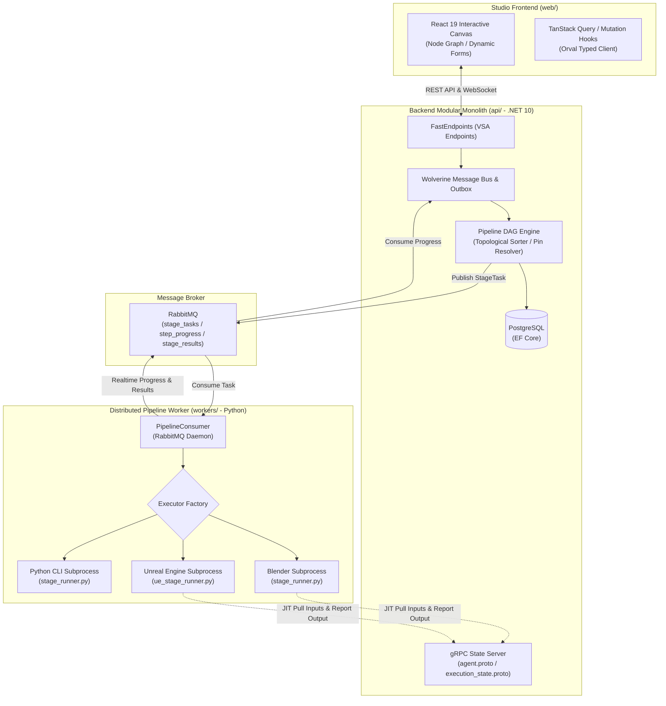

<div align="center">

# ⚡ Automation Studio

### *Extensible Distributed Workflow Orchestration & Digital Asset Pipeline Platform*

[](https://dotnet.microsoft.com/)
[](https://react.dev/)
[](https://python.org/)
[](https://fast-endpoints.com/)
[](https://wolverine.netlify.app/)
[](https://grpc.io/)
[](https://www.rabbitmq.com/)
[](https://tailwindcss.com/)

<p align="center">
  A production-grade, distributed workflow automation engine and node-based studio designed to orchestrate complex digital asset pipelines, DCC tools, and creative automation across heterogeneous environments.
</p>

[Architecture Overview](#-architecture-overview) •
[Core Pillars](#-core-pillars) •
[Monorepo Structure](#-monorepo-structure) •
[Quick Start](#-quick-start) •
[Extensibility](#-extensibility)

</div>

---

## 🚀 What is Automation Studio?

Managing digital asset pipelines across heterogeneous tools (Blender, Unreal Engine, Daz, DCC suites, rendering farms, and custom toolchains) is notoriously fragile. Studios often rely on disconnected Python scripts, ad-hoc CLI triggers, and manual file transfers that break easily and leak system memory.

**Automation Studio** solves this by providing:
1. **Interactive Node-based Canvas (DAG)**: A visual graph workflow editor where technical artists and engineers assemble multi-stage pipelines with typed inputs/outputs (Pins).
2. **Robust Backend Core (.NET 10)**: A Vertical Slice Architecture (VSA) Modular Monolith with transactional outbox, real-time WebSocket state dispatch, and gRPC execution services.
3. **Headless Distributed Workers (Python)**: Daemon agents running on local workstations or render nodes that execute pipeline stages in isolated subprocess sessions with automated memory management.

---

## 🏛️ Architecture Overview

The platform is designed around a decoupled, event-driven architecture connecting visual clients, backend orchestrators, and headless execution daemons:



---

## 🌟 Core Pillars

### 1. Visual DAG & Dynamic Pin System
- **Node-Based Orchestration**: Construct complex pipelines using Directed Acyclic Graphs (DAG) with dependency resolution and cycle detection.
- **Granular Pin Typing**: Strong contract-driven pin bindings (`$ref` and intra-stage data flow) allowing downstream steps to seamlessly consume upstream outputs in-memory.
- **Dynamic Form Engine**: Schema-driven forms rendered dynamically with Zod validation, supporting custom input controls and scoped field registries.

### 2. Host Daemon vs. Guest Stage Runner Architecture
- **Complete Isolation**: Software like Blender and Unreal Engine are spawned as dedicated headless subprocesses (`UnrealEditor-Cmd.exe`, `blender --background`). If an engine encounters a native segmentation fault, the main worker host remains completely unaffected.
- **In-RAM Batching**: Stages execute all constituent steps inside a single engine RAM session, eliminating slow engine restart overhead.
- **Automated Memory Recycling**: Built-in hooks automatically execute datablock purges (`bpy.ops.outliner.orphans_purge()`) and Unreal Engine garbage collection (`unreal.SystemLibrary.collect_garbage()`) after each step.

### 3. Single Source of Truth Contracts (`packages/proto/`)
- All cross-service gRPC communication contracts (`agent.proto`, `execution_state.proto`) are centralized in `packages/proto/`.
- .NET projects reference shared protos using `<Protobuf ProtoRoot="..." Link="..." />` with automated compilation on build.
- Python workers compile protobuf contracts directly via `python cli.py compile-protos`.

---

## 📂 Monorepo Structure

```
Automation/
├── packages/
│   └── proto/                      # 📜 Single Source of Truth gRPC contracts
│       ├── agent.proto             # Agent connection, heartbeat & file browsing
│       └── execution_state.proto   # JIT input resolution & step output reporting
│
├── api/                            # 🚀 Backend Core (.NET 10 Modular Monolith)
│   ├── src/
│   │   ├── Automation.Api/         # Host Web API & Middleware configuration
│   │   ├── Modules/                # Independent business slices (Pipelines, DynamicForms,
│   │   │                           # Identity, Assets, Workspace, Tag, System...)
│   │   └── SharedKernel/           # Shared abstractions & infrastructural extensions
│   ├── tests/                      # Automated unit & integration test suites
│   └── tools/Automation.Cli/       # Scaffolding CLI for instant module & CRUD generation
│
├── web/                            # 🎨 Studio Frontend (React 19 + TypeScript + Vite)
│   ├── src/
│   │   ├── components/             # Shadcn UI (powered by React Aria Components)
│   │   ├── features/               # Domain feature modules (Pipelines, Canvas, Assets, Forms)
│   │   ├── gen/                    # Auto-generated typed API clients (via Orval)
│   │   └── lib/                    # Core utilities (Temporal API, Axios client)
│   └── public/                     # Static assets and icons
│
├── workers/                        # ⚙️ Headless Pipeline Worker (Python 3.12+)
│   ├── commands/                   # Agent CLI commands (start, register, browse, scan)
│   ├── core/                       # Compiled gRPC stubs & shared network clients
│   └── worker/
│       ├── executors/              # Host Process Managers (Blender, Unreal, Python)
│       └── scripts/                # Guest Stage Runners (stage_runner.py, ue_stage_runner.py)
│
├── docs/                           # 📚 Centralized Technical Documentation
│   ├── architecture/               # System architecture & inter-service flow
│   ├── backend/                    # VSA philosophy, Pipeline Engine & Pin System
│   ├── frontend/                   # React Aria patterns, Canvas specifications & rules
│   └── workers/                    # Host-Guest Subprocess guide & lifecycle
│
└── .agents/                        # 🤖 AI Coding Assistant & Team Orchestration
    ├── AGENTS.md                   # Master Router & Resource Index
    ├── rules/                      # Scoped guidelines (backend, frontend, workers, general)
    └── skills/                     # 15+ automated skills for development & scaffolding
```

---

## ⚡ Quick Start

### Prerequisites
- [.NET 10 SDK](https://dotnet.microsoft.com/)
- [Node.js 20+](https://nodejs.org/) & [pnpm](https://pnpm.io/)
- [Python 3.12+](https://python.org/)
- [Docker](https://www.docker.com/) (for PostgreSQL & RabbitMQ)

### 1. Launch Infrastructure
```bash
# Run PostgreSQL and RabbitMQ containers
docker run -d --name automation-postgres -e POSTGRES_PASSWORD=postgres -p 5432:5432 postgres:16
docker run -d --name automation-rabbitmq -p 5672:5672 -p 15672:15672 rabbitmq:3-management
```

### 2. Start Backend API (`api/`)
```bash
cd api
dotnet restore
dotnet run --project src/Automation.Api
# Swagger available at: http://localhost:5189/swagger
```

### 3. Start Studio Web Frontend (`web/`)
```bash
cd web
pnpm install
pnpm dev
# Studio UI available at: http://localhost:5173
```

### 4. Start Pipeline Worker Daemon (`workers/`)
```bash
cd workers
python -m venv worker/venv
.\worker\venv\Scripts\activate
pip install -r worker/requirements.txt

# (Optional) Recompile shared protobuf contracts
python cli.py compile-protos

# Start background pipeline worker & gRPC stream
python cli.py start
```

---

## 🧩 Extensibility

### Adding a New Pipeline Tool (Backend)
Tools represent the functional nodes on the Canvas. Implement `BaseResolverTool` within `api/src/Modules/Pipeline/`:
```csharp
[Tool("custom_tool_key", "Custom Tool Name", Category = "Geometry")]
public class CustomGeometryTool : BaseResolverTool
{
    [ToolPin(PinDirection.Input, DataType = PinDataTypes.String)]
    public string InputPath { get; set; } = string.Empty;

    [ToolPin(PinDirection.Output, DataType = PinDataTypes.String)]
    public string OutputPath { get; set; } = string.Empty;
}
```

### Adding a New Engine Executor (Worker)
To support a new DCC or engine (e.g. Maya, Houdini, Unity):
1. Inherit from `BaseSubprocessExecutor` in `workers/worker/executors/`.
2. Implement `build_command(task)` with target executable and headless arguments.
3. Register the new executor key in `EXECUTOR_REGISTRY` (`workers/worker/executors/__init__.py`).

---

## 📄 License

This project is licensed under the [MIT License](LICENSE).
