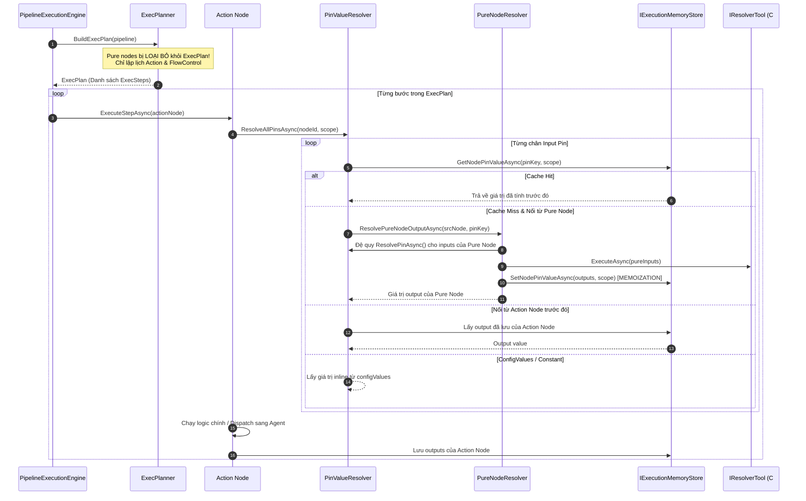

# Kiến Trúc Pipeline Engine: Hybrid Control-Flow & Demand-Driven Lazy Pull

Tài liệu này ghi nhận nguyên lý hoạt động cốt lõi của **Pipeline Execution Engine** trong hệ thống Automation Backend, giải thích chi tiết thuật toán **Demand-Driven Lazy Pull kết hợp Memoization** đã được cải tiến vượt bậc so với mô hình DAG truyền thống.

---

## 1. Triết Lý Thiết Kế: Vượt Thoát Khỏi DAG Truyền Thống

Trong các hệ thống điều phối tiến trình cổ điển (như Airflow, Prefect, Celery):
- Mọi node trên đồ thị đều được xếp vào một hàng đợi **Topological Sort**.
- Quá trình thực thi hoạt động theo kiểu **Push-Driven (Eager Execution)**: chạy từ node nguồn và đẩy toàn bộ dữ liệu về phía trước.
- **Nhược điểm:** Phải tính toán toàn bộ các node phụ trợ kể cả khi output không được sử dụng; khó khăn trong việc xử lý rẽ nhánh điều kiện (`If/Branch`) hoặc vòng lặp (`ForEach`) vì dữ liệu bị tính toán trước khi luồng điều khiển chạm tới.

### Mô hình Hybrid của Automation Pipeline (Blueprint Architecture)
Lấy cảm hứng từ kiến trúc Unreal Engine Blueprints, Engine tách bạch hoàn toàn thành 2 hệ thống độc lập:

1. **Control Flow (Luồng điều khiển - Dây Exec trắng):** Hoạt động theo cơ chế **Push-Driven**. Chỉ kích hoạt các Action Node và FlowControl Node theo thứ tự tuần tự hoặc phân nhánh logic.
2. **Data Flow (Luồng dữ liệu - Dây Data màu):** Hoạt động theo cơ chế **Demand-Driven (Lazy Pull)**. Dữ liệu **chỉ được tính toán khi và chỉ khi có một Action Node yêu cầu**, được truy vấn đệ quy ngược từ đích về nguồn và ghi nhớ qua **Memoization Cache**.

```
[Pure Node: ParseJson] ──(Data)──► [Pure Node: FormatPath] ──(Data)──┐
                                                                     ▼
[Action Node: Start] ════(Exec)═════════════════════════════► [Action Node: RunScript]
                                                               (Tới lượt chạy mới PULL data)
```

---

## 2. Các Thành Phần Trọng Tâm Của Thuật Toán



---

## 3. Chi Tiết Triển Khai Trong Code

### 3.1. Loại bỏ Pure Nodes khỏi Kế hoạch Thực thi (`ExecPlanner.cs`)
File: `src/Modules/Pipeline/Automation.Pipeline/Engine/ExecPlanner/ExecPlanner.cs`

Khi xây dựng `ExecPlan`, Engine duyệt qua tất cả các nodes. Nếu node là **Pure** (`tool.IsPure == true`) và không phải `Start` hay `FlowControl`, nó sẽ bị **bỏ qua hoàn toàn**:
```csharp
var tool = toolRegistry.Get(node.RefId);
var isPure = tool is { IsPure: true };

// Pure nodes are excluded from ExecPlan (resolved on-demand via pull)
if (isPure && !isStart && !isFlowControl)
{
    continue;
}
```
*Kết quả:* Một đồ thị có 100 node tính toán phụ trợ chỉ sinh ra một `ExecPlan` chứa đúng số lượng Action Node cần bấm máy, giúp giảm tải thuật toán lập lịch về mức tối thiểu.

---

### 3.2. Đệ quy Kéo ngược Dữ liệu (`PinValueResolver.cs`)
File: `src/Modules/Pipeline/Automation.Pipeline/Engine/DataResolver/PinValueResolver.cs`

Khi một Action Node chuẩn bị thực thi, nó gọi `ResolvePinAsync(executionId, nodeId, pinKey)`:
1. **Kiểm tra dây cắm phía trước (Upstream Connections):**
   - Nếu nguồn phát là **Action Node**: Lấy giá trị output mà Action Node đó đã ghi vào `IExecutionMemoryStore` khi nó chạy qua.
   - Nếu nguồn phát là **Pure Node**: Chuyển giao cho `PureNodeResolver` để tính toán tức thời.
2. **Fallback:** Nếu không có dây cắm, phân giải tiếp theo thứ tự ưu tiên:
   - `ScopeContext`: Biến cục bộ trong vòng lặp `ForEach` (`Item`, `Index`, `Key`).
   - `StartInput`: Dữ liệu đầu vào do người dùng truyền vào khi kích hoạt Pipeline.
   - `Variables`: Biến toàn cục của Pipeline (`GetVariable`).
   - `ConfigValues`: Giá trị inline được nhập từ Node Inspector trên giao diện.
   - `DefaultValue`: Giá trị mặc định định nghĩa trong Tool/Node schema.

---

### 3.3. Đánh Giá Lười & Ghi Nhớ (`PureNodeResolver.cs`)
File: `src/Modules/Pipeline/Automation.Pipeline/Engine/DataResolver/Resolvers/PureNodeResolver.cs`

Mỗi Pure Node hoạt động như một hàm thuần túy (Idempotent / Pure Function):
```csharp
public async Task<object?> ResolvePureNodeOutputAsync(...)
{
    // 1. Kiểm tra Memoization Cache
    var cached = await memoryStore.GetNodePinValueAsync(executionId, pureNode.Id, requestedPinKey, scope, ct);
    if (cached != null) return cached;

    // 2. Đệ quy kéo tiếp các input của chính Pure Node này
    foreach (var inPin in tool.Inputs)
    {
        inputs[inPin.Id] = await pinResolver.ResolvePinAsync(executionId, pureNode.Id, inPin.Id, scope, ct);
    }

    // 3. Thực thi tool C#
    var result = await tool.ExecuteAsync(context, ct);

    // 4. Lưu toàn bộ outputs vào Cache (Memoization)
    await memoryStore.SetNodePinValuesAsync(executionId, pureNode.Id, result.Outputs, scope, ct);
    return result.Outputs[requestedPinKey];
}
```
*Lợi ích:* Nếu một Pure Node cung cấp dữ liệu cho 5 Action Node khác nhau, phép tính phức tạp của nó chỉ diễn ra đúng 1 lần duy nhất trong frame thực thi đó.

---

## 4. Quản Lý Phạm Vi Vòng Lặp (`ScopeContext`)

Khi chạy qua các node điều khiển luồng (Flow Control) như `ForEach`:
1. `FlowControlExecutor` tạo một `ScopeContext` con gắn với `iterationIndex` và `scopeId` riêng biệt.
2. Bộ nhớ đệm `IExecutionMemoryStore` (Memory hoặc Redis) phân tách key theo Scope:
   ```
   pipeline:{executionId}:node:{nodeId}:pin:{pinKey}:scope:{scopeId}
   ```
3. Nhờ cơ chế này, các Pure Node cắm vào bên trong thân vòng lặp (`Loop Body`) sẽ được tự động tính toán lại độc lập cho từng phần tử lặp mà không bao giờ bị dính cache của phần tử trước đó.

---

## 5. Phân Loại Ranh Giới: C# Tools vs Agent Stage Tasks

| Đặc Điểm | C# Resolver Tool (`IResolverTool`) | Agent Stage Task (Worker) |
|---|---|---|
| **Môi trường** | Chạy In-Process trong .NET Backend. | Chạy Out-of-Process trên Worker (Blender/Unreal Python). |
| **Giao tiếp** | Gọi method C# trực tiếp (Memory). | Bắn message qua RabbitMQ (Wolverine MessageBus). |
| **Độ trễ** | Cực nhanh (< 1-5ms). | Phụ thuộc khởi động phần mềm và GPU/CPU (hàng giây/phút). |
| **Bản chất Pin** | Thường là Pure Node (hoặc Action Node nhẹ). | Luôn luôn là Action Node (bắt buộc có chân `Exec`). |
| **Ví dụ** | `FormatPathTool`, `GetVariableTool`, `ParseJsonTool`, `SetMapKeyTool`. | `RunUnrealScript`, `BlenderRenderBatch`, `DazExportTool`. |

---

## 6. Quy Tắc Bất Di Bất Dịch Cho Các Lần Refactor Tương Lai

1. **Tuyệt đối không áp dụng Topological Sort toàn cục cho Pure Nodes:** Không đưa Pure Node vào danh sách `ExecSteps`. Chỉ duy trì luồng duyệt theo dây `Exec`.
2. **Giữ tính thuần túy cho Pure Tool:** Mọi tool có cờ `IsPure = true` bắt buộc không được tạo side-effect (không ghi database, không gọi API bên ngoài gây thay đổi trạng thái).
3. **Mọi dữ liệu đầu vào phải đi qua `IPinValueResolver`:** Không tự ý đọc trực tiếp `node.ConfigValues` trong Tool hoặc Handler, vì sẽ làm mất khả năng ghi đè dữ liệu từ dây cắm (`Wires Override Config`).
