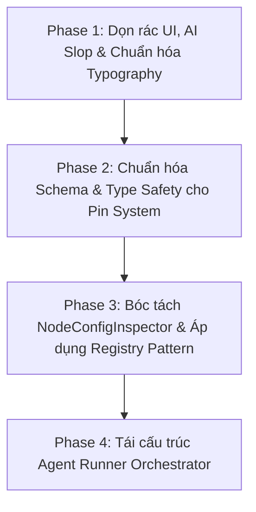

# KẾ HOẠCH ĐẠI TU KIẾN TRÚC VÀ TỐI ƯU HỆ THỐNG (REFACTORING MASTER PLAN)

Tài liệu này đóng vai trò là **Kim chỉ nam Kiến trúc (Architectural Blueprint)** ghi nhận toàn bộ các vấn đề nợ kỹ thuật (technical debt), "AI slop" và sự suy thoái cấu trúc (architectural entropy) tích tụ trong quá trình phát triển tính năng Pipeline Automation. 

Kế hoạch được chia thành **4 giai đoạn (Phases)** độc lập, thực hiện tuần tự theo quy trình:
> **Lập kế hoạch chi tiết từng Phase $\rightarrow$ Duyệt $\rightarrow$ Triển khai $\rightarrow$ Kiểm tra/Verify $\rightarrow$ Chuyển sang Phase kế tiếp.**

---

## 🎯 Mục tiêu cốt lõi
1. **Loại bỏ triệt để "AI Slop":** Xóa sạch mockup data, placeholder vô nghĩa, các đoạn text dính liền, icon/phông chữ lộn xộn.
2. **Chuẩn hóa Pin System:** Chuyển từ hệ thống Pin chắp vá, mơ hồ sang **Schema-First Type System** có validate và ngữ nghĩa rõ ràng.
3. **Decoupling Pipeline Canvas UI:** Bóc tách `NodeConfigInspector.tsx` (gần 1.000 dòng) về dưới 150 dòng bằng cách áp dụng **Registry Pattern** tương tự như kiến trúc Dynamic Form đã thành công ở module Content.
4. **Củng cố Runner Orchestrator trên Agent:** Tách bạch trách nhiệm giữa "Bộ điều phối tổng quan" (Orchestrator Head) và "Tiến trình thực thi cụ thể" (Runners), loại bỏ các hardcode cục bộ.

---

## 🗺️ Lộ trình 4 Giai đoạn (Phases)

---

## 📋 Chi tiết các Giai đoạn

### 🧹 Phase 1: Dọn rác UI, AI Slop & Chuẩn hóa Typography (Frontend) - [x] HOÀN THÀNH
*Mục tiêu: Đem lại cảm giác chuyên nghiệp, tinh tươm, đồng nhất về thị giác trước khi đụng vào code logic sâu.*

1. **Dọn sạch Mockup / Demo Settings (Đã xong):**
   - Đã xóa bỏ hoàn toàn `NotificationsSettings.tsx` (chứa các checkbox giả định nhận email marketing/security).
   - Đã loại bỏ mục Notifications khỏi `SettingsSidebar.tsx` và redirect an toàn sang `/settings/profile`.
2. **Sửa lỗi Typography, Label & Breadcrumbs (Đã xong):**
   - Đã tách các chuỗi dính liền trong UI và locale `vi.json` (`Quản lý Loại nội dung`, `Mục nội dung`, `Content Types`, `Content Items`).
   - Bổ sung `staticData: { breadcrumb: '...' }` cho toàn bộ các route còn thiếu (`Pipelines`, `Pipeline Editor`, `Node Library`, `Create Custom Node`, `Content Items`, `Content Types`).
3. **Thanh lọc Table & UI Text (Đã xong):**
   - Loại bỏ triệt để các boilerplate `description` rác tại `ResourcePageShell` của toàn bộ các bảng (`UserPage`, `RolePage`, `ProjectPage`, `PlatformPage`, `ExtensionPage`, `AuditLogsPage`, `SystemSettingsPage`, `ContentTypePage`, `ContentItemPage`, `PipelineListPage`) giúp tối ưu tối đa không gian và tăng tính thanh thoát.
   - Tạo mới component `DynamicIcon.tsx` và hiển thị icon động đúng theo cấu hình của người dùng tại Sidebar con và cột Bảng dữ liệu của Content Types / Items.
4. **Căn lề và Đồng bộ Icon Global Sidebar (Đã xong):**
   - Thay đổi icon "All Projects" từ `LayoutDashboard` sang `FolderKanban` để không trùng lặp với Dashboard chính.
   - Thụt lề danh sách dự án với `SidebarMenuSub`, có `border-l` phân cấp trực quan và icon `FolderGit2` đồng bộ.
   - Kiểm tra `pnpm tsc --project tsconfig.app.json --noEmit` đạt 0 lỗi type.

---

### 📐 Phase 2: Chuẩn hóa Schema & Type Safety cho Pin System (Backend + Frontend) - [x] HOÀN THÀNH
*Mục tiêu: Xây dựng nền móng dữ liệu vững chắc cho Canvas đồ thị, chấm dứt tình trạng type mông lung và chắp vá.*

1. **Định nghĩa Schema chuẩn hóa & Single Source of Truth (Đã xong):**
   - Backend cung cấp API `GET /api/pipelines/pin-catalogue` (`PinTypeMetadataDto`) bộc lộ mã màu HEX, nhãn hiển thị, style badge, và control gợi ý.
   - Frontend kết nối qua `usePinCatalogue.ts` làm Single Source of Truth (SSOT).
2. **Lưu trữ String Enums & Dọn dẹp Migration (Đã xong):**
   - Chuyển đổi toàn bộ `PinKind` (Data/Exec) và `PinCardinality` (Single/Array/Map) sang String Enum trong DB PostgreSQL qua migration `20260906041319_MigratePinEnumsToStringAndCleanVariable.cs`, khắc phục triệt để lỗi Inverted Enum Bug.
   - Loại bỏ kiểu "Variable" nguyên thủy mơ hồ; chuẩn hóa thành `EntityTarget = "variable"` hoặc quy chuẩn tên chân `VariableName`/`TargetVariable`.

---

### 🧩 Phase 3: Bóc tách `NodeConfigInspector` & Áp dụng Scoped Registry Pattern (Frontend) - [x] HOÀN THÀNH
*Mục tiêu: Giải phóng file gần 1.000 dòng, đưa kiến trúc Scoped Registry ("Sàn" Pattern) thanh thoát vào toàn bộ hệ thống Pipeline Canvas.*

1. **Hạ tầng Scoped Field Registry ("Sàn" Pattern) (Đã xong):**
   - Bổ sung class `ScopedFieldRegistry` (hỗ trợ phân cấp Scope Chain Lookup) và `baseRegistry` trong `src/lib/field-registry.ts`.
   - Khởi tạo sàn riêng `pipelineRegistry = new ScopedFieldRegistry(baseRegistry)` kế thừa toàn bộ controls cơ sở mà không làm lộ controls đặc thù sang Content FormBuilder.
2. **Loại bỏ triệt để Prop Drilling qua Scope Context (Đã xong):**
   - Tạo `PipelineFormScopeProvider` inject context nghiệp vụ (`pipelineId`, `projectId`, `variables`, `edges`, `nodes`) tại `PipelineCanvas.tsx`.
   - Các Form Controls đọc trực tiếp dữ liệu qua hook `usePipelineFormScope()`.
3. **Form Controls chuyên biệt & Rule-based Strategy Factory (Đã xong):**
   - Xây dựng 4 form controls đặc thù: `FormPinVariableSelect`, `FormPinEntitySelect`, `FormPinAssetUpload`, `FormPinPathInput` tự đăng ký vào `pipelineRegistry`.
   - Viết Pure Adapter `pinToFieldDefinition` áp dụng Rule-based Strategy Factory Pattern (`PIN_RULES` với `predicate` và `create`) tuân thủ Open-Closed Principle (OCP), hỗ trợ cả `Map` (`FormKeyValue`) và `Array` (`FormTagsInput`).
4. **Cải tổ `NodeConfigInspector.tsx` & `RunPipelineModal.tsx` (Đã xong):**
   - Bóc tách mạch lạc Inspector: **Wired Inputs** (đã nối dây, chỉ hiển thị card thông tin kết nối) và **Configurable Fields** (chưa nối dây, render qua `FormRenderer` với `pipelineRegistry`).
   - Tích hợp `useForm` cùng cơ chế Debounced Autosave (250ms) gửi mutation PATCH về server mượt mà.
   - Refactor `RunPipelineModal.tsx` loại bỏ hoàn toàn đống `if-else` thủ công, chuyển sang render bằng `FormRenderer` + `pipelineRegistry` kết hợp `useForm`.
   - Cập nhật `PinConfigInspector.tsx` đồng bộ với Catalogue API (`usePinCatalogue`), hỗ trợ String Enum và Entity Target.
   - Xóa bỏ hoàn toàn `PinPropertyControl.tsx`. Kiểm tra toàn bộ dự án đạt 0 lỗi TypeScript (`pnpm tsc -b`).

---

### 🕹️ Phase 4: Tái cấu trúc Agent Runner Orchestrator (Python Agent) - [x] HOÀN THÀNH
*Mục tiêu: Đưa bộ não điều phối về đúng chỗ, biến các Runner thành executor gọn gàng, loại bỏ hoàn toàn hardcode.*

1. **Chuẩn hóa Tầng Executor qua `BaseSubprocessExecutor` (Đã xong):**
   - Đưa toàn bộ subprocess lifecycle, cross-platform UTF-8 streaming, structured `PIPELINE_EVENT` parsing, real-time progress callbacks, và timeout handling về [base.py](file:///d:/FullStack/Automation/Automation-Agent/worker/executors/base.py).
   - Tối giản hóa [blender_executor.py](file:///d:/FullStack/Automation/Automation-Agent/worker/executors/blender_executor.py), [python_executor.py](file:///d:/FullStack/Automation/Automation-Agent/worker/executors/python_executor.py), và [unreal_executor.py](file:///d:/FullStack/Automation/Automation-Agent/worker/executors/unreal_executor.py) thành các lightweight classes kế thừa.
2. **Trích xuất Thư viện Dùng chung Guest Runners (`runner_common.py`) (Đã xong):**
   - Tạo [runner_common.py](file:///d:/FullStack/Automation/Automation-Agent/worker/scripts/lib/runner_common.py) chứa `resolve_step_inputs` ($file, $ref, $data), `apply_input_mappings`, và `call_script_main` (auto-typecast int/float/bool, kebab/snake_case mapping).
   - [stage_runner.py](file:///d:/FullStack/Automation/Automation-Agent/worker/scripts/stage_runner.py) và [ue_stage_runner.py](file:///d:/FullStack/Automation/Automation-Agent/worker/scripts/ue_stage_runner.py) tái sử dụng 100% logic dùng chung, triệt tiêu mã nguồn trùng lặp.
3. **Thanh lọc Action Scripts & Hardcode (Đã xong):**
   - Xóa bỏ `DEFAULT_MASTER_REGISTRY` Genesis 9 khỏi [setup_asset_materials.py](file:///d:/FullStack/Automation/Automation-Agent/worker/scripts/pipeline/unreal/setup_asset_materials.py).
   - Thay thế đường dẫn đích mặc định thành `/Game/Assets/{asset_name}` và xử lý fallback master material động qua Material Contracts.

---

## 🏆 KẾT LUẬN TOÀN BỘ REFACTORING MASTER PLAN
Cả **4 giai đoạn (Phases 1, 2, 3, 4)** đã hoàn tất 100%:
- **Phase 1 (Frontend):** Dọn rác UI, thanh lọc sidebar, loại bỏ mockup rác, chuẩn hóa icon động.
- **Phase 2 (Backend + DB):** Chuẩn hóa String Enums cho Pin System, xây dựng Single Source of Truth Pin Catalogue API, loại bỏ kiểu Variable nguyên thủy.
- **Phase 3 (Frontend Canvas):** Áp dụng Scoped Field Registry ("Sàn" Pattern) cho Pipeline Canvas, phân tách Wired/Unwired Pins, bóc tách NodeConfigInspector, tối ưu RunPipelineModal, đạt 0 lỗi TypeScript.
- **Phase 4 (Python Agent):** Thống nhất kiến trúc BaseSubprocessExecutor, chia sẻ runner_common.py cho Blender/Python/Unreal, dọn dẹp toàn bộ hardcode Genesis9.

