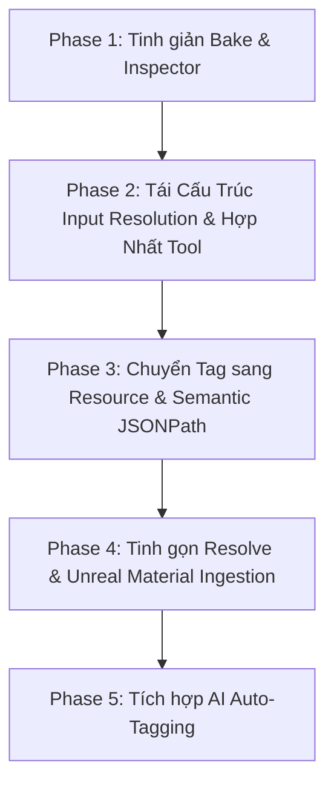

# Kế Hoạch Cải Tiến Pipeline: Tinh Giản Ingestion, Tái Cấu Trúc Tagging Tầng Resource & Tích Hợp AI Classification

> **Tài liệu Kế hoạch & Thiết kế Kiến trúc (Draft)**  
> **Vị trí**: `Automation-Backend/plans/draft/ASSET_PIPELINE_AND_AI_TAGGING_PLAN.md`  
> **Mục tiêu**: 
> 1. Tinh giản khâu nướng texture (SimpleBake) và Inspector trong Agent Worker để đạt hiệu năng cao, không ôm đồm logic dựng shader trong Blender.
> 2. Chuẩn hóa quy ước Channel Packing (ART, ORM, RMA) và hợp đồng Metadata tinh gọn.
> 3. Đưa hệ thống Tagging lên tầng `Resource` kết hợp cú pháp Generic Semantic Path (`[name='...']`), loại bỏ hoàn toàn rủi ro mất tag hoặc lệch index khi nâng cấp version.
> 4. Tích hợp AI Structured Output để tự động nhận diện và phân loại Tag cho tài sản 3D phức tạp (đặc biệt là Daz/Marketplace assets) với chi phí siêu rẻ (~5 - 8 VNĐ / asset).

---

## 1. Bối cảnh & Những Điểm Nghẽn Hiện Tại

Qua quá trình vận hành thực tế chuỗi xử lý tài sản từ **Blender $\rightarrow$ Automation Agent $\rightarrow$ Unreal Engine 5**, chúng ta nhận diện được 4 điểm nghẽn lớn:

1. **`simple_bake.py` bị cồng kềnh & làm sai chức năng:**
   - Dài gần 700 dòng code. Trong đó hơn 300 dòng dành cho việc quét lại thư mục, tính điểm matching và tái tạo shader graph (Principled BSDF + SeparateColor) trong Blender.
   - Khi export FBX sang Unreal, Unreal **hoàn toàn không đọc Shader Graph của Blender**! Việc rewire shader trong Blender vừa thừa thãi, vừa dễ gãy, vừa làm script nặng nề.
2. **Inspector bị "mù" trước các Channel-Packed Maps (ART / ORM):**
   - `inspect_unified_mesh.py` chỉ duyệt node tree của vật liệu trong Blender.
   - Vì Blender không có chân cắm bản địa cho `ART` (Ambient Occlusion + Roughness + Thickness), Inspector chỉ đọc được chân `Color` hoặc bỏ sót hoàn toàn tấm ART đã nướng ra thư mục.
3. **Metadata Inspector dư thừa và vênh với khâu hạ nguồn:**
   - Metadata sinh ra mảng object chứa `socket`, `hint`, `file_name`, `colorspace`, lặp `name` và `material_name`.
   - Trong khi hạ nguồn (`setup_asset_materials.py` và `resolve_material_manifest.py`) lại mong đợi Dictionary dạng phẳng: `{ "ParamName": "FilePath" }`.
4. **Hệ thống Tagging gắn vào `ResourceVersion` gây mất tag khi cập nhật file:**
   - Khi artist chỉnh sửa lưới hoặc UV và sync lên Version 2, Version 2 là bản ghi mới trong DB nên **mất sạch toàn bộ tag đã gán ở Version 1**.
   - Logic `TagMigrationHelper` hiện tại dễ gặp lỗi bất đồng bộ (Race Condition) vì khi file mới sync chưa có Metadata thì không thể migrate tag.
   - Đường dẫn index số (`slots[0]`, `streams[1]`) bị lệch hoàn toàn nếu thứ tự các phần tử trong mảng thay đổi ở version mới.
5. **Dữ liệu Daz / Marketplace thiếu nhất quán:**
   - Asset từ Daz hoặc chợ 3D đặt tên texture rất lộn xộn (`diff_4k`, `albedo`, `nor`, `nm`, `diffuse`). Nếu ngồi kéo thả tag tay thì tốn công, còn viết code `if/else` rule cứng thì không bao giờ bao quát hết.
6. **Hệ thống Tool và cơ chế phân giải Input bị phân mảnh, trùng lặp:**
   - Trùng lặp giữa `Utility` và `Collections`: `AppendMapTool` (Utility) và `MergeMapsTool` (Collections) làm cùng 1 việc; `SetMapKey` vs `GetMapItem` lệch quy chuẩn đặt tên; `MakeMap` và `MakeArray` nằm rải rác.
   - Vênh kiến trúc: Nhiều tool trong `Collections` vẫn dùng interface thô `IResolverTool` tự parse `JsonElement`/`Dictionary` thủ công thay vì dùng chuẩn hiện đại `BaseResolverTool<TIn, TOut>` kèm `[ToolPin]`.
   - Cơ chế ép kiểu (Type Coercion) trong `PinValueResolver` chưa tập trung, dẫn đến việc các tool phải tự loay hoay xử lý type casting dễ sinh lỗi ngầm.

---

## 2. Trụ Cột 1: Tinh Giản Khâu Bake & Chuẩn Hóa Channel Packing

### 2.1. Tinh gọn `simple_bake.py`
- **Tách bạch trách nhiệm:** Nhiệm vụ duy nhất của `simple_bake` là **Bake Engine**:
  - Nhận preset SimpleBake (từ upload hoặc tên có sẵn).
  - Chọn đúng UV Map đích.
  - Chạy bake ra thư mục đích (`export_path`).
  - **Loại bỏ hoàn toàn** hàm `apply_baked_textures_to_materials` (~300 dòng code rewire shader node).
- **Output của khâu Bake:** Trả về manifest kết quả trực tiếp:
  ```json
  {
    "status": "SUCCESS",
    "output_dir": "D:/Project/Textures/Baked",
    "textures": {
      "Body": {
        "BASE_COLOR": "D:/.../Genesis9_Body_BaseColor.png",
        "NORMAL": "D:/.../Genesis9_Body_Normal.png",
        "ART": "D:/.../Genesis9_Body_ART.png"
      }
    }
  }
  ```

### 2.2. Quy ước chuẩn Channel Packing (Channel Packing Convention)
Thống nhất quy ước hậu tố (suffix) cho toàn bộ pipeline:
- **`ART`**: **A**mbient Occlusion (R) + **R**oughness (G) + **T**hickness/Translucency (B) $\rightarrow$ *Dành cho Da (Skin), Vải mỏng (Cloth), Tóc.*
- **`ORM`**: **O**cclusion (R) + **R**oughness (G) + **M**etallic (B) $\rightarrow$ *Chuẩn PBR Game Engine chung cho Giáp, Kim loại, Đồ cứng.*
- **`RMA`**: **R**oughness (R) + **M**etallic (G) + **A**mbient Occlusion (B).

---

## 3. Trụ Cột 2: Tái Cấu Trúc Metadata & Inspector (Folder-First)

### 3.1. Inspector Cơ chế "Folder-First / Hybrid Scan"
- Nâng cấp [`inspect_unified_mesh.py`](file:///d:/FullStack/Automation/Automation-Agent/worker/scripts/inspectors/blender/inspect_unified_mesh.py) nhận thêm tham số `textures_dir` (hoặc tự động dò thư mục `textures/` cùng cấp):
  - **Ưu tiên quét folder textures:** Dựa vào tên file convention (`<Slot>_<Type>.<ext>`), tự động gom `BASE_COLOR`, `NORMAL`, `ART`, `ORM`. Bất kể trong Blender có cắm dây hay không, có file trên đĩa là nhận diện chính xác 100%.
  - **Fallback shader nodes:** Chỉ khi không có folder textures mới duyệt shader nodes của Blender.

### 3.2. Cấu trúc Metadata Chuẩn hóa (Key-Value)
Rút gọn cấu trúc của Material Slot về dạng tinh gọn, loại bỏ cột rác:
```json
{
  "asset_name": "Genesis9",
  "slots": [
    {
      "index": 0,
      "name": "Body",
      "textures": {
        "BASE_COLOR": "textures/body_basecolor.png",
        "NORMAL": "textures/body_normal.png",
        "ART": "textures/body_art.png"
      }
    }
  ]
}
```
- **Lợi ích trên UI:** Bảng `JsonTreeTable` không bị đẻ thêm sub-table 5 cột (`socket`, `hint`, `file_name`, `colorspace`). Người dùng nhìn vào thấy ngay danh mục texture sạch sẽ.

---

## 4. Trụ Cột 3: Đưa Tagging Về Tầng Resource & Cú Pháp Semantic Path

### 4.1. Tagging thuộc về Resource (`EntityType = "Resource"`)
- Chuyển toàn bộ liên kết `TagLink` từ `ResourceVersion.Id` sang `Resource.Id`.
- **Lợi ích cốt lõi:**
  - Ý đồ gắn tag (`Trim-1` là `Material.Cloth`) là thuộc tính của Resource nhân vật.
  - Khi artist cập nhật file lên Version 2, Version 3... **Toàn bộ Tag vẫn giữ nguyên**, không cần code migration, không sợ mất tag.

### 4.2. Generic Semantic JSONPath (Định danh theo Tên thay vì Index)
Để đảm bảo tính **100% Generic** cho mọi loại asset (3D, Video, Audio, CSV):
- Thay vì lưu đường dẫn theo index số dễ bị lệch: `slots[0].name` hay `streams[1].codec`.
- Chuyển sang định danh theo thuộc tính nhận diện (Identity Predicate theo chuẩn RFC 9535):
  - 3D Model: `slots[name='Trim-1']` (hoặc `slots[Trim-1]`)
  - Video Stream: `streams[type='audio']`
  - Audio Track: `tracks[lang='en']`
- **Nâng cấp Backend (`MetadataExtensions.ExtractJsonValue`):** Hỗ trợ regex bóc tách `array[prop='val']` tổng quát cho mọi đối tượng JSON.

### 4.3. Giữ Trọn Vẹn Tính Generic của `BuildTagMapFromResourceTool`
Tool này tiếp tục tuân thủ Struct `TaggedAssetStructDefinition`, không chứa bất kỳ logic riêng nào về Material/3D:
```json
{
  "ObjectsMap": {
    "Eva": {
      "resource_id": "3fa85f64-...",
      "asset_name": "Eva",
      "file_path": "D:/Assets/Eva.fbx",
      "resource_tags": ["ClothType.Top"],
      "path_map": {
        "slots[name='Trim-1']": {
          "value": {
            "name": "Trim-1",
            "textures": {
              "BASE_COLOR": "D:/Assets/textures/Trim-1_BaseColor.png",
              "NORMAL": "D:/Assets/textures/Trim-1_Normal.png",
              "ART": "D:/Assets/textures/Trim-1_ART.png"
            }
          },
          "tags": [
            { "id": "guid-1", "name": "Cloth", "path": "Material.Cloth" }
          ]
        }
      }
    }
  }
}
```

---

## 5. Trụ Cột 4: Mô Hình Hybrid Mapping 2 Tầng (Lười thì Auto, Cần thì Tag tay)

Trong một Material, **hoàn toàn có thể có nhiều texture cùng một thể loại** (ví dụ: 2 tấm Normal gồm `Base_Normal` và `Detail_Normal`; nhiều tấm Mask gồm `ORM` và `DirtMask`).

Hệ thống hỗ trợ 2 tầng xử lý linh hoạt:

1. **Tầng 1 - Tự Động (Auto Default):**
   - Áp dụng cho 80% asset PBR thông thường (chỉ có BaseColor, Normal, ART/ORM).
   - Người dùng **chỉ cần gắn 1 tag duy nhất** ở Slot: `Material.Cloth`.
   - Khâu Unreal tự động ghép `BASE_COLOR` $\rightarrow$ `BaseColorMap`, `NORMAL` $\rightarrow$ `NormalMap`, `ART` $\rightarrow$ `ARTMap`.
2. **Tầng 2 - Tường Minh (Explicit Override):**
   - Áp dụng cho các shader nâng cao (có thêm vân vải dệt `DetailNormal`, vết bẩn `DirtMask`).
   - Người dùng gắn tag sâu đến leaf parameter: `Material.Cloth.Textures.Cloth_DetailNormal` trỏ vào đúng file mong muốn.
   - Hệ thống ưu tiên tag tường minh số 1, cắm trực tiếp vào đúng parameter `Cloth_DetailNormal` bên Unreal!

---

## 6. Trụ Cột 5: Chuẩn Hóa Input Resolution & Hợp Nhất Bộ Tool (Collections & Utility)

### 6.1. Hợp Nhất Danh Mục Tool (Collections vs Utility Taxonomy)
Phân định ranh giới trách nhiệm rõ ràng giữa `Collections` (xử lý dữ liệu cấu trúc) và `Utility` (xử lý chuỗi, đường dẫn và điều khiển luồng):

| Danh mục | Trách nhiệm | Danh sách Tool chuẩn hóa |
| :--- | :--- | :--- |
| **`Collections/`** | Toàn bộ thao tác với **Map (Dictionary)** và **Array (List)** | - **Map Suite**: `MakeMapTool`, `GetMapItemTool`, `SetMapItemTool` (hợp nhất từ `SetMapKeyTool`), `MergeMapsTool` (hợp nhất `AppendMapTool` vào đây), `GetMapKeysTool`, `GetMapValuesTool`, `ZipToMapTool`.<br>- **Array Suite**: `MakeArrayTool`, `GetArrayItemTool`, `GetCollectionCountTool`. |
| **`Utility/`** | Thao tác chuỗi, đường dẫn đĩa, laser extraction và flow control | - **Chuỗi & Đường dẫn**: `FormatStringTool`, `AppendStringTool`, `CombinePathTool`.<br>- **Trích xuất JSON**: `GetByPathTool` (Laser Extraction qua JSONPath).<br>- **Khác**: `StaticValueTool`, `ForEachLoopTool`, `BeginExecuteTool`. |

- **Loại bỏ trùng lặp:**
  - Xóa `AppendMapTool` (Utility), chuyển toàn bộ logic gộp Map về `MergeMapsTool` (Collections).
  - Chuẩn hóa tên gọi: `SetMapKeyTool` $\rightarrow$ `SetMapItemTool` (để song hành đối xứng với `GetMapItemTool`). Giữ alias `SetMapKey`, `AddMapItem` để không làm gãy các pipeline cũ.
  - Đưa `MakeMapTool` và `MakeArrayTool` từ `Utility` về đúng `Collections`.

### 6.2. Quy Chuẩn Hóa Toàn Bộ Tool sang `BaseResolverTool<TIn, TOut>`
- Chuyển đổi 100% các tool còn dùng interface `IResolverTool` thủ công (`MergeMapsTool`, `GetMapItemTool`, `ZipToMapTool`, `GetMapKeysTool`, `GetMapValuesTool`, `GetArrayItemTool`) sang `BaseResolverTool<TInput, TOutput>`.
- **Lợi ích:**
  - Tự động hóa Model Binding thông qua `ToolModelBinder` và attribute `[ToolPin]`.
  - Loại bỏ hoàn toàn hơn 200 dòng boilerplate code parse `JsonElement`, `IDictionary`, `string` lặp đi lặp lại ở từng tool.
  - Đảm bảo tính nhất quán (Consistency) trong toàn bộ module `Pipeline`.

### 6.3. Tách Tầng Ép Kiểu Dữ Liệu Tập Trung (`PinTypeCoercer`)
- Thay vì để từng Tool tự `switch-case` kiểm tra kiểu dữ liệu đầu vào:
  - Xây dựng `PinTypeCoercer`: Nhận `object?` và tự động ép kiểu chuẩn xác sang `T` mong muốn (`Dictionary<string, object?>`, `List<T>`, `string`, `int`, `bool`, etc.).
  - Xử lý mượt mà sự khác biệt giữa `JsonElement` (từ API/JSON), `string` (JSON raw text), và strongly-typed C# objects.
- **Làm sạch `PinValueResolver.cs`:**
  - Chuẩn hóa chuỗi ưu tiên phân giải:
    1. **Wire Connection** (Dây nối từ node trước - Pure Node tự tính on-demand, Task Node đọc cache).
    2. **Memoized Cache** (Bộ nhớ đệm trong phiên thực thi).
    3. **Scope / Loop Context** (Biến vòng lặp `ForEachLoopTool`).
    4. **Start Input** (Tham số đầu vào của Pipeline).
    5. **Default Value / Config** (Giá trị mặc định trên node).

---

## 7. Trụ Cột 6: Tích Hợp AI Auto-Tagging Bằng Structured Output

### 6.1. Giải pháp cho dữ liệu Daz / Marketplace hỗn loạn
Thay vì viết hàng nghìn dòng `if/else` để đoán tên file texture bát nháo của Daz, ta sử dụng LLM Vision/Text Flash (như **Gemini 2.0 Flash / 1.5 Flash** hoặc **GPT-4o-mini**) làm bài toán **Classification**:

- **Đầu vào gửi cho AI:**
  - Danh sách tên mesh, tên slot, danh sách tên file texture thô.
  - Danh mục các tag có sẵn của Project (`Material.Cloth`, `Material.Skin`, `ClothType.Top`, v.v.).
- **Cơ chế Structured Output (JSON Schema):**
  - Ép AI trả về 100% đúng schema JSON:
    ```json
    {
      "cloth_type": "Top",
      "slot_mappings": [
        {
          "slot_name": "M_Jacket_Trim",
          "material_tag": "Material.Cloth",
          "textures": {
            "BASE_COLOR": "tex_jacket_diff_4k.png",
            "NORMAL": "tex_jacket_norm.png",
            "ART": "tex_jacket_art_pack.png"
          }
        }
      ]
    }
    ```

### 6.2. Phân tích Chi phí (Cost Analysis)
- **Token Input cho 1 model 3D:** ~1.000 tokens.
- **Token Output:** ~250 tokens.
- **Giá Gemini Flash:** Input $0.075 / 1M tokens, Output $0.30 / 1M tokens.
- **Chi phí thực tế:** **~0.00015$ (khoảng 5 đến 8 VNĐ / 1 asset)**!
- **Free Tier (Google AI Studio):** Miễn phí 1.500 requests/ngày $\rightarrow$ **0 đồng** trong giai đoạn phát triển và thử nghiệm.

### 6.3. Trải nghiệm người dùng (UX)
- **Trên Frontend (`ResourceMetadataTab` / `JsonTreeTable`):**
  - Bổ sung nút bấm: **`✨ Gợi ý Tag bằng AI`**.
  - Người dùng bấm nút $\rightarrow$ AI gợi ý toàn bộ Tag vào bảng $\rightarrow$ Người dùng kiểm tra lại và bấm **Save** (Human-in-the-loop).
- **Trên Pipeline Canvas:**
  - Cung cấp node `AutoTagResourceAITool` cho các luồng xử lý tự động hàng loạt (Batch Ingestion).

---

## 8. Lộ Trình Triển Khai (Phased Roadmap)



### Phase 1: Tinh giản Bake & Inspector (Blender Worker)
- [x] Cắt bỏ ~300 dòng code `apply_baked_textures_to_materials` trong `simple_bake.py` và chuẩn hóa manifest 1 shape `objects`.
- [x] Tạo node độc lập `apply_baked_textures.py` chuyên trách kết nối phẫu thuật Principled BSDF với channel-packed `ART` (100% tiếng Anh).
- [x] Tinh giản `inspect_unified_mesh.py` và `inspect_separated_meshes.py`: loại bỏ hoàn toàn regex đoán hint rườm rà, thu thập danh sách file paths đóng góp thực tế, bổ sung cơ chế quét folder textures.
- [x] Chuẩn hóa output metadata thành dạng danh sách textures phẳng tinh gọn (danh sách file paths, hiển thị gọn đẹp trên `JsonTreeTable`).

### Phase 2: Tái Cấu Trúc Input Resolution & Hợp Nhất Bộ Tool (Backend .NET)
- [x] Xóa bỏ trùng lặp tool: Hợp nhất `AppendMapTool` vào `MergeMapsTool`, chuẩn hóa `SetMapKeyTool` $\rightarrow$ `SetMapItemTool` (giữ alias cũ), chuyển `MakeMapTool` & `MakeArrayTool` từ `Utility` về `Collections`.
- [x] Chuyển đổi 100% các tool trong `Collections/` (`GetMapItemTool`, `MergeMapsTool`, `ZipToMapTool`, `GetMapKeysTool`, `GetMapValuesTool`, `GetArrayItemTool`, `GetCollectionCountTool`, `RemapKeysTool`) sang chuẩn `BaseResolverTool<TIn, TOut>` với `[ToolPin]`.
- [x] Xây dựng tầng `PinTypeCoercer` tập trung: Tự động chuyển đổi an toàn giữa `JsonElement`, `IDictionary`, `IEnumerable`, `string` trước khi bind vào Tool.
- [x] Tinh gọn và làm sạch `PinValueResolver.cs`: Chuẩn hóa ép kiểu Cardinality & Type qua `PinTypeCoercer.Coerce`.
- [x] Dọn dẹp các artifact sinh mã lỗi thời của Wolverine (`Internal/Generated`) và đảm bảo `dotnet build` toàn bộ solution đạt 0 warning / 0 error.
- [x] Bổ sung / cập nhật Unit Tests trong `Automation.Pipeline.Tests` để verify toàn bộ suite tool Collections & Utility mới (100% 84/84 tests pass).

### Phase 3: Chuyển Tag sang Resource & Semantic JSONPath (Backend .NET)
- [x] Cập nhật module `Tag` và `Workspace`: Gắn tag theo `EntityType = "Resource"` thay vì `ResourceVersion`.
- [x] Nâng cấp hàm `MetadataExtensions.ExtractJsonValue` hỗ trợ cú pháp `[name='...']`.
- [x] Cập nhật `BuildTagMapFromResourceTool` đọc metadata từ Active Version và tag từ Resource.

### Phase 4: Tinh gọn Resolve & Unreal Setup (Python Worker)
- [x] Đơn giản hóa `resolve_material_manifest.py`: Bóc tách anchor theo `[name='...']`, gom trực tiếp dictionary textures.
- [x] Đồng bộ khâu `setup_asset_materials.py` và `register_appearance_datatable.py` theo convention mới.

### Phase 5: Tích hợp AI Auto-Tagging (Backend / Worker / UI)
- [ ] Xây dựng service gọi Gemini 2.0 Flash với JSON Schema Structured Output để phân loại Asset.
- [ ] Thêm nút bấm `✨ Auto-Tag` trên giao diện `JsonTreeTable` ở Frontend.
- [ ] Tạo node `AutoTagResourceAITool` trên Pipeline Canvas.
