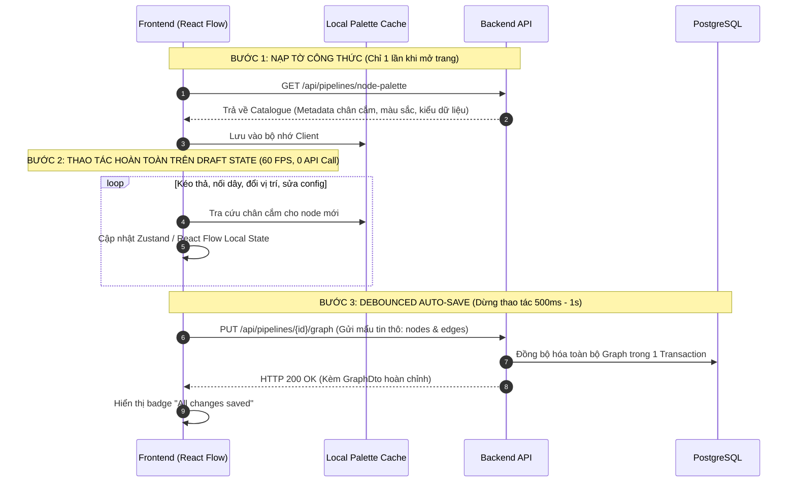
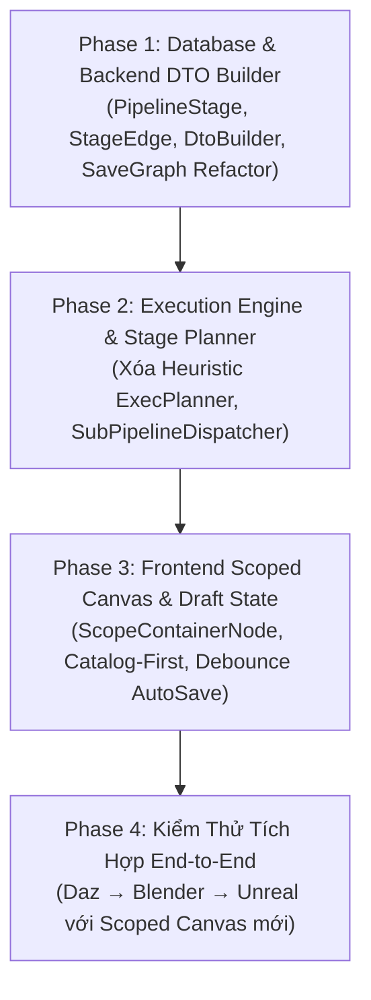

# Kế Hoạch Cải Cách Kiến Trúc: Scoped Pipeline Canvas & Modern Execution Engine

> **Tài liệu Kế hoạch Kỹ thuật Toàn diện (Technical Design & Execution Plan)**  
> **Vị trí**: `plans/backend/SCOPED_PIPELINE_CANVAS_AND_ENGINE_PLAN.md`  
> **Phiên bản**: v1.0 (2026-09-30)  
> **Mục tiêu**: Xóa bỏ thuật toán Heuristic đoán mò, khai tử cơ chế Granular API giật lag, thiết lập mô hình Đồ thị Thực thi 2 Tầng (2-Tier Execution Graph) với Scope Box và Client-side Hydration Draft Save.

---

## 1. Bối Cảnh & Các Điểm Nghẽn Cốt Lõi Cần Giải Tỏa

PoC luồng **Daz → Blender → Unreal Engine** đã chạy thành công, nhưng để đưa hệ thống lên mức độ Studio chuyên nghiệp, cần giải quyết dứt điểm 4 "gông cùm" kiến trúc sau:

| # | Điểm nghẽn hiện tại | Hậu quả thực tế | Giải pháp tái cấu trúc |
|---|---|---|---|
| **1** | **Heuristic đoán mò trong `ExecPlanner`** (Cắt segment mỗi khi đổi `step.Executor`) | Chèn 1 node Server C# vào giữa 2 node Blender $\rightarrow$ Blender bị tắt đi bật lại 2 lần, **mất sạch RAM, active scene và mesh** vừa import. | **Scoped Stages**: Đọc trực tiếp ranh giới thực thi từ Scope Box trên Canvas. Không đoán mò. |
| **2** | **Cả đồ thị chỉ gán được 1 Runner duy nhất** | Không thể cho Blender chạy máy Render GPU khủng và Unreal chạy máy Dev có Editor. | **Per-Stage Target Runner**: Mỗi Scope Box có dropdown chọn Runner riêng trên Header. |
| **3** | **Đồ thị phẳng & Spaghetti Dây Exec** | Dây exec trắng đâm xiên xẹo lộn xộn giữa các node của các phần mềm khác nhau. | **Mô hình 2 Tầng**: Dây Exec vĩ mô chỉ nối viền hộp Scope $\rightarrow$ viền hộp Scope. Cấm cắm exec xuyên Scope. |
| **4** | **Cơ chế Granular API quá lắt nhắt** (`AddNode`, `UpdatePos`, `AddEdge`...) | Di chuyển 1 node hay nối 1 dây đều bắn HTTP request $\rightarrow$ Lag mạng, khóa DB connection, canvas bị re-render giật cục. | **Draft State + Debounced Save**: Thao tác 60 FPS trên FE, tự tra "Tờ công thức" (Catalogue), chỉ lưu 1 request sau 500ms-1s. |

---

## 2. Trụ Cột 1: Mô Hình Đồ Thị Thực Thi 2 Tầng (2-Tier Execution Architecture)

Tách bạch rạch ròi giữa **Luồng Điều Khiển Tiến Trình Vĩ Mô** và **Luồng Thực Thi Nội Bộ Vi Mô**.

```
========================================================================================================================
[ TẦNG VĨ MÔ: MACRO GRAPH — TIẾN TRÌNH & ĐIỀU PHỐI ]

[START NODE]                                                                                         [RETURN NODE]
(Pipeline Inputs)                                                                                    (Pipeline Outputs)
+----------------+                                                                                   +----------------+
| START          |                                                                                   | RETURN         |
| (exec_out)═════╡══════════════════════════════════════════════════════════════════════════════════►╞(exec_in)        |
| Out: MeshPath ─┼──────────────┐                                                     ┌──────────────┼─In: FinalAsset |
+----------------+              │                                                     │              +----------------+
                                ▼                                                     │
                 +------------------------------+              +----------------------│-------+
                 | WORKER STAGE: Blender Bake   |              | WORKER STAGE: Unreal Ingest  |
                 | Target: [ Render GPU #1 ▼ ]  |              | Target: [ Dev PC #2 ▼ ]      |
                 |                              |══(exec_out)═►|                              |
                 |   [Import] ──► [Simple Bake] |  (Dây viền)  |   [Import UE] ──► [Setup Mat]|
                 |      ▲                       |              |                         │    |
                 +------│-----------------------+              +-------------------------│----+
                        │ (Dây Data Pin: MeshPath)                                       │ (Dây Data Pin: FinalAsset)
                        └────────────────────────────────────────────────────────────────┘
========================================================================================================================
[ TẦNG VI MÔ: MICRO GRAPH — CÁC BƯỚC NỘI BỘ TIẾN TRÌNH ]
```

### 2.1. Quy tắc Cắm Dây Nghiêm Ngặt (Connection Grammar)

1. **Dây EXEC (Màu trắng - Luồng chạy tuần tự):**
   - **Cấp Vĩ Mô (Inter-Scope):** Chỉ nối giữa `exec_out` ở mép viền Scope này $\rightarrow$ `exec_in` ở mép viền Scope khác (hoặc từ `Start.exec_out`, tới `Return.exec_in`).
   - **Cấp Vi Mô (Intra-Scope):** Chỉ nối giữa các Action Node **bên trong cùng một Scope** (`sourceNode.StageId == targetNode.StageId`).
   - ❌ **CẤM TUYỆT ĐỐI:** Không cho phép cắm dây Exec từ 1 node bên trong Scope này sang 1 node bên trong Scope khác. Chặn ngay tại `isValidConnection` (Frontend) và `AddPipelineEdgeHandler` (Backend).

2. **Dây DATA (Màu sắc - Luồng dữ liệu nghiệp vụ):**
   - ✅ **TỰ DO XUYÊN BIÊN GIỚI:** Cho phép kéo trực tiếp từ chân Output của bất kỳ Node nào sang chân Input của Node khác (kể cả xuyên Scope, từ `Start`, hoặc tới `Return`).
   - **Nguyên lý an toàn:** Nhờ cơ chế **Demand-Driven Lazy Pull & Memoization Cache** (`IExecutionMemoryStore`), dữ liệu của Scope trước đã được ghi nhớ hoàn tất trước khi Scope sau khởi động. Không có xung đột tiến trình hay race condition.

### 2.2. Cơ chế Tự động Nhận diện Điểm vào/ra Nội bộ (Implicit Entry & Exit)
Người dùng **không cần kéo dây thừa** từ mép trong của Scope vào Node đầu tiên:
- **Vào Scope:** Khi nhận xung tại `exec_in` ở viền trái, Engine tự tìm Action Node nào trong Scope **chưa có dây exec vào** $\rightarrow$ Kích hoạt chạy đầu tiên.
- **Thoát Scope:** Khi Action Node cuối cùng (node không có dây exec ra) hoàn thành $\rightarrow$ Scope tự động kích hoạt `exec_out` ở viền phải để truyền luồng sang Scope sau.

---

## 3. Trụ Cột 2: Phân Loại 3 Nhóm Scope Tường Minh

Không gom chung các loại tác vụ vào cùng một giỏ, chia thành 3 Scope rõ ràng:

```
┌──────────────────────────────────────────────────────────────────────────────────────────────────┐
│ 1. MACRO / ORCHESTRATOR SCOPE ("Đầu não điều phối")                                              │
│ - Môi trường: .NET Host Orchestrator.                                                            │
│ - Chứa: Các node Sub-Pipeline (gọi pipeline khác), If/Branch, ForEach, Delay.                    │
│ - Mục đích: Điều phối logic nghiệp vụ cấp cao, theo dõi cây thực thi đệ quy, hủy cascade.        │
├──────────────────────────────────────────────────────────────────────────────────────────────────┤
│ 2. SERVER SCOPE ("Xử lý in-process siêu tốc")                                                    │
│ - Môi trường: .NET Backend Process (< 1-5ms).                                                    │
│ - Chứa: Các C# Tools thuần túy (Tag Mapping, Format Path, Parse JSON, Zip/Unzip, HTTP Download). │
│ - Mục đích: Tính toán phụ trợ, chuẩn bị tham số mà không cần khởi động bất kỳ phần mềm ngoài nào.│
├──────────────────────────────────────────────────────────────────────────────────────────────────┤
│ 3. WORKER SCOPES (DCC Stages: "Phiên làm việc phần mềm nặng")                                    │
│ - Môi trường: Subprocess headless trên Runner (Blender Python, Unreal Python/Editor).            │
│ - Chứa: Toàn bộ tool chuyên biệt của DCC đó (Import, Bake, Rig, Material Setup, Render).         │
│ - Mục đích: Gom tất cả bước vào ĐÚNG 1 PHIÊN LÀM VIỆC (Single Session), bảo toàn 100% RAM/Scene. │
└──────────────────────────────────────────────────────────────────────────────────────────────────┘
```

---

## 4. Trụ Cột 3: Tích Hợp Sub-Pipeline (Pipeline-as-a-Node)

Khi một Pipeline được gọi làm một Node bên trong Pipeline khác:

1. **Vị trí chuẩn mực:**
   - Nằm bên trong **`Macro Scope`** (hoặc đứng độc lập ở tầng Vĩ Mô).
   - Tuyệt đối không nhét lọt thỏm vào trong Worker Scope của DCC khác.
2. **Khuôn đúc tự nhiên từ `Start` và `Return`:**
   - Cặp `Start` và `Return` của Pipeline con tự động biến thành giao diện chân cắm của Sub-Pipeline Node bên ngoài:
     - `Start` Inputs bên trong $\rightarrow$ Thành các chân **Data Input Pins** bên ngoài.
     - `Return` Outputs bên trong $\rightarrow$ Thành các chân **Data Output Pins** bên ngoài.
     - `Start.exec_out` $\rightarrow$ Ánh xạ tới `exec_in` bên ngoài.
     - `Return.exec_in` $\rightarrow$ Ánh xạ tới `exec_out` bên ngoài.
3. **Quản lý Cây Thực thi Đệ quy (Execution Tree Tracking):**
   - Bảng `pipeline_executions` thêm `parent_execution_id` và `triggered_by_node_id`.
   - **Cascading Kill:** Hủy Pipeline cha $\rightarrow$ Tự động ngắt toàn bộ Worker đang chạy Pipeline con.
   - **Hierarchical Live Drawer:** UI hiển thị tiến độ dạng cây thư mục (Cha $\rightarrow$ Con $\rightarrow$ Cháu).

---

## 5. Trụ Cột 4: Khai Tử Granular APIs — Client-side Hydration & Debounced Save

### 5.1. Phân tích Chi phí Thực tế (Performance Reality)
- **Backend:** Tính toán DTO từ DB + In-memory ToolRegistry cực kỳ nhẹ (**1 - 3 ms CPU**).
- **Thủ phạm gây lag:** Granular APIs (`AddNode`, `UpdatePos`...) bắt DB mở kết nối liên tục, làm nghẽn pool và khiến FE re-fetch làm chớp nháy (flicker) giao diện.
- **Frontend:** Nặng nhất ở khâu render DOM và tính toán đường cong Bezier.

### 5.2. Luồng Vận Hành 3 Bước Chuẩn Công Nghiệp (Catalog-First)



### 5.3. Payload Tối Giản của `SavePipelineGraphRequest`
Chỉ gửi những gì thực sự thay đổi, không gửi metadata thừa:
```json
{
  "stages": [
    {
      "id": "3fa85f64-5717-4562-b3fc-2c963f66afa6",
      "name": "Blender Mesh & Bake",
      "kind": "Worker",
      "executorKey": "blender",
      "targetRunnerId": "9fa85f64-5717-4562-b3fc-2c963f66afa1",
      "position": { "x": 100, "y": 200 },
      "size": { "width": 800, "height": 400 }
    }
  ],
  "stageEdges": [
    {
      "sourceStageId": "3fa85f64-5717-4562-b3fc-2c963f66afa6",
      "targetStageId": "4ba85f64-5717-4562-b3fc-2c963f66afa7"
    }
  ],
  "nodes": [
    {
      "id": "1fa85f64-5717-4562-b3fc-2c963f66afa2",
      "stageId": "3fa85f64-5717-4562-b3fc-2c963f66afa6",
      "refId": "BlenderSimpleBakeTool",
      "kind": "Tool",
      "position": { "x": 250, "y": 300 },
      "configValues": { "bakeType": "Normal", "resolution": 2048 }
    }
  ],
  "edges": [
    {
      "sourceNodeId": "1fa85f64-5717-4562-b3fc-2c963f66afa2",
      "sourcePin": "exec_out",
      "targetNodeId": "2fa85f64-5717-4562-b3fc-2c963f66afa3",
      "targetPin": "exec_in"
    }
  ]
}
```

---

## 6. Thiết Kế Cơ Sở Dữ Liệu (Database Schema)

### 6.1. Entity Mới: `PipelineStage`
```csharp
// api/src/Modules/Pipeline/Automation.Pipeline/Domain/Entities/PipelineStage.cs
public class PipelineStage : BaseEntity
{
    public Guid PipelineId { get; set; }
    public Pipeline Pipeline { get; set; } = null!;

    public string Name { get; set; } = string.Empty;
    public StageKind Kind { get; set; } = StageKind.Worker; // Worker, Server, Macro
    public string ExecutorKey { get; set; } = string.Empty; // "blender", "unreal", "server", "macro"
    public Guid? TargetRunnerId { get; set; }               // null = Auto runner

    public float PositionX { get; set; }
    public float PositionY { get; set; }
    public float Width { get; set; }
    public float Height { get; set; }

    public ICollection<PipelineNode> Nodes { get; set; } = new List<PipelineNode>();
}
```

### 6.2. Entity Mới: `PipelineStageEdge` (Luồng Exec Vĩ Mô)
```csharp
// api/src/Modules/Pipeline/Automation.Pipeline/Domain/Entities/PipelineStageEdge.cs
public class PipelineStageEdge : AuditableEntity
{
    public Guid PipelineId { get; set; }
    public Guid SourceStageId { get; set; }
    public PipelineStage SourceStage { get; set; } = null!;
    public Guid TargetStageId { get; set; }
    public PipelineStage TargetStage { get; set; } = null!;
}
```

### 6.3. Bổ sung `PipelineNode` & `PipelineExecution`
```diff
 public class PipelineNode : BaseEntity
 {
     public Guid PipelineId { get; set; }
     public string ToolKey { get; set; }
+    public Guid? StageId { get; set; }          // FK trỏ về PipelineStage
     public float PositionX { get; set; }
     public float PositionY { get; set; }
 }

 public class PipelineExecution : BaseEntity
 {
     public Guid PipelineId { get; set; }
+    public Guid? ParentExecutionId { get; set; }   // Quản lý đệ quy Sub-Pipeline
+    public Guid? TriggeredByNodeId { get; set; }   // Node kích hoạt
 }
```

---

## 7. Kế Hoạch Triển Khai Chi Tiết (Phased Roadmap)



### Phase 1: Database & Backend DTO Builder (Backend Core) — (HOÀN THÀNH 100% ✅)
- [x] **1.1.** Tạo Domain Entities: `PipelineStage`, `PipelineStageEdge`, enum `StageKind`.
- [x] **1.2.** Thêm quan hệ `StageId` vào `PipelineNode` và `ParentExecutionId` vào `PipelineExecution`.
- [x] **1.3.** Cấu hình EF Core Configurations & Viết Migration:
  - Tạo bảng `pipeline.pipeline_stages`, `pipeline.pipeline_stage_edges`.
  - Thêm cột `stage_id` vào `pipeline.pipeline_nodes`.
  - Thêm cột `parent_execution_id`, `triggered_by_node_id` vào `pipeline.pipeline_executions`.
- [x] **1.4.** Xây dựng Service `IPipelineGraphDtoBuilder`:
  - Gom toàn bộ logic hydrate metadata/pins từ `GetPipelineGraph` sang service tái sử dụng này.
- [x] **1.5.** Cải tiến Endpoint `PUT /api/pipelines/{id}/graph` (`SavePipelineGraph`):
  - Hỗ trợ lưu mẩu tin trọn gói gồm `stages`, `stageEdges`, `nodes`, `edges`.
  - Xóa bỏ các endpoint lắt nhắt: Đánh dấu obsolete / loại bỏ `AddPipelineNode`, `UpdateNodePosition`, `DeletePipelineNode`, `AddPipelineEdge`, `DeletePipelineEdge`.

### Phase 2: Engine Thực Thi Mới & Loại Bỏ Heuristic (Pipeline Engine) — (HOÀN THÀNH 100% ✅)
- [x] **2.1.** Viết lại `ExecPlanner`:
  - **Tầng 1 (Macro):** Lấy danh sách Stage theo Topological Sort dựa vào `PipelineStageEdge`.
  - **Tầng 2 (Micro):** Với mỗi Stage, duyệt chuỗi `exec` nội bộ của các node thuộc Stage đó.
  - Xóa bỏ 100% thuật toán heuristic đoán mò cắt segment theo executor cho các pipeline dùng Stage.
- [x] **2.2.** Đóng gói `StageExecutionMessage`:
  - Gắn kèm `TargetRunnerId` trực tiếp từ Stage metadata.
- [x] **2.3.** Tách riêng `SubPipelineDispatcher`:
  - Tách logic chạy Sub-Pipeline ra khỏi `DotNetSegmentDispatcher`.
  - Quản lý truyền `ParentExecutionId` và map dữ liệu 2 chiều giữa cha và con.

### Phase 3: Frontend Scoped Canvas & Draft State (Frontend UI/UX) — (HOÀN THÀNH CƠ BẢN ✅)
- [x] **3.1.** Tái cấu trúc Store Canvas (Local Draft State):
  - Chuyển toàn bộ thao tác Canvas sang cơ chế **Draft State** hoàn toàn ở client, khai tử các API CRUD rời rạc.
  - Tích hợp debounced auto-save (600ms) tự động gọi `useSavePipelineGraph()`.
  - Hiển thị trạng thái Header `Saving...` / `All changes saved` mượt mà.
- [x] **3.2.** Tạo Component `ScopeContainerNode` (React Flow Group Node):
  - Render hộp bao quanh các node con với `NodeResizer` min-width/height và bo góc hiện đại.
  - Header: Hiển thị Loại Scope (`Worker`, `Server`, `Macro`), inline rename tên Stage, dropdown chọn `Target Runner`.
  - Mép viền: Handle `exec_in` (trái) và `exec_out` (phải).
- [x] **3.3.** Ràng buộc `isValidConnection`:
  - Cấm cắm dây Exec giữa 2 node con khác Scope (chỉ cho phép trong cùng stage).
  - Cho phép cắm Exec từ Viền Scope này sang Viền Scope kia (`exec_out` -> `exec_in`).
  - Dây Data cho phép cắm tự do xuyên Scope.
- [x] **3.4.** Cập nhật `ContextMenuPalette`:
  - Lọc công cụ phù hợp với Scope mục tiêu (`Worker` -> DCC tool, `Server` -> Builtin/C#, `Macro` -> SubPipeline/FlowControl).
  - Cho phép tạo mới Stage (`Worker`, `Server`, `Macro`) khi click chuột phải trên canvas trống.

---

### Phase 3.5: Cải Cách Kiến Trúc Canvas Frontend & Trải Nghiệm Studio (Front & Back Polish) — (ĐANG THỰC HIỆN 🚀)

Nhằm giải quyết triệt để tình trạng "God Component" (> 1000 dòng code trong `PipelineCanvas.tsx`), tách biệt triệt để Logic & UI theo chuẩn React hiện đại, và tinh chỉnh trải nghiệm người dùng đạt chuẩn Studio:

#### 1. Bóc Tách Trách Nhiệm `PipelineCanvas.tsx` (Separation of Concerns)
Hiện tại `PipelineCanvas.tsx` ôm đồm 5 khối nghiệp vụ độc lập. Tách thành 5 headless hooks chuyên biệt tại `web/src/features/pipelines/components/canvas/hooks/`:
- **`usePipelineDraftState.ts`**:
  - Quản lý state `nodes`, `edges`, `onNodesChange`, `onEdgesChange`.
  - Xử lý Debounced Auto-Save (600ms) gọi `useSavePipelineGraph` trọn gói DTO.
  - Bắt các Custom Window Events (`pipeline:update-stage`, `pipeline:delete-stage`, `pipeline:update-node-config`).
  - Xử lý xóa node an toàn (`onNodesDelete` - cascade xóa node con khi xóa Stage, bảo vệ `Start` node).
- **`usePipelineLiveTracking.ts`**:
  - Quản lý kết nối SignalR (`usePipelineSignalR`) và polling fallback (`usePipelineExecution`).
  - Tự động parse `executionState` JSON và đồng bộ trạng thái thực thi (`idle` | `running` | `succeeded` | `failed`) cùng `executionError` vào React Flow nodes.
- **`useCanvasConnectionRules.ts`**:
  - `isValidConnection`: Ràng buộc 2 tầng (Inter-stage Exec chỉ nối giữa viền Scope, Intra-stage Exec chỉ trong cùng Stage, Data Pins kết nối tự do xuyên Scope).
  - `onConnect`: Thiết lập dây nối với marker mũi tên, cưỡng chế 1-to-1 cho luồng Exec.
  - Auto-Infer StructType cho node `BreakStruct` khi nối dây Data Target.
  - `onEdgeContextMenu`: Xóa dây nối tức thì bằng chuột phải.
- **`useVariableDropHandler.ts`**:
  - Quản lý sự kiện kéo thả biến từ Blackboard (`VariablePanel`) vào Canvas (`onDragOver`, `onDrop`).
  - Phím tắt Unreal Blueprint: Giữ `Ctrl` thả ra `GetVariable`, giữ `Alt` thả ra `SetVariable`, thả tự do mở menu popover `VariableDropMenu`.
- **`useCanvasContextMenu.ts`**:
  - Tọa độ hóa màn hình $\rightarrow$ Flow coordinates (`screenToFlowPosition`).
  - Hình học phát hiện va chạm (Hit-testing) để xác định con trỏ đang nằm trong Stage container nào.
  - Quản lý đóng/mở Palette và Spawn node / Stage mới.
- **Kết quả mục tiêu**: `PipelineCanvas.tsx` tinh gọn còn **~120 dòng code**, chỉ làm nhiệm vụ kết nối hooks và render Layout Shell.

#### 2. Nâng Cấp Scoped Node Palette với Backend Query Param (`executorKey`)
- **Backend API (`GetNodePalette.cs`)**:
  - Bổ sung tham số truy vấn: `GetNodePaletteQuery(Guid? ProjectId = null, string? Executor = null, string? Category = null)`.
  - Hỗ trợ lọc trực tiếp từ server theo `Executor` (ví dụ `executor=blender`, `executor=unreal`, `executor=builtin`).
- **Frontend Hook (`useNodePalette`) & Palette Popover**:
  - `useNodePalette(projectId, targetStage?.executorKey)`.
  - Khi chuột phải trên Root Canvas: Không cho add tool rời rạc, chỉ hiển thị danh sách tạo Stage (`Worker`, `Core Services`, `Macro`).
  - Khi chuột phải trong Stage: Chỉ hiển thị các tool tương thích với executor của Stage đó, hỗ trợ tìm kiếm nhanh không gây quá tải visual.

#### 3. Cơ Chế Tự Động Mở Rộng Khung Stage (Auto-Expanding Stage Bounding Box)
- Khi thêm một tool mới hoặc kéo thả một node bên trong Stage (`onNodeDragStop`):
  - Thuật toán tính toán biên tự động:
    $$\text{requiredWidth} = \max(\text{currentWidth}, \text{nodePositionX} + \text{nodeWidth} + \text{paddingX})$$
    $$\text{requiredHeight} = \max(\text{currentHeight}, \text{nodePositionY} + \text{nodeHeight} + \text{paddingY})$$
  - Nếu tọa độ của node tiến sát hoặc vượt ra ngoài mép viền, kích thước Stage tự động co giãn êm ái, bảo đảm các node con luôn nằm gọn gàng bên trong và không đè lên các handle `exec_in`/`exec_out`.

#### 4. Chuẩn Hóa Nhận Diện Thương Hiệu DCC (`dccEngines.ts`) Trên Stage
- Tận dụng `getSoftwareMetadata(executorKey)` từ `web/src/features/runners/constants/dccEngines.ts`:
  - Render Logo chính hãng (CDN SimpleIcons hoặc inline SVG như Daz Studio) trên Header của `ScopeContainerNode`.
  - Tự động áp dụng `brandColor` chính thức (Blender `#F5792A`, Unreal `#0E1128`, Python `#3776AB`, Daz `#00B4D8`, Maya `#0696D7`, v.v.) làm viền, header tint và ambient glow.

#### 5. Loại Bỏ Triệt Để Jargon Kỹ Thuật (.NET / C# In-Process) Khỏi Giao Diện
- Chuẩn hóa ngôn ngữ hướng người dùng (User/Workflow-Centric) thay vì phô diễn công nghệ nền tảng:
  - `Server (.NET)` $\rightarrow$ **`Core Services`** hoặc **`System Stage`**.
  - `SERVER STAGE • IN-PROCESS .NET TOOLS` $\rightarrow$ **`CORE SERVICES • SYSTEM & DATA PROCESSING`**.
  - `...across Python, Blender, and .NET tools` $\rightarrow$ **`...across Blender, Unreal, and background automation tasks`**.
  - Custom Pipeline Node executor: Hiển thị thân thiện `System / Core` thay vì `.NET`.

---

### Phase 4: Kiểm Thử Toàn Diện & Nghiệm Thu
- [ ] Kiểm tra tính toàn vẹn dữ liệu: Graph cũ chưa có Stage tự động gom vào Default Server Scope.
- [ ] Chạy luồng tích hợp: Daz prep (Core Services) $\rightarrow$ SimpleBake (Blender Scope trên máy Render) $\rightarrow$ Ingestion (Unreal Scope trên máy Dev).
- [ ] Kiểm tra Sub-Pipeline: Gọi 1 pipeline con từ `Macro Scope`, xác nhận việc truyền tham số và hủy luồng hoạt động chuẩn xác.
- [ ] Kiểm tra FPS Canvas: Đạt chuẩn 60 FPS khi di chuyển hàng chục node cùng lúc ở chế độ Draft sau khi tách hooks.

---

## 8. Kết Luận
Bản kế hoạch này giải quyết toàn diện từ **mô hình hình học trên Canvas**, **trải nghiệm người dùng 60 FPS**, cho tới **thuật toán thực thi chính xác tuyệt đối trong Backend Engine**. Sau khi hoàn tất, Automation Studio sẽ sở hữu một hệ thống Pipeline đồ thị tương đương với các chuẩn mực công nghiệp hàng đầu như Unreal Engine Blueprints hay Houdini Subnets.

