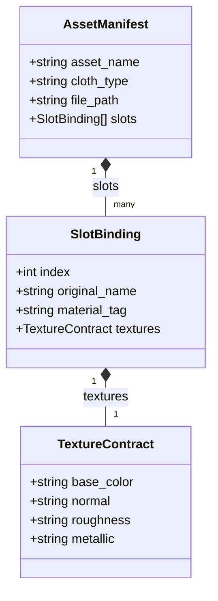

# Kiến Trúc Hệ Thống Struct & Mở Rộng Dynamic Forms (Scale-Ready Architecture Plan)

> **Tài liệu Kế hoạch & Thiết kế Kiến trúc (Draft)**  
> **Mục tiêu**: Đưa Struct thành công dân hạng nhất (First-Class Citizen) trong hệ sinh thái, đặt tại `Automation.DynamicForms` làm hạt nhân Schema trung tâm, phục vụ đa hình cho cả **Content (CMS Forms)** lẫn **Pipeline (Visual Scripting Canvas)** với khả năng lồng nhau vô hạn (Nested Structs) và cơ chế nạp phụ thuộc tối ưu $O(1)$ batch query.

---

## 1. Mở đầu & Khẳng định Tầm nhìn

Qua quá trình phát triển và trải nghiệm thực tế trên Visual Scripting, chúng ta nhận ra 3 "điểm nghẽn" lớn nếu tiếp tục dùng các giải pháp chắp vá (`FormKeyValue`, `Values: Map<string, string>`):
1. **Content Forms bị gò bó**: Chỉ có các trường phẳng nguyên thủy (text, number, select, file). Khi cần một nhóm trường cấu trúc (vd: danh sách `Skills`, thông tin `MaterialBinding`), phải dùng bảng key-value tự gõ tay không có schema, không có validation.
2. **Pipeline Canvas thiếu Typed Pins**: Không thể truyền các object phức tạp qua 1 sợi dây. Node `BreakContentItem` chỉ nhả ra 1 chân `Values` gom chung, bắt người dùng phải đoán key và dùng node phụ để bóc tách.
3. **Thiếu khả năng lồng nhau (Nesting)**: Trong thực tế thế giới đồ họa 3D/Game, dữ liệu **bắt buộc phải phân cấp** (vd: `AssetManifest` chứa danh sách `Slots`, mỗi `Slot` chứa `TextureMap`). Không có Struct lồng nhau thì không thể mô hình hóa được pipeline Unreal hay Blender.

**Giải pháp cốt lõi**: Đặt Struct tại **`Automation.DynamicForms`** và biến module này thành **Universal Dynamic Schema Engine** của toàn bộ giải pháp.

---

## 2. Giải mã Module `Automation.DynamicForms` Hiện tại

Để đảm bảo việc mở rộng Struct không phá vỡ hay xung đột với kiến trúc hiện có, chúng ta cùng nhìn lại toàn bộ bức tranh của `DynamicForms`:

### 2.1. Kiến trúc Backend hiện hữu
- **`SchemaDefinition`** (`Domain/Entities/SchemaDefinition.cs`):
  - Sở hữu cơ chế đa hình cực mạnh thông qua cặp `OwnerType` và `OwnerId`.
  - Hiện tại: `OwnerType = "ContentType"`, `OwnerId = ContentType.Id`.
- **`SchemaVersion`** (`Domain/Entities/SchemaVersion.cs`):
  - Quản lý phiên bản (`Version`), trạng thái (`IsActive`), và danh sách trường lưu trong `Fields` (`JsonDocument`).
- **`SchemaData`** (`Domain/Entities/SchemaData.cs`):
  - Lưu trữ dữ liệu thực tế (`Values: JsonDocument`) theo `ClientId` và `ClientType` (hiện tại là `ContentItem`).
- **`DynamicFormEngine`** (`Services/DynamicFormEngine.cs`):
  - `ValidateValues`: Kiểm tra tính hợp lệ của dữ liệu theo `Fields`.
  - `NormalizeValues`: Tự động migrate dữ liệu cũ khi schema thay đổi version.
  - `LinkFileFieldsAsync`: Tự động bóc tách các trường `file-upload` và gọi `IAssetApi` để liên kết file trong module Files.
  - `ResolveDataAsync`: Nạp metadata và URL của file khi trả về dữ liệu.
- **`ISchemaApi`** (`Contracts/ISchemaApi.cs`):
  - Cổng giao tiếp duy nhất giữa các module ngoài (`Content`, `Pipeline`) với `DynamicForms`.

### 2.2. Kiến trúc Frontend hiện hữu
- **`field-registry.ts`**: Hệ thống đăng ký linh hoạt cho phép bất kỳ component nào khai báo kiểu trường (Field Type) và tự động tích hợp vào Form.
- **`FormRenderer.tsx`**: Đọc mảng `FieldDefinition[]` để render ra giao diện người dùng.
- **`BuilderConfigRenderer.tsx`**: Nền tảng của Form Builder để cấu hình thuộc tính của từng trường.

---

## 3. Kiến Trúc Mở Rộng: Struct trong `DynamicForms`

### 3.1. Phân loại Schema trong `DynamicForms`
Thay vì chỉ phục vụ Form nhập liệu cho `ContentType`, `SchemaDefinition` sẽ hỗ trợ 2 vai trò song song:

```
                          ┌─────────────────────────────┐
                          │      SchemaDefinition       │
                          │                             │
                          │  - OwnerType: string        │
                          │  - OwnerId: string          │
                          │  - Name: string             │
                          └──────────────┬──────────────┘
                                         │
                 ┌───────────────────────┴───────────────────────┐
                 ▼                                               ▼
    [ Content Form Schema ]                             [ Project Struct ]
  - OwnerType = "ContentType"                         - OwnerType = "ProjectStruct"
  - OwnerId = ContentTypeId                           - OwnerId = ProjectId
  - Mục đích: Form cho ContentItem                    - Mục đích: DTO / Wire Contract
```

### 3.2. Cấu trúc Field Schema hỗ trợ Struct & Nested Structs
Một trường (Field) trong `SchemaVersion.Fields` sẽ được bổ sung hỗ trợ kiểu `struct`. Để bảo toàn cấu trúc chuẩn của `FieldDefinition` (không làm ô nhiễm root schema của 90% các field thông thường khác và giữ cho FormBuilder tự động map cấu hình), **`cardinality` được đóng gói hoàn toàn bên trong `properties`**:

```json
{
  "name": "slots",
  "label": "Material Slots",
  "type": "struct",
  "properties": {
    "structId": "0192e212-0000-7000-8000-000000000010",
    "structName": "SlotBinding",
    "cardinality": "array",
    "required": true
  }
}
```

- **`properties.cardinality: "single"`**: Đại diện cho 1 Struct con duy nhất (vd: `Transform`, `Metadata`).
- **`properties.cardinality: "array"`**: Danh sách các Struct con (vd: `slots: SlotBinding[]`, `skills: Skill[]`).
- **`properties.cardinality: "map"`**: Từ điển Struct con có key động (vd: `objects: Record<string, ObjectManifest>`).
- Khi tích hợp với Pipeline Canvas, adapter `pinToFieldDefinition.ts` sẽ tự động ánh xạ giữa `PinCardinality` và `properties.cardinality`.

---

## 4. Cơ Chế Tối Ưu: Tổng Hợp Phụ Thuộc (Transitive Dependency Closure) & $O(1)$ Query

Khi một Struct A chứa Struct B, Struct B lại chứa Struct C (Nested Structs):
Nếu không có cơ chế quản lý phụ thuộc, hệ thống sẽ gặp vấn đề **N+1 Query / Waterfall Roundtrips** nghiêm trọng (Backend phải đọc A $\rightarrow$ query B $\rightarrow$ query C... hoặc Frontend phải bắn hàng loạt API con để render từng form).

### 4.1. Giải pháp: Precomputed Dependency Manifest trên `SchemaVersion`
Thêm trường `DependencySchemaIds` (`List<Guid>`) vào entity `SchemaVersion`:

```csharp
public class SchemaVersion : BaseEntity
{
    public Guid SchemaDefinitionId { get; set; }
    public JsonDocument Fields { get; set; } = null!;
    public int Version { get; set; }
    public bool IsActive { get; set; }

    // Danh sách phẳng chứa toàn bộ SchemaDefinitionId phụ thuộc (Direct + Transitive)
    // Map thành cột jsonb trong PostgreSQL: ["guid-1", "guid-2"]
    public List<Guid> DependencySchemaIds { get; set; } = [];
}
```

### 4.2. Nguyên lý hoạt động Save-time vs. Query-time

| Thời điểm | Thao tác thực hiện | Lợi ích đạt được |
| :--- | :--- | :--- |
| **Save-time (Upsert Schema)** | 1. Trích xuất direct struct IDs từ `Fields`.<br>2. **Fail-Fast Cycle Detection**: Dùng DFS/Topological check xem có vòng lặp (A $\rightarrow$ B $\rightarrow$ A) không; nếu có thì chặn ngay lập tức.<br>3. Tổng hợp Transitive Closure: $\text{Direct} \cup \text{Child.Dependencies}$.<br>4. Lưu danh sách phẳng `DependencySchemaIds` vào `SchemaVersion`. | Chặn đứng lỗi đệ quy vô tận trước khi vào DB. Tính toán 1 lần duy nhất lúc tạo/sửa. |
| **Query-time (Nạp Form / Canvas / Engine)** | 1. Query lấy Struct chính A.<br>2. Lấy `depIds = A.ActiveVersion.DependencySchemaIds`.<br>3. Thực thi đúng **1 query batch duy nhất**: `WHERE Id IN (depIds)`.<br>4. Đóng gói Struct A kèm từ điển `dependencies: Dictionary<Guid, SchemaDefinitionDto>`. | **Triệt tiêu N+1 queries** ($O(1)$ roundtrip duy nhất bất kể độ sâu lồng nhau). Tối ưu Multi-Get cho Cache. |
| **Delete-time (Xóa Struct an toàn)** | Kiểm tra xem có `SchemaVersion` nào đang chứa ID của Struct muốn xóa trong `DependencySchemaIds` không. | Đảm bảo **Referential Integrity** (Tính toàn vẹn tham chiếu), ngăn người dùng vô tình xóa Struct con khi đang có Struct cha sử dụng. |

---

## 5. Khả Năng Scale: Đệ Quy (Recursive) & Lồng Nhau Vô Hạn

Một trong những yêu cầu sống còn là **Struct lồng Struct**. Hãy xem xét cấu trúc thực tế của `AssetManifest`:



### 5.1. Kiến Trúc Plug-in / Registry Cho Form Engine (Học Tập Từ Pipeline Engine)

Hiện tại, `DynamicFormEngine.cs` đang rơi vào tình trạng **"dồn cục" (Monolithic / God Class)**:
- File dài 340 dòng nhưng có tới **hơn 200 dòng code private helpers phục vụ riêng cho duy nhất một loại trường `file-upload`** (`ExtractAssetUpserts`, `ExtractAssetIdStrings`, `ResolveAssetDtosForField`...).
- Engine bị ép phải inject trực tiếp `IAssetApi` của module Files và hardcode `if (fieldType != SchemaType.File) continue;`.
- Nếu tiếp tục nhồi nhét logic đệ quy của `Struct` vào đây, `DynamicFormEngine` sẽ phình to lên 600-800 dòng, vi phạm nghiêm trọng nguyên lý Đóng/Mở (Open-Closed Principle) và gây nguy cơ Circular Dependency.

**Giải pháp**: Học theo kiến trúc Registry thành công của Pipeline và Frontend (`field-registry.ts`), tái cấu trúc Engine theo mô hình **Field Processors Registry Pattern**:

```
                               ┌────────────────────────┐
                               │   DynamicFormEngine    │
                               │   (Coordinator ~80L)   │
                               └───────────┬────────────┘
                                           │
                    Tự động nạp qua DI: IEnumerable<IFieldTypeProcessor>
                                           │
         ┌─────────────────────────────────┼─────────────────────────────────┐
         ▼                                 ▼                                 ▼
┌──────────────────┐             ┌──────────────────┐             ┌──────────────────┐
│FileFieldProcessor│             │StructFieldProcess│             │DefaultFieldProces│
│ (type: "file")   │             │ (type: "struct") │             │ (text, num, ...) │
├──────────────────┤             ├──────────────────┤             ├──────────────────┤
│- Tự inject       │             │- Đệ quy validate │             │- Validate min/max│
│  IAssetApi       │             │- Đệ quy link file│             │- Check required  │
│- Link files      │             │- Đệ quy resolve  │             │- Migrate default │
│- "Bơm" AssetDtos │             │  dữ liệu         │             │                  │
└──────────────────┘             └──────────────────┘             └──────────────────┘
```

#### Định nghĩa Interface chuẩn: `IFieldTypeProcessor`
```csharp
public interface IFieldTypeProcessor
{
    string FieldType { get; }
    Result Validate(FieldDefinition field, JsonElement value, FieldValidationContext ctx);
    JsonNode? Normalize(FieldDefinition field, JsonElement? rawValue);
    Task<Result> BeforeSaveAsync(FieldDefinition field, JsonElement value, FieldSaveContext ctx, CancellationToken ct);
    Task<JsonNode?> ResolveAsync(FieldDefinition field, JsonElement value, FieldResolveContext ctx, CancellationToken ct);
}
```

* **`FileFieldProcessor`**: Đóng gói toàn bộ 200 dòng code thao tác với `IAssetApi` và module Files.
* **`StructFieldProcessor`**: Đóng gói toàn bộ logic đệ quy duyệt qua các trường con của Struct (dựa trên `properties.structId` và `properties.cardinality`).
* **`DefaultFieldProcessor`**: Đóng gói các kiểm tra cơ bản (required, pattern, min/max).
* **`DynamicFormEngine`**: Trở thành một **Điều phối viên (Coordinator) siêu gọn nhẹ (~60-80 dòng)**, chỉ việc lặp qua schema và ủy quyền cho Processor tương ứng.

### 5.2. Xử lý trong Frontend (`FormRenderer` & `FormStruct`)
- Tạo Form Control mới: `FormStruct.tsx` và `FormStructArray.tsx`.
- Khi render `FormStruct`:
   - Component đọc schema của struct con trực tiếp từ từ điển `dependencies` (đã được nạp trọn gói từ Backend, không phát sinh thêm HTTP request).
   - Tự động nhúng một `<FormRenderer />` con bên trong chính nó (Recursive Component Pattern).
   - Hỗ trợ Accordion / Collapse để giao diện gọn gàng, người dùng có thể đóng mở từng struct con.

---

## 6. Tác Động & Bước Đột Phá Cho Content Module & Pipeline Canvas

### 6.1. Content CMS
- Người dùng tạo Struct `CharacterSkill` (gồm Tên, Sát thương, Cooldown, Icon).
- Thêm trường `skills` vào Content Type `HeroCharacter` (Type: `Struct`, Cardinality: `Array`).
- **Giao diện**: Nhập liệu ContentItem hiển thị một danh sách động thẻ kỹ năng tuyệt đẹp, validate từng trường, upload icon mượt mà.

### 6.2. Pipeline Canvas (Visual Scripting)
- **Node `BreakContentItemTool`**: Nở ra các chân cắm có kiểu (Typed Pins), ví dụ chân `Skills: Array<Struct: CharacterSkill>`.
- **Node `BreakStructTool` & `MakeStructTool`**: Cho phép bóc tách hoặc đóng gói bất kỳ Struct động nào đã tạo trong Project thành các chân Input/Output trực quan.
- **Node `ResolveAssetManifestTool`**: Xuất ra đúng `Map<string, Struct: AssetManifest>` gửi thẳng cho Worker (Unreal/Blender) mà không cần map thủ công rườm rà.

---

## 7. Lộ Trình Triển Khai Theo Từng Phase (Chia Nhỏ & Dễ Nghiệm Thu)

Để tránh dồn ứ khối lượng công việc quá lớn và đảm bảo kiểm soát chất lượng chặt chẽ, kế hoạch được chia thành **6 Phase độc lập, ngắn gọn và có thể nghiệm thu ngay sau mỗi phase**:

```
┌────────────────────────────────────────────────────────────────────────┐
│ Phase 1: Database Migration & Dependency Indexing Model                │
└───────────────────────────────────┬────────────────────────────────────┘
                                    │
┌───────────────────────────────────▼────────────────────────────────────┐
│ Phase 2: Refactor Form Engine sang Registry Pattern (Field Processors) │
└───────────────────────────────────┬────────────────────────────────────┘
                                    │
┌───────────────────────────────────▼────────────────────────────────────┐
│ Phase 3: Single-Batch Query & Struct CRUD APIs (Backend Contracts)     │
└───────────────────────────────────┬────────────────────────────────────┘
                                    │
┌───────────────────────────────────▼────────────────────────────────────┐
│ Phase 4: Frontend Struct Management (UI Quản Lý Data Models)           │
└───────────────────────────────────┬────────────────────────────────────┘
                                    │
┌───────────────────────────────────▼────────────────────────────────────┐
│ Phase 5: Frontend FormRenderer cho Nested Structs (Content CMS)        │
└───────────────────────────────────┬────────────────────────────────────┘
                                    │
┌───────────────────────────────────▼────────────────────────────────────┐
│ Phase 6: Visual Scripting Canvas Integration (Pipeline Module)         │
└────────────────────────────────────────────────────────────────────────┘
```

---

### Phase 1: Database Migration & Dependency Indexing Model
*Mục tiêu: Hoàn tất cấu trúc dữ liệu nền tảng trên database và các helper thuật toán đồ thị, sẵn sàng trước khi sửa code nghiệp vụ.*

- [ ] **1.1. Cập nhật Entity & Migration:**
  - Thêm thuộc tính `public List<Guid> DependencySchemaIds { get; set; } = [];` vào `SchemaVersion`.
  - Cấu hình EF Core lưu dạng `jsonb` trong `DynamicFormsDbContext`.
  - Tạo và chạy migration cho module `DynamicForms` (`AddDependencySchemaIdsToSchemaVersion`).
- [ ] **1.2. Thuật toán Đồ Thị Phụ Thuộc (DAG Helpers):**
  - Viết helper `ExtractStructDependencies(JsonDocument fields)`: Scan `properties.structId` để lấy danh sách direct struct IDs.
  - Viết thuật toán `DetectCircularDependency`: Kiểm tra chu trình đồ thị có hướng (DAG Check) chống đệ quy vô tận.
  - Viết hàm `ComputeTransitiveDependenciesAsync`: Hợp nhất danh sách phụ thuộc thành Transitive Closure phẳng.
- [ ] **Nghiệm thu Phase 1:** Migration chạy thành công vào PostgreSQL; Unit test thuật toán DAG check và trích xuất dependency chạy xanh 100%.

---

### Phase 2: Refactor Form Engine sang Registry Pattern (Field Processors)
*Mục tiêu: Dọn sạch nợ kỹ thuật của `DynamicFormEngine.cs`, chuyển sang kiến trúc Registry có interface và nạp các Processors độc lập.*

- [ ] **2.1. Thiết kế Core Abstractions:**
  - Định nghĩa interface `IFieldTypeProcessor` trong `Services/Processors/`.
  - Định nghĩa các context models (`FieldValidationContext`, `FieldSaveContext`, `FieldResolveContext`).
- [ ] **2.2. Tách và Đóng gói Processors:**
  - **`FileFieldProcessor`**: Di chuyển toàn bộ 200 dòng code liên quan đến `IAssetApi` (LinkFile, ResolveAsset) ra khỏi engine.
  - **`DefaultFieldProcessor`**: Xử lý validation cơ bản (required, min, max) cho các field nguyên thủy.
  - **`StructFieldProcessor`**: Xử lý đệ quy cho Struct (validate đệ quy, link files lồng nhau, resolve dữ liệu lồng nhau theo `properties.cardinality`).
- [ ] **2.3. Tinh gọn `DynamicFormEngine`:**
  - Inject `IEnumerable<IFieldTypeProcessor>`, chuyển `DynamicFormEngine` thành Coordinator thuần túy (~60-80 dòng).
  - Tự động đăng ký tất cả Processors qua DI trong `DynamicFormsModule.cs`.
- [ ] **Nghiệm thu Phase 2:** Chạy lại toàn bộ test hiện có của DynamicForms và Content module để đảm bảo chức năng upload/link file và validate cũ hoạt động nguyên vẹn (Zero Regressions), code sạch đẹp không còn "dồn cục".

---

### Phase 3: Single-Batch Query & Struct CRUD APIs (Backend Contracts)
*Mục tiêu: Cung cấp đầy đủ API CRUD cho Project Struct và hoàn thiện cơ chế nạp 1 batch duy nhất.*

- [x] **3.1. Đăng ký Schema Type & Mở rộng `ISchemaApi`:**
  - Thêm `SchemaType.Struct = "struct"` và `OwnerType.ProjectStruct = "ProjectStruct"`.
  - Đăng ký `OwnerType = "ProjectStruct"` trong `DynamicFormsModule.cs`.
  - Bổ sung các phương thức vào `ISchemaApi`:
    - `GetActiveVersionWithDependenciesAsync(Guid schemaId)`: Nạp Struct gốc + toàn bộ Struct con phụ thuộc chỉ bằng **1 batch query duy nhất**: `WHERE Id IN (schemaId, ...depIds)`.
    - `CanDeleteSchemaAsync(Guid schemaId)`: Kiểm tra xem Struct có đang được Struct khác hoặc ContentType khác tham chiếu không.
    - `GetReferencingSchemasAsync(Guid schemaId)`: Trả về danh sách chi tiết các schema đang phụ thuộc.
- [x] **3.2. Xây dựng CRUD Feature Slices cho Struct:**
  - Tạo Endpoint Group `StructsGroup` (prefix: `projects/{projectId:guid}/structs`).
  - Slice `GetProjectStructs`: Lấy danh sách struct trong project (hỗ trợ tìm kiếm theo từ khóa).
  - Slice `GetStructById`: Lấy chi tiết struct kèm dictionary dependencies.
  - Slice `CreateStruct`: Tạo struct mới, tính toán và lưu `DependencySchemaIds`.
  - Slice `UpdateStruct`: Cập nhật schema, kiểm tra cycle qua DAG check, cập nhật lại `DependencySchemaIds`.
  - Slice `DeleteStruct`: Kiểm tra ràng buộc qua `CanDeleteSchemaAsync` trước khi xóa mềm.
- [x] **Nghiệm thu Phase 3:** Cập nhật EF migration `UpdateSchemaDefinitionUniqueIndex` cho index unique `(OwnerId, OwnerType, Name)`. Viết bộ kiểm thử 20 unit tests trong `Automation.DynamicForms.Tests` bao gồm test SingleBatchQuery nạp 3 cấp lồng nhau, Cycle Detection, và Referential Integrity kiểm chứng toàn diện. 100% Passed.

---

### Phase 4: Frontend Struct Management (UI Quản Lý Data Models)
*Mục tiêu: Người dùng có giao diện để xem, tạo, sửa các Structs trong Project như Data Models.*

- [x] **4.1. Sinh mã API Client & Custom Hook:**
  - Chỉnh sửa `Endpoints => [.. DiscoveredTypes.All];` trong `DynamicFormsModule.cs` giúp FastEndpoints quét trọn vẹn assembly module.
  - Chạy `pnpm run gen:api` sinh mã TypeScript client trong `src/gen/endpoints/structs/structs.ts` và models liên quan.
  - Viết custom hook `src/features/structs/hooks/useStructs.ts` tuân thủ nghiêm ngặt `createMutationHook`, bọc `useGetProjectStructs`, `useGetStructById`, `useCreateStruct`, `useUpdateStruct`, `useDeleteStruct`, tự động invalidate TanStack Query cache.
- [x] **4.2. Màn hình Quản lý Structs trong Project:**
  - Tạo trang `StructsPage` (`src/features/structs/StructsPage.tsx`) hiển thị danh sách Structs dạng thẻ trực quan (Card Grid) kèm thanh tìm kiếm, số lượng fields, số lượng dependencies.
  - Dialog tạo nhanh Struct: `CreateStructDialog.tsx` sử dụng `BaseFormDialog`, Zod schema, tự động chuyển hướng sang Schema Designer sau khi tạo.
  - Dialog xóa an toàn: `DeleteStructDialog.tsx` kế thừa `ConfirmDialog`, kiểm tra lỗi ràng buộc Referential Integrity nếu struct đang được struct khác tham chiếu.
  - Đăng ký toàn bộ dialogs vào `GlobalDialogRegistry` tại `src/features/structs/dialogs/index.ts`.
  - Cấu hình route TanStack Router: `/projects/$projectId/structs`, `/projects/$projectId/structs/$structId/builder`.
  - Bổ sung menu điều hướng "Structs" với icon `Boxes` trên thanh sidebar của Project (`ProjectSidebar.tsx`).
- [x] **4.3. Nâng cấp FormBuilder:**
  - Tạo Dynamic Form Control `FormStructField.tsx` (`field-registry.ts` type: `"struct"`), hiển thị badge cấu hình Struct trong Canvas Form.
  - Cấu hình `builderFields`:
    - `structId`: Dynamic resolver lọc danh sách Structs trong Project (loại trừ chính `currentStructId` để ngăn ngừa tự tham chiếu).
    - `cardinality`: Lựa chọn kiểu dữ liệu `single` (Đơn), `array` (Danh sách), `map` (Bảng tra cứu).
    - Dữ liệu lưu trọn vẹn vào `field.properties` (`structId`, `structName`, `cardinality`), giữ nguyên root schema `FieldDefinition`.
  - Tích hợp `StructSchemaBuilderPage.tsx` và nâng cấp `ContentTypeSchemaBuilderPage.tsx` truyền context `{ projectId, structs }` xuống `FormBuilder`.
- [x] **Nghiệm thu Phase 4:** Toàn bộ hệ thống Frontend biên dịch sạch sẽ (`pnpm tsc --project tsconfig.app.json --noEmit` đạt 0 lỗi), routing và dialogs hoạt động đồng bộ với Backend API.

---

### Phase 5: Frontend FormRenderer cho Nested Structs (Content CMS)
*Mục tiêu: Đưa Struct vào Content Type và render Form nhập liệu lồng nhau tự động cho ContentItem.*

- [x] **5.1. Xây dựng Form Controls mới:**
  - `FormStructSingle.tsx`: Render 1 struct con dạng Collapsible Card, bên trong nhúng đệ quy `<FormRenderer />` sử dụng schema từ từ điển `dependencies` kèm tiền tố `${name}.*`.
  - `FormStructArray.tsx`: Render danh sách động các struct items bằng `useFieldArray`, hỗ trợ Thêm, Xóa, Thu gọn/Mở rộng.
  - `FormStructMap.tsx`: Render từ điển Key-Value động với Value là sub-form Struct.
  - `FormStructField.tsx`: Bộ điều phối runtime/builder đăng ký type `"struct"` trong `field-registry.ts`.
- [x] **5.2. Tích hợp vào Content Type Builder:**
  - Admin khi thiết kế Content Type (như `HeroCharacter`) được chọn thêm các trường kiểu Struct từ Project với 3 Cardinality: `single`, `array`, `map`.
- [x] **5.3. Render Form ContentItem & Đệ quy Zod Validation:**
  - `ContentTypeDto` & `GetContentTypeHandler`: Nạp toàn bộ dependencies transitive trong 1 query duy nhất qua `GetActiveVersionWithDependenciesAsync`.
  - `buildDynamicSchema`: Đệ quy xây dựng Zod Object/Array/Record validation từ `dependencies` dictionary.
  - `ContentItemForm.tsx`: Bọc `StructDependenciesProvider`, tự động nạp initial defaults cho Struct fields và lưu chuẩn xác vào `SchemaData`.
- [x] **Nghiệm thu Phase 5:** Toàn bộ hệ thống Frontend biên dịch TypeScript sạch sẽ (`pnpm tsc -b` đạt 0 lỗi), render lồng nhau không giới hạn cấp, quản lý danh sách động và form validation hoạt động type-safe.

---

### Phase 6: Visual Scripting Canvas Integration (Pipeline Module)
*Mục tiêu: Bộc lộ toàn bộ sức mạnh của Struct ra Pipeline Canvas với Typed Pins và các Tool bóc tách chuyên dụng.*

- [x] **6.1. Nạp Dynamic Structs vào Pipeline Engine:**
  - `DynamicEntityStructDefinition.cs`: Cầu nối ánh xạ `FieldDefinition` sang các `PinDefinition` có kiểu (`String`, `Number`, `Boolean`, `Path`, `EntityRef`).
  - Mở rộng `IEntityStructRegistry` & `EntityStructRegistry`: Bổ sung cơ chế nạp các Struct động từ `ISchemaApi` (`OwnerType = "ProjectStruct"`) theo `ProjectId` kèm bộ nhớ đệm luồng (ConcurrentDictionary cache).
  - Cập nhật `IPinResolutionContext` chứa `ProjectId`, truyền trực tiếp từ `GetPipelineGraphHandler` và `AddPipelineNodeHandler`.
- [x] **6.2. Nâng cấp Bộ Tool Struct:**
  - `MakeStructTool.cs`: Tool đóng gói dữ liệu đa hình, tự động nở ra các chân **Inputs** theo schema của Struct $\rightarrow$ xuất ra 1 chân **Output** `Result` (Struct Object).
  - `BreakStructTool.cs`: Nâng cấp bóc tách đa hình, hỗ trợ unpack cả Static Structs lẫn bất kỳ Project Dynamic Structs nào thành các chân **Outputs** chi tiết.
- [x] **6.3. Tích hợp Frontend Canvas & Node Inspector:**
  - `NodeConfigInspector.tsx`: Nạp danh sách Project Structs qua `useGetProjectStructs(projectId)` vào Dropdown `StructType` cho cả `BreakStruct` và `MakeStruct`.
  - `PipelineCanvas.tsx`: Tự động nhận diện (auto-infer) Struct Type khi nối dây vào chân `Target` của `BreakStruct` qua `sourcePin.metadata`.
- [x] **Nghiệm thu Phase 6:** 
  - Toàn bộ 44 tests của Pipeline (`DynamicStructToolsTests` gồm test MakeStruct, BreakStruct, và RoundTrip Pack/Unpack) đạt 100% Passed.
  - Frontend TypeScript check (`pnpm tsc -b`) đạt 0 lỗi. Toàn bộ 6 Phase của kiến trúc Nested Structs hoàn tất thành công!

---

## 8. Kết Luận
Việc bổ sung cơ chế **Transitive Dependency Closure ($O(1)$ batch query)**, **Field Processors Registry Pattern** cùng việc chia nhỏ thành **6 Phase tinh gọn** giúp dự án:
1. **Kiểm soát rủi ro tối đa**: Tách bạch rõ ràng giữa sửa DB $\rightarrow$ Refactor Engine $\rightarrow$ Viết API $\rightarrow$ Làm UI $\rightarrow$ Tích hợp Canvas.
2. **Loại bỏ nợ kỹ thuật**: `DynamicFormEngine` trở nên siêu gọn nhẹ, dễ bảo trì, dễ mở rộng mà không có nguy cơ xung đột vòng lặp.
3. **Hiệu năng vượt trội**: Loại bỏ hoàn toàn mối lo về N+1 query và lag UI khi struct lồng nhau phức tạp.
4. **Mở rộng bền vững**: Sẵn sàng đáp ứng mọi nhu cầu phức tạp từ Headless CMS cho đến Visual Automation Pipeline cho 3D/Game Engine.
