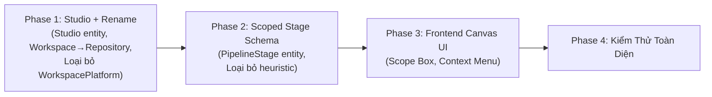

# Kế Hoạch Cải Cách Kiến Trúc: Studio Layer, Repository Rename & Scoped Pipeline Canvas

> **Tài liệu Kế hoạch & Thiết kế Kiến trúc (Revised Plan)**
> **Vị trí**: `plans/backend/STUDIO_WORKSPACE_AND_SCOPED_PIPELINE_PLAN.md`
> **Phiên bản**: v2 (2026-09-24) — Sửa đổi sau phân tích chống over-engineering
> **Nguyên tắc xuyên suốt**: Pragmatic-first — chỉ thay đổi những gì mang lại giá trị thực, không xây infrastructure cho viễn cảnh chưa đến.

---

## 1. Bối Cảnh & Các Vấn Đề Thực Sự Cần Giải Quyết

Hệ thống đã chứng minh thành công luồng **Daz → Blender → Unreal Engine (PoC)**. Database đã backup. Đây là thời điểm vàng để cải thiện nền móng trước khi tiến xa hơn.

### 1.1. Các vấn đề THỰC SỰ (đã gây đau khi chạy PoC):

| #   | Vấn đề                                                           | Ảnh hưởng                                                       | Thuộc về        |
| --- | ---------------------------------------------------------------- | --------------------------------------------------------------- | --------------- |
| 1   | Pipeline không biết chạy trên máy (Agent) nào một cách tự nhiên  | Phải chọn Agent bằng dropdown cưỡng ép khi bấm Run              | Pipeline Engine |
| 2   | Canvas phẳng lì — không phân biệt đâu là Server, Blender, Unreal | Người dùng mất phương hướng khi nhìn vào đồ thị                 | Frontend Canvas |
| 3   | Engine tự đoán mò Stage bằng heuristic                           | Chèn 1 node server giữa 2 node Blender → gãy Stage ngoài ý muốn | Pipeline Engine |
| 4   | Menu chuột phải xổ ra 50-70 tools, không phân loại               | UX quá tải, khó tìm tool cần dùng                               | Frontend Canvas |

### 1.2. Các vấn đề ĐẶT TÊN / TỔ CHỨC (technical debt nhẹ, nên sửa khi hệ thống còn trẻ):

| #   | Vấn đề                                                                                                                                            | Giải pháp                                                                       |
| --- | ------------------------------------------------------------------------------------------------------------------------------------------------- | ------------------------------------------------------------------------------- |
| 5   | Thiếu khái niệm "Studio" (Root Tenant) — Agent lơ lửng không thuộc về ai                                                                          | Thêm entity `Studio` nhẹ nhàng                                                  |
| 6   | Tên "Workspace" gây nhầm lẫn với SaaS workspace, bản chất nó là kho tài nguyên (repo)                                                             | Đổi tên entity → `Repository`                                                   |
| 7   | `WorkspacePlatform` (gán Workspace vào Platform) không phản ánh thực tế — người ta chia repo theo **loại file** quản lý, không phải theo platform | Loại bỏ `WorkspacePlatform`, để `ResourceItem` tự mang thông tin file extension |

### 1.3. Các ý tưởng ĐÃ CÂN NHẮC VÀ QUYẾT ĐỊNH CHƯA LÀM:

Những hạng mục dưới đây đã được phân tích kỹ và kết luận là **over-engineering ở thời điểm hiện tại**. Ghi nhận lại để thực hiện khi cần.

| Ý tưởng                                                    | Lý do chưa làm                                                                                                                                         |
| ---------------------------------------------------------- | ------------------------------------------------------------------------------------------------------------------------------------------------------ |
| Đổi tên module `Automation.Projects` → `Automation.Studio` | Tốn công (rename assembly, namespace, DB schema, frontend regen) mà không tạo tính năng mới. Module Projects chứa thêm Studio entity là đủ.            |
| Multi-tenancy: `StudioId` ở mọi bảng + Global Query Filter | Hệ thống hiện chỉ có 1 studio. Thêm cột vào ~15 bảng + xây middleware + sửa toàn bộ query = 1-2 tuần cho zero user value. Khi cần, thêm incrementally. |
| `StudioMember` thay thế `ProjectMember`                    | Chưa xây StudioMember → không thể bỏ ProjectMember. Giữ ProjectMember nguyên trạng, đánh giá lại khi mở rộng team.                                     |
| Gộp module `Agent` vào `Studio`/`Projects`                 | Agent có gRPC streaming, heartbeat tần suất cao, command tracking — khác biệt kỹ thuật quá lớn so với CRUD. Giữ riêng.                                 |

---

## 2. Trụ Cột 1: Thêm Studio Layer (Nhẹ Nhàng, Không Đảo Lộn)

### 2.1. Entity `Studio` — Thêm vào module `Automation.Projects`

```csharp
// api/src/Modules/Projects/Automation.Projects/Domain/Entities/Studio.cs
public class Studio : BaseEntity
{
    public string Name { get; set; } = string.Empty;
    public string Slug { get; set; } = string.Empty;     // URL-friendly: "limito-studio"
    public string? Description { get; set; }

    public Studio() { }
    public Studio(string name, string slug, string? description = null)
    {
        Name = name;
        Slug = slug;
        Description = description;
    }
}
```

- **Project** thêm FK `StudioId`:

```diff
 public class Project : BaseEntity
 {
+    public Guid StudioId { get; set; }
     public string Name { get; set; } = string.Empty;
     public Guid OwnerId { get; set; } = Guid.Empty;    // Giữ nguyên, là UserId của người tạo
 }
```

- **Migration**: Tạo bảng `projects.studios`, seed 1 row mặc định (`Default Studio`), gán `StudioId` cho toàn bộ Project hiện có.

### 2.2. `StudioRunner` — Runner kết nối vào Studio (Many-to-Many)

Một máy vật lý (Runner) có thể phục vụ **nhiều Studio** cùng lúc (freelancer, shared render farm). Do đó KHÔNG đặt `StudioId` FK trực tiếp trên `Runner`, mà dùng junction table.

```csharp
// api/src/Modules/Projects/Automation.Projects/Domain/Entities/StudioRunner.cs
public class StudioRunner : AuditableEntity
{
    public Guid StudioId { get; set; }
    public Guid RunnerId { get; set; }
    public string? Alias { get; set; }         // Tên hiển thị trong Studio: "Render Machine #3"
    public bool IsApproved { get; set; }       // Studio Admin duyệt máy

    public StudioRunner() { }
    public StudioRunner(Guid studioId, Guid runnerId, string? alias = null)
    {
        StudioId = studioId;
        RunnerId = runnerId;
        Alias = alias;
        IsApproved = false;
    }
}
```

**Luồng vận hành:**

1. Runner daemon cài trên máy → tạo `Runner` record (thông tin phần cứng).
2. Người dùng nhập mã mời Studio → tạo `StudioRunner` record liên kết máy vào Studio.
3. Cùng máy, nhập mã Studio khác → thêm 1 `StudioRunner` record nữa.
4. Pipeline chạy: _"Pipeline thuộc Project thuộc Studio X → tìm Runner có `StudioRunner` với Studio X và đang Online"_.

### 2.3. Phân cấp tổ chức sau Phase 1

```
Studio (Limito Studio)
├── Compute Pool: [Runner 1 (via StudioRunner), Runner 2 (via StudioRunner)]
└── Projects:
    ├── Project Laura
    │   ├── Repositories (ex-Workspaces): [Daz Source, Blender Work, Unreal Game]
    │   ├── Pipelines: [Daz→Blender→UE Ingestion]
    │   ├── Tags: [Asset.Character.Hero, ...]
    │   └── ProjectMembers: [User A (Lead), User B (Member)]
    └── Project B
        └── ...
```

---

## 3. Trụ Cột 2: Đổi Tên `Workspace` → `Repository`

### 3.1. Lý do & Nguyên tắc

**Tại sao đổi?**

- "Workspace" trong SaaS (Notion, Slack, Figma) = Không gian tổ chức (Root Tenant). Gây nhầm lẫn khi hệ thống có cả Studio lẫn Workspace.
- Bản chất thực sự: **Kho tài nguyên độc lập** — giống một Git repo chứa một tập hợp files cùng ngữ cảnh.
- "Repository" phản ánh chính xác: mỗi repo là một đơn vị quản lý tài nguyên, có thể chứa `.duf`, `.blend`, `.fbx`, `.uasset`...

**Quy tắc đổi tên:**

- CHỈ đổi tên **entity** (`Workspace` → `Repository`), KHÔNG đổi tên module (`Automation.Workspace` giữ nguyên).
- Đổi tên entity liên quan: `WorkspaceAgent` → `RepositoryAgent`.

### 3.2. Loại bỏ `WorkspacePlatform` — Repository KHÔNG gán Platform

**Vấn đề hiện tại:**

- `WorkspacePlatform` liên kết Workspace ↔ Platform, ngụ ý "Workspace này dành cho Blender".
- Thực tế: người ta chia repo theo **loại tài nguyên quản lý** (file Daz, file Blender, meshes FBX), không phải theo platform DCC.
- Một repo hoàn toàn có thể chứa cả file `.blend` VÀ `.fbx` (Blender export ra FBX).

**Giải pháp:**

- **Loại bỏ** entity `WorkspacePlatform` và các API liên quan (`AddPlatform`, `RemovePlatform` trên Workspace entity).
- **Repository** schema tối giản: `Id`, `ProjectId`, `Name`, `Description` — đơn giản, sạch sẽ.
- Thông tin file type đã nằm trên `ResourceItem.PlatformExtensionId` (mỗi resource biết mình là `.duf`, `.blend`, `.fbx`...).
- Platform (`Automation.Platform`) giữ vai trò **global system**: liệt kê DCC nào được hệ thống hỗ trợ, quản lý file extension registry, và cấu hình executor trên Runner.

**Deferred Feature — File Type Filtering trên Repository:**

Việc "ràng buộc loại file nào được phép đưa vào repo" là một tính năng có giá trị, nhưng chưa cần ở giai đoạn này. Lý do defer:

1. **Workflow thực tế**: Một "Blender Repo" thường chứa cả `.blend` (source) + `.fbx` (export) + `.png` (baked texture) — whitelist cứng sẽ gây friction liên tục.
2. **Vấn đề chưa thực sự xảy ra**: Với team nhỏ và vài repo, không ai nhầm lẫn upload file sai chỗ.
3. **Dễ thêm sau**: Chỉ cần thêm 1 cột nullable vào bảng `repositories`, không phá vỡ gì.

Khi cần triển khai, đây là cách làm:

```csharp
// Thêm vào Repository entity khi feature này được prioritize:
public List<string>? AllowedExtensions { get; set; }
// null = không ràng buộc (mặc định)
// ["duf", "duf.gz"] = chỉ nhận file Daz
// ["blend", "fbx", "png"] = nhận file Blender + output của nó
```

Migration khi đó: `ALTER TABLE workspace.repositories ADD COLUMN allowed_extensions jsonb NULL;`

### 3.3. Bảng ánh xạ đổi tên chi tiết

| Entity / Property cũ                       | Entity / Property mới                       | Ghi chú                      |
| ------------------------------------------ | ------------------------------------------- | ---------------------------- |
| `Workspace`                                | `Repository`                                | Đổi class name               |
| `Workspace.ProjectId`                      | `Repository.ProjectId`                      | Giữ nguyên                   |
| `Workspace.Name`                           | `Repository.Name`                           | Giữ nguyên                   |
| `Workspace.Resources`                      | `Repository.Resources`                      | Giữ nguyên                   |
| `Workspace.WorkspaceAgents`                | `Repository.RepositoryRunners`               | Đổi tên                      |
| `Workspace.WorkspacePlatforms`             | ❌ **Loại bỏ**                               | Không cần                    |
| `Workspace.AddPlatform()`                  | ❌ **Loại bỏ**                               | Không cần                    |
| `Workspace.RemovePlatform()`               | ❌ **Loại bỏ**                               | Không cần                    |
| `WorkspaceAgent`                           | `RepositoryRunner`                           | Đổi class name               |
| `WorkspaceAgent.WorkspaceId`               | `RepositoryRunner.RepositoryId`              | Đổi FK name                  |
| `WorkspaceAgent.AgentId`                   | `RepositoryRunner.RunnerId`                  | Đổi FK name                  |
| `WorkspaceAgent.RootPath`                  | `RepositoryRunner.RootPath`                  | Giữ nguyên                   |
| `WorkspacePlatform`                        | ❌ **Loại bỏ**                               | Entity và bảng DB            |
| `ResourceItem.WorkspaceId`                 | `ResourceItem.RepositoryId`                  | Đổi FK name                  |
| `ResourceVersionLocation.WorkspaceAgentId` | `ResourceVersionLocation.RepositoryRunnerId` | Đổi FK name                  |
| DB schema `workspace.workspaces`           | `workspace.repositories`                     | Rename table trong migration |
| DB schema `workspace.workspace_agents`     | `workspace.repository_runners`               | Rename table trong migration |
| DB schema `workspace.workspace_platforms`  | ❌ **Drop table**                            | Migration drop               |

### 3.4. Entity `Repository` sau khi refactor

```csharp
// api/src/Modules/Workspace/Automation.Workspace/Domain/Entities/Repository.cs
public class Repository : BaseEntity
{
    public Guid ProjectId { get; set; }
    public string Name { get; set; } = string.Empty;
    public string? Description { get; set; }

    public ICollection<ResourceItem> Resources { get; set; } = new List<ResourceItem>();
    public ICollection<RepositoryRunner> RepositoryRunners { get; set; } = new List<RepositoryRunner>();

    public Repository() { }
    public Repository(Guid projectId, string name, string? description = null)
    {
        ProjectId = projectId;
        Name = name;
        Description = description;
    }

    public void Update(string name, string? description = null)
    {
        Name = name;
        Description = description;
    }
}
```

```csharp
// api/src/Modules/Workspace/Automation.Workspace/Domain/Entities/RepositoryRunner.cs
public class RepositoryRunner : AuditableEntity
{
    public Guid RepositoryId { get; set; }
    public Repository Repository { get; set; } = null!;
    public Guid RunnerId { get; set; }
    public string RootPath { get; set; } = string.Empty;

    public ICollection<ResourceVersionLocation> Locations { get; set; } = new List<ResourceVersionLocation>();

    public RepositoryRunner() { }
    public RepositoryRunner(Guid repositoryId, Guid runnerId, string rootPath)
    {
        RepositoryId = repositoryId;
        RunnerId = runnerId;
        RootPath = rootPath;
    }

    public void UpdateRootPath(string rootPath)
    {
        RootPath = rootPath;
    }
}
```

---

## 4. Trụ Cột 3: Scoped Pipeline Canvas (Giá Trị Cao Nhất)

Đây là thay đổi kiến trúc **mang lại đột phá lớn nhất cho sản phẩm**. Các trụ cột 1 & 2 là dọn nền (naming, organization), trụ cột này là tạo giá trị.

### 4.1. Mô hình Scope Box trên Canvas

Thay vì một đồ thị phẳng, Canvas được nâng cấp với **Scope Box (Vùng thực thi tường minh)**, lấy cảm hứng từ Comment Box (UE5) và Network Box (Houdini):

```
+-------------------------------------------------------------------------+
|  SCOPE: Server (C# Backend Resolver)                                   |
|                                                                         |
|    [ Build Tag Map from Resource ] ──────────┐                          |
+----------------------------------------------│--------------------------+
                                               │ (Data Pin: ObjectsMap)
+----------------------------------------------│--------------------------+
|  STAGE: Blender Mesh & Bake                  │ Target: [ Agent 1 ▼ ]    |
|                                              ▼                          |
|    [ Import Asset ] ──(exec)──> [ Simple Bake ] ──(exec)──> [ Export ]  |
|                                                                         |
+-------------------------------------------------------------------------+
                                               │ (Data Pin: BakedTextures)
+----------------------------------------------│--------------------------+
|  STAGE: Unreal Material Ingestion            │ Target: [ Agent 1 ▼ ]    |
|                                              ▼                          |
|    [ Resolve Manifest ] ──────> [ Setup Asset Materials ]               |
+-------------------------------------------------------------------------+
```

### 4.2. Lợi ích

1. **Ranh giới thực thi tường minh**: Tất cả step trong hộp `Blender Stage` chạy trong **CÙNG MỘT tiến trình Blender** (giữ RAM, giữ scene). Backend đọc trực tiếp Stage từ đồ thị → **loại bỏ hoàn toàn thuật toán heuristic đoán mò**.
2. **Scoped Palette Menu**: Chuột phải trong `Blender Stage` → chỉ hiện tool Blender. Chuột phải trong `Unreal Stage` → chỉ hiện tool Unreal. Vùng trống → tool Server/Math.
3. **Data Flow xuyên biên giới**: Dây dữ liệu kéo tự do giữa các Scope.
4. **Target Agent Selector**: Mỗi DCC Stage có dropdown chọn Agent trên thanh tiêu đề.

### 4.3. Thay đổi Pipeline Graph Schema (Backend)

```diff
 // PipelineNode cần bổ sung metadata về Stage
 public class PipelineNode : BaseEntity
 {
     public Guid PipelineId { get; set; }
     public string ToolKey { get; set; }
+    public Guid? StageId { get; set; }          // null = Server Scope
     public float PositionX { get; set; }
     public float PositionY { get; set; }
     // ...
 }

+// Entity mới: PipelineStage
+public class PipelineStage : BaseEntity
+{
+    public Guid PipelineId { get; set; }
+    public string Name { get; set; }             // "Blender Mesh & Bake"
+    public string ExecutorKey { get; set; }       // "blender", "unreal"
+    public Guid? TargetAgentId { get; set; }      // null = Auto (chọn Agent khả dụng)
+    public float PositionX { get; set; }
+    public float PositionY { get; set; }
+    public float Width { get; set; }
+    public float Height { get; set; }
+}
```

### 4.4. Đơn giản hóa Stage Planner (Backend)

```
[ Hiện tại — Heuristic đoán mò ]
Engine duyệt graph → gặp 2 node cùng executor nối nhau → "có lẽ cùng Stage" → UNRELIABLE

[ Sau khi refactor — Đọc trực tiếp ]
Engine đọc danh sách PipelineStage → mỗi Stage chứa N nodes → đóng gói StageExecutionMessage → gửi Worker
```

---

## 5. Trụ Cột 4: Loại Bỏ Magic Hacks & Chuẩn Hóa Đường Dẫn

Quy tắc đã được PoC chứng minh, chuẩn hóa lại cho rõ ràng:

1. **Mọi dữ liệu Asset trong Pipeline sử dụng `RelativePath`** (đường dẫn tương đối chuẩn hóa).
2. **Khi bước vào Agent nào, Runner lấy `RootPath`** từ `RepositoryAgent` (ex-WorkspaceAgent) của chính máy đó:
   $$\text{Absolute Path} = \text{RepositoryAgent.RootPath} + \text{ResourceItem.RelativePath}$$
3. **Không bao giờ nhét `fullPath` ngầm** vào DTO từ phía Backend.

---

## 6. Lộ Trình Triển Khai (Phased Roadmap)



### Phase 1: Studio Layer + Rename Workspace → Repository

**Backend Tasks:**

- [ ] **1.1.** Tạo entity `Studio` trong `Automation.Projects/Domain/Entities/`
- [ ] **1.2.** Thêm `StudioId` FK vào entity `Project`
- [ ] **1.3.** Tạo entity `StudioRunner` trong `Automation.Projects/Domain/Entities/` (đổi tên entity `Agent` → `Runner` trong module `Automation.Agent`)
- [ ] **1.4.** Đổi tên entity `Workspace` → `Repository` (class, properties, all references)
- [ ] **1.5.** Đổi tên entity `WorkspaceAgent` → `RepositoryRunner` (class, properties, all references)
- [ ] **1.6.** Loại bỏ entity `WorkspacePlatform` và method `AddPlatform()` / `RemovePlatform()` trên Repository
- [ ] **1.7.** Cập nhật tất cả Feature handlers, DTOs, Endpoints (find & replace)
- [ ] **1.8.** Cập nhật EF Configurations, rename FK columns
- [ ] **1.9.** Viết Migration:
  - Tạo bảng `projects.studios`, seed row mặc định
  - Thêm cột `studio_id` vào `projects.projects`, gán giá trị mặc định
  - Tạo bảng `projects.studio_runners`
  - Rename table `agent.agents` → `agent.runners`
  - Rename table `workspace.workspaces` → `workspace.repositories`
  - Rename table `workspace.workspace_agents` → `workspace.repository_runners`
  - Drop table `workspace.workspace_platforms`
  - Rename FK columns (`workspace_id` → `repository_id`, `agent_id` → `runner_id`, v.v.)
- [ ] **1.10.** Regenerate frontend API client (Orval)
- [ ] **1.11.** Cập nhật frontend components: Workspace → Repository, Agent → Runner (naming)

**Ước tính**: 2-3 ngày (phần lớn là find & replace + migration)

### Phase 2: Scoped Stage Schema (Backend Pipeline Engine)

- [ ] **2.1.** Tạo entity `PipelineStage` (Name, ExecutorKey, TargetRunnerId, vị trí/kích thước trên canvas)
- [ ] **2.2.** Thêm `StageId?` FK vào `PipelineNode`
- [ ] **2.3.** Cập nhật Pipeline CRUD để lưu/đọc Stage metadata
- [ ] **2.4.** Viết Stage Planner mới: đọc trực tiếp Stage từ graph thay vì heuristic
- [ ] **2.5.** Cập nhật `StageExecutionMessage` để mang theo `TargetRunnerId` từ Stage
- [ ] **2.6.** Migration: tạo bảng `pipeline.pipeline_stages`, thêm cột `stage_id` vào `pipeline.pipeline_nodes`

**Ước tính**: 3-5 ngày

### Phase 3: Frontend Scoped Canvas UI

- [ ] **3.1.** Tạo `ScopeContainerNode` (React Flow): hộp bao quanh, header hiển thị executor + dropdown Runner
- [ ] **3.2.** Scoped Palette Menu: lọc tool theo executor khi chuột phải trong Stage box
- [ ] **3.3.** Header navigation: `[ Studio: Limito ▼ ] / [ Project: Laura ▼ ]`
- [ ] **3.4.** Cập nhật API hooks cho Repository (ex-Workspace), Runner (ex-Agent)

**Ước tính**: 3-5 ngày

### Phase 4: Kiểm Thử & Nghiệm Thu

- [ ] Chạy build backend .NET (tsc, dotnet build)
- [ ] Chạy lại luồng Daz → SimpleBake → Unreal Ingestion trên cấu trúc mới
- [ ] Verify dữ liệu PoC hiện có vẫn hoạt động sau migration

---

## 7. Tóm Tắt Quyết Định Kiến Trúc

| Quyết định                             | Chi tiết                                                 | Trạng thái       |
| -------------------------------------- | -------------------------------------------------------- | ---------------- |
| Thêm entity `Studio`                        | Vào module `Projects`, nhẹ nhàng, seed 1 row              | ✅ Làm (Phase 1) |
| Đổi tên `Agent` → `Runner`                  | Entity rename trong module `Automation.Agent`             | ✅ Làm (Phase 1) |
| `StudioRunner` (Many-to-Many)               | Runner kết nối nhiều Studio, junction table               | ✅ Làm (Phase 1) |
| Đổi tên `Workspace` → `Repository`          | Entity rename, không đổi module                           | ✅ Làm (Phase 1) |
| Đổi tên `WorkspaceAgent` → `RepositoryRunner` | Đổi theo cả 2 rename trên                               | ✅ Làm (Phase 1) |
| Loại bỏ `WorkspacePlatform`                 | Repo không gán platform, resource tự mang file extension  | ✅ Làm (Phase 1) |
| Giữ `ProjectMember`                         | Không có gì thay thế hiện tại, hoạt động ổn               | ✅ Giữ nguyên    |
| Giữ module name `Automation.Projects`       | Tốn công đổi mà không có giá trị                          | ✅ Giữ nguyên    |
| Giữ module name `Automation.Agent`          | Entity bên trong đổi (Agent→Runner), module giữ nguyên   | ✅ Giữ nguyên    |
| Giữ module name `Automation.Workspace`      | Entity bên trong đổi (Workspace→Repository), module giữ  | ✅ Giữ nguyên    |
| Multi-tenancy (`StudioId` mọi bảng)         | Over-engineering cho 1 studio                             | ❌ Chưa làm      |
| `StudioMember`                              | Chưa cần, dùng ProjectMember hiện có                      | ❌ Chưa làm      |
| Scoped Pipeline Stages                      | Giá trị cao nhất, giải quyết vấn đề thực                  | ✅ Làm (Phase 2) |

---

## Phụ Lục: Ví Dụ Thực Tế Sau Refactor

### A. Cấu trúc Repository của Project Laura

```
Project Laura
├── Repository "Daz Source Library"
│   ├── ResourceItem: "Genesis9_Laura.duf" (PlatformExtensionId → .duf)
│   ├── ResourceItem: "LauraHair_V2.duf" (PlatformExtensionId → .duf)
│   └── RepositoryRunners:
│       ├── Runner 1 (Máy Dev) → RootPath: "C:\DAZ 3D\My Library"
│       └── Runner 2 (Máy Render) → (không mount, máy render không cần Daz)
│
├── Repository "Blender Staging & Bake"
│   ├── ResourceItem: "Laura_BaseMesh.blend" (.blend)
│   ├── ResourceItem: "Laura_BakedBody.fbx" (.fbx)
│   ├── ResourceItem: "Laura_Body_BaseColor.png" (.png)
│   └── RepositoryRunners:
│       ├── Runner 1 → RootPath: "D:\Work\Laura_Blend"
│       └── Runner 2 → RootPath: "D:\RenderFarm\BakeCache"
│
└── Repository "Unreal Game Client"
    ├── ResourceItem: "SK_Laura.uasset" (.uasset)
    ├── ResourceItem: "MI_Laura_Body.uasset" (.uasset)
    └── RepositoryRunners:
        ├── Runner 1 → RootPath: "E:\UnrealProjects\LauraGame"
        └── Runner 2 → RootPath: "D:\Perforce\LauraGame"
```

### B. Pipeline xuyên Repository

```
Pipeline "Daz → Blender Bake → Unreal Ingestion"
│
├── [Server Scope] Build Tag Map from Resources
│   → Đọc metadata từ Repository "Daz Source Library"
│   → Output: ObjectsMap (data pin)
│
├── [Blender Stage] Target: Runner 1
│   → Import từ Daz (RelativePath) → ghép với RepositoryRunner.RootPath của Repo "Daz Source"
│   → SimpleBake → Export thành phẩm
│   → Output: BakedTextures (data pin)
│
└── [Unreal Stage] Target: Runner 1
    → Đọc thành phẩm → ghép với RepositoryRunner.RootPath của Repo "Unreal Game Client"
    → Setup Materials trong Unreal
```
