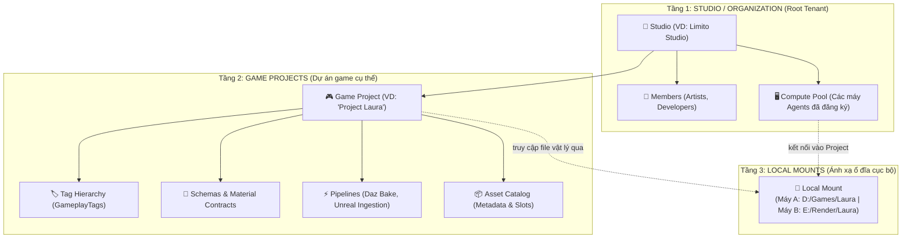
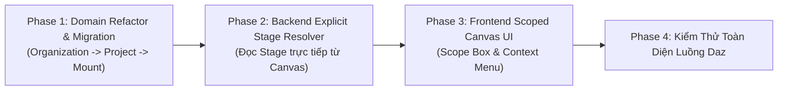

# Kế Hoạch Cải Cách Kiến Trúc: Studio Phân Tầng, Compute Pool & Scoped Pipeline Canvas

> **Tài liệu Kế hoạch & Thiết kế Kiến trúc (Master Architectural Plan)**  
> **Vị trí**: `plans/backend/draft/STUDIO_WORKSPACE_AND_SCOPED_PIPELINE_PLAN.md`  
> **Mục tiêu**:
> 1. Hóa giải sự xung đột ngữ nghĩa (Semantic Collision) của từ "Workspace": Tái cấu trúc chuẩn theo 3 tầng công nghiệp: **Studio (Organization) $\rightarrow$ Game Project $\rightarrow$ Compute Pool & Local Mounts**.
> 2. Đưa Agent từ vị trí "cô lập ở nấc 1 cá nhân" trở thành **Compute Resource (Tài nguyên tính toán)** chung của Studio.
> 3. Nâng cấp Pipeline Canvas từ đồ thị phẳng (Flat Graph) sang **Mô hình Phân vùng thực thi tường minh (Scoped Stages / Execution Locality)**, giải quyết triệt để vấn đề "Engine phải đoán mò Stage" và menu chuột phải bị quá tải (Context Overload).
> 4. Chuẩn hóa luồng truyền dữ liệu (Data Flow crossing scopes) và loại bỏ hoàn toàn các cơ chế ngầm (Magic behavior / Implicit hacks).

---

## 1. Bối Cảnh & Nguyên Nhân Gốc Rễ Của Sự "Khập Khiễng"

Hệ thống vừa chứng minh thành công luồng xử lý tự động từ **Daz $\rightarrow$ Blender $\rightarrow$ Unreal Engine (PoC)**. Tuy nhiên, khi nhìn lại tổng thể để chuẩn bị scale lên, chúng ta nhận thấy rõ 4 rào cản kiến trúc:

```
[ Hiện Tại - Sự Lệch Tầng Cọc Cạch ]
System Level ─────────────> Agent (Máy vật lý lơ lửng ở ngoài)
     │
     ▼
  Projects ───────────────> Pipeline (Thuộc về Project, nhưng không thấy Agent)
     │
     ▼
 Workspaces ──────────────> Resources (Assets) & WorkspaceAgent (Nơi duy nhất giữ RootPath)
```

1. **Xung đột ngữ nghĩa chữ "Workspace" (SaaS vs Game Dev):**
   - Trong SaaS (Notion, Linear, Figma): *Workspace* = Studio / Organization (Root Tenant).
   - Trong Game Dev (Perforce Helix Core): *Workspace* = Thư mục làm việc cục bộ trên ổ đĩa của 1 máy (Client Workspace).
   - Việc đặt `Workspace` nằm dưới `Project` trong database hiện tại là chuẩn theo Perforce, nhưng lại khiến UX bị gượng gạo khi người dùng muốn có một "Không gian làm việc chung của cả Studio".
2. **Pipeline nằm ở `Project`, nhưng Agent lại nằm ở `Workspace`:**
   - Khi đứng trong Pipeline Canvas, Pipeline không thể biết mình sẽ chạy trên máy nào một cách tự nhiên. Người dùng phải chọn Agent bằng một dropdown cưỡng ép khi bấm Run.
3. **Ảo ảnh phẳng trên Canvas (Flat Graph Illusion):**
   - Node C# Server (`BuildTagMap`), Node Blender (`SimpleBake`), và Node Unreal (`SetupMaterials`) nằm phẳng lì cạnh nhau.
   - Người dùng không biết node nào chạy trên server, node nào chạy trên máy cá nhân, node nào chia sẻ RAM với nhau.
4. **Engine tự đoán mò Stage (Implicit Heuristic Grouping):**
   - Hiện tại Backend phải tự duyệt đồ thị: nếu thấy 2 node cùng executor `Blender` nối nhau thì tự gom thành 1 Stage để giữ RAM. Nếu người dùng vô tình chèn 1 node Server ở giữa $\rightarrow$ gãy Stage, Blender bị tắt đi bật lại 2 lần ngoài ý muốn.
5. **Menu chuột phải ô hợp (Context Overload):**
   - Chuột phải mở menu thì 50-70 công cụ xổ ra: tool toán học, tool server, script blender, script unreal... không hề có ngữ cảnh phân loại.

---

## 2. Trụ Cột 1: Tái Cấu Trúc Domain Model Phân Tầng

Mô hình mới giải quyết trọn vẹn sự phân cấp, mô phỏng chính xác cách một Studio Game ngoài đời vận hành:



### 2.1. Chi tiết các thực thể mới

#### 1. `Organization` (Studio - Root Tenant):
* Đại diện cho Studio hoặc Đội ngũ (ví dụ: `Limito Studio`).
* **Sở hữu:** Danh sách thành viên và **Toàn bộ Compute Pool (Agents)**.
* Khi cài worker daemon trên máy nào, máy đó đăng ký vào Studio. Studio hiển thị danh sách: *Máy Workstation (RTX 3080), Máy Render phụ (RTX 4090), trạng thái Online/Offline*.

#### 2. `Project` (Game Project):
* Đại diện cho một tựa game cụ thể.
* Thuộc về 1 `Organization`.
* **Sở hữu toàn bộ tài sản trí tuệ (IP) của game:**
  * Bộ thẻ GameplayTags (Tag Hierarchy).
  * Hợp đồng vật liệu (Material Contracts) & Schemas.
  * Các luồng Pipeline tự động hóa.
  * Danh mục Asset Catalog.

#### 3. `ProjectMount` (Đổi tên từ `Workspace` cũ):
* Đại diện cho sự kết nối giữa **Một Máy (Agent)** và **Một Dự án (Project)**.
* Chứa thuộc tính cốt lõi: `RootPath` (`D:\Games\Projects\MyGame`).
* Khi Agent A chạy một pipeline của Project X, Worker sẽ lấy `RootPath` từ `ProjectMount` của chính máy A để tìm file.

---

## 3. Trụ Cột 2: Scoped Pipeline Canvas (Visual Execution Locality)

Thay vì một đồ thị phẳng lì, Canvas được nâng cấp theo mô hình **Scope Box (Vùng thực thi tường minh)**, lấy cảm hứng từ Comment Box của Unreal Engine và Network Box của Houdini.

```
+-------------------------------------------------------------------------+
|  SCOPE: Server (C# Backend Resolver)                                   |
|                                                                         |
|    [ Build Tag Map from Resource ] ──────────┐                          |
+----------------------------------------------│--------------------------+
                                               │ (Data Pin: ObjectsMap)
+----------------------------------------------│--------------------------+
|  STAGE: Blender Mesh & Bake                  │ Target: [ Agent 1 ▼ ]    |
|                                              ▼                          |
|    [ Import Asset ] ──(exec)──> [ Simple Bake ] ──(exec)──> [ Export ]  |
|                                                                         |
+-------------------------------------------------------------------------+
                                               │ (Data Pin: BakedTextures)
+----------------------------------------------│--------------------------+
|  STAGE: Unreal Material Ingestion            │ Target: [ Agent 1 ▼ ]    |
|                                              ▼                          |
|    [ Resolve Manifest ] ──────> [ Setup Asset Materials ]               |
+-------------------------------------------------------------------------+
```

### 3.1. Các đặc tính vượt trội của Scoped Canvas:

1. **Ranh giới thực thi tường minh (Explicit Stage Boundary):**
   - Hộp Stage định nghĩa rõ: Tất cả các step bên trong hộp `Blender Stage` sẽ được chạy tuần tự **trong CÙNG MỘT tiến trình Blender** (giữ RAM, giữ scene, không bị reload).
   - Backend **không cần dùng thuật toán đoán mò heuristic nữa**! Đọc trực tiếp danh sách step trong Stage $\rightarrow$ đóng gói thành 1 `StageExecutionMessage` gửi tới Worker.
2. **Scoped Palette Menu (Menu chuột phải thông minh):**
   - Click chuột phải **bên trong** hộp `Blender Stage` $\rightarrow$ Menu CHỈ hiển thị các thao tác Blender (`Import`, `Bake`, `Clean Orphan`, `Export`).
   - Click chuột phải **bên trong** hộp `Unreal Stage` $\rightarrow$ Menu CHỈ hiển thị các thao tác Unreal (`Setup Materials`, `Build DataTable`...).
   - Click chuột phải ở **vùng trống (Server Scope)** $\rightarrow$ Menu hiển thị các công cụ xử lý dữ liệu (`BuildTagMap`, `MergeMaps`, `Math.Add`...).
3. **Data Crossing Boundaries (Dây dữ liệu xuyên biên giới):**
   - Các dây Data Flow (màu xanh/vàng/tím) hoàn toàn có thể kéo xuyên qua ranh giới giữa các Scope.
   - Ví dụ: Pin `ObjectsMap` từ Server Scope nối thẳng vào input pin của node trong Unreal Stage.
4. **Target Agent Selector linh hoạt:**
   - Trên thanh tiêu đề của mỗi DCC Stage có một dropdown nhỏ: `Target: [ Auto / Agent 1 / Agent 2 ]`.
   - Mặc định là `Auto (Current Local Agent)`. Khi cần render nặng, người dùng chỉ việc đổi sang máy phụ ngay trên thanh tiêu đề của Stage mà không cần sửa logic bên trong.

---

## 4. Trụ Cột 3: Loại Bỏ Magic Hacks & Chuẩn Hóa Đường Dẫn

1. **Xóa bỏ việc tự tiện thêm `fullPath` ngầm:**
   - Trước đây trong `ResourceBatchItemDto`, backend cố gắng nhét `fullPath = Path.Combine(RootPath, RelativePath)` vào một cách ngầm định, khiến logic bị trói chặt vào một workspace cố định.
2. **Quy tắc mới:**
   - Mọi dữ liệu Asset trao đổi qua Pipeline đều sử dụng **`RelativePath` (Đường dẫn tương đối chuẩn hóa)**.
   - Khi bước vào Agent nào, Runner của Agent đó có sẵn `RootPath` của máy mình (đọc từ `ProjectMount`), và tự ghép đường dẫn một cách minh bạch:
     $$\text{Absolute File Path} = \text{Agent.RootPath} + \text{Asset.RelativePath}$$

---

## 5. Lộ Trình Triển Khai Chi Tiết (Phased Roadmap)



### Phase 1: Tái Cấu Trúc Domain Model & Migration (Backend)
- [ ] **1.1. Tạo Module `Automation.Organization`:**
  - Entity `Organization` (Id, Name, Slug, CreatedAt).
  - Quản lý quan hệ `Organization` $\rightarrow$ `Projects` và `Organization` $\rightarrow$ `Agents`.
- [ ] **1.2. Nâng cấp quan hệ Project & Agent:**
  - Thêm `OrganizationId` vào bảng `Projects` và `Agents`.
  - Đổi tên khái niệm `Workspace` thành `ProjectMount` (hoặc `LocalMount`) để làm rõ ý nghĩa: *Ánh xạ thư mục cục bộ của 1 Agent vào 1 Project*.
- [ ] **1.3. Migration an toàn (Zero-Data-Loss):**
  - Viết script Migration tự động tạo một Organization mặc định (ví dụ: `Default Studio`), gán toàn bộ Project và Agent hiện có vào Organization này. Dữ liệu của Laura / Daz hiện tại được bảo toàn 100%.

### Phase 2: Nâng Cấp Pipeline Engine (Backend)
- [ ] **2.1. Cấu trúc đồ thị hỗ trợ Scoped Stages:**
  - Schema Pipeline Graph bổ sung metadata `stageId` hoặc `scopeId` cho từng Node.
- [ ] **2.2. Đơn giản hóa Stage Planner:**
  - Loại bỏ thuật toán heuristic đoán Stage trong `PipelineEngine`.
  - Chuyển sang đọc trực tiếp Stage từ cấu trúc Scope của đồ thị:
    - Nhóm Server Scope $\rightarrow$ Chạy cục bộ bằng C# Handler.
    - Nhóm DCC Stage Scope $\rightarrow$ Gom toàn bộ steps gửi qua RabbitMQ cho Worker.

### Phase 3: Nâng Cấp Frontend Canvas UI (React Flow)
- [ ] **3.1. Tạo Component `ScopeContainerNode`:**
  - Hộp giao diện tương tự Comment Box trong Unreal Engine 5.
  - Header hiển thị: Loại môi trường (`Server`, `Blender`, `Unreal`) và Dropdown chọn `Target Agent`.
  - Tự động thay đổi kích thước khi người dùng kéo thả các node step bên trong.
- [ ] **3.2. Cài đặt Scoped Palette Menu:**
  - Lắng nghe sự kiện chuột phải: Nếu con trỏ chuột nằm trong phạm vi của một `Blender Stage`, menu chỉ mở danh sách các action thuộc executor Blender.
- [ ] **3.3. Header Navigation (Tenant Switcher):**
  - Thanh điều hướng trên cùng hiển thị: `[ Studio: Limito Studio ▼ ] / [ Project: Project Laura ▼ ]`.

### Phase 4: Kiểm Thử & Nghiệm Thu
- [ ] Chạy lại toàn bộ bộ test tự động (97 unit tests Backend .NET, 20 test Python Worker, TypeScript check).
- [ ] Chạy thực tế luồng Daz $\rightarrow$ SimpleBake $\rightarrow$ Unreal Ingestion trên giao diện Scoped Canvas mới.

---

## 6. Kết Luận
Bản kế hoạch này không chỉ giải quyết triệt để sự "khập khiễng" hiện tại, mà còn chuẩn bị sẵn sàng nền tảng vững chắc cho hệ thống phát triển trong nhiều năm tới. Ngày mai, chúng ta có thể bắt đầu từng bước một từ Phase 1 một cách nhẹ nhàng và an toàn nhất!
