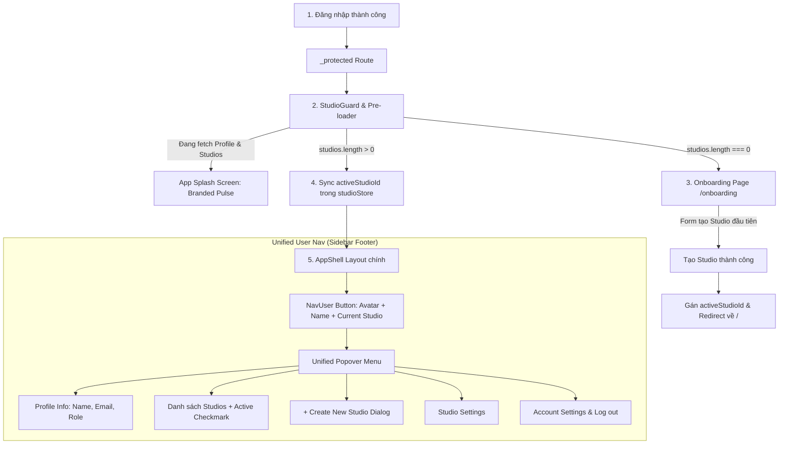

# Kế Hoạch Cải Tạo Giao Diện: Studio Root Tenant, Onboarding & Unified User Nav (Linear / Vercel Style)

> **Tài liệu Kế hoạch Triển khai Frontend (Frontend Implementation Plan)**  
> **Vị trí**: `plans/frontend/STUDIO_ROOT_TENANT_AND_REPOSITORY_UI_PLAN.md`  
> **Phiên bản**: v2 (2026-09-24)  
> **Mục tiêu**: Đồng bộ hóa Frontend với Trụ cột 1 & 2 của Backend; Thiết lập kiến trúc Root Pre-loader & Studio Guard, luồng Onboarding tạo Studio ban đầu, và tích hợp Studio Switcher trực tiếp vào User Nav chuẩn SaaS B2B hiện đại (Linear/Vercel/Raycast).

---

## 1. Bối Cảnh & Triết Lý Thiết Kế Mới

Hệ thống Backend đã hoàn tất tái cấu trúc:
- **Trụ cột 1**: `Studio` (Root Tenant cao nhất) và `StudioRunner` (Many-to-Many máy trạm với Studio).
- **Trụ cột 2**: Đổi tên `Workspace` → `Repository` (kho tài nguyên độc lập), loại bỏ hoàn toàn `WorkspacePlatform`, đổi `Agent` → `Runner`.

### 💡 Tư duy trải nghiệm người dùng (UX Paradigm):
1. **Triệt tiêu "Empty State / Broken Context" bằng Root Pre-loader & Studio Guard**:
   - Trước khi bất kỳ trang chính nào bắt đầu fetch dữ liệu (Projects, Repositories, Compute...), một Guard ở tầng Root sẽ nạp trước danh tính và danh sách Studio của user.
   - **Chưa có Studio**: Tự động chuyển hướng / chặn lại bằng **Onboarding Screen (`/onboarding`)** để tạo Studio đầu tiên. Không cho phép vào App Shell khi chưa có ngữ cảnh Studio.
   - **Đã có Studio**: Tự động xác thực & gán `activeStudioId`, sau đó mới mount App Shell và nạp các router con.
   - **Zero Layout Shift**: Hiển thị Splash Screen tối giản (Branded Logo + Micro-pulse) khi đang xác thực và nạp data ban đầu.
2. **Unified Account & Workspace Nav (Tích hợp Studio Switcher vào User Nav)**:
   - Thay vì chia nhỏ thành 2 popover riêng biệt (Studio Switcher ở header và User Profile ở footer), toàn bộ danh tính của người dùng được gom lại ở một nơi duy nhất: **"Tôi là ai"** và **"Tôi đang thao tác trong Studio nào"**.
   - Menu User Nav hỗ trợ chuyển nhanh giữa các Studio, tạo mới Studio, truy cập Studio Settings và Cài đặt tài khoản cá nhân.
3. **Chuyển đổi toàn diện `workspaces` → `repositories` & `agents` → `runners`**:
   - Đảm bảo 100% code sạch sẽ, không tàn dư concept cũ, tuân thủ nghiêm ngặt các Frontend Skills của dự án.

---

## 2. Luồng Hoạt Động Cốt Lõi (Architecture Flow)



---

## 3. Kiến Trúc Chi Tiết Từng Thành Phần

### 3.1. Tầng Root Pre-loader & Studio Guard (`src/routes/_protected.tsx`)
- **Nhiệm vụ**: Đảm bảo toàn bộ ứng dụng luôn có ngữ cảnh hợp lệ trước khi render router con.
- **Cơ chế**:
  - Gọi song song `useGetProfile()`, `useGetPermissions()` và `useStudios()`.
  - Nếu một trong các dữ liệu trên đang `isLoading`: Render component `<AppSplashScreen />` (màn hình đen/xám với logo ứng dụng chuyển động nhẹ nhàng, không gây giật màn hình).
  - Nếu `studios` rỗng (`studios.length === 0`):
    - Nếu đường dẫn hiện tại chưa phải `/onboarding`, chuyển hướng `navigate({ to: "/onboarding" })`.
  - Nếu `studios` đã có dữ liệu:
    - Kiểm tra `activeStudioId` trong `useStudioStore`. Nếu null hoặc ID không khớp với bất kỳ studio nào trong danh sách, tự động set `setActiveStudioId(studios[0].id)`.
    - Nếu đang ở `/onboarding`, tự động redirect về trang chủ `/`.
    - Render `<Outlet />` cho các route con.

### 3.2. Màn Hình Onboarding (`src/routes/_protected/onboarding.tsx`)
- **Giao diện**:
  - Giao diện độc lập (không chứa Sidebar của AppShell để tránh phân tâm), canh giữa màn hình (`max-w-md mx-auto`).
  - Tiêu đề: *"Welcome to Automation Studio"*
  - Phụ đề: *"Let's create your first studio workspace to get started."*
  - Form UI:
    - `Name`: Tên Studio (e.g. `Laura Production Studio`).
    - `Slug`: Mã định danh ngắn (e.g. `laura-studio`, tự động tạo gợi ý từ tên).
    - `Description`: Mô tả ngắn (tùy chọn).
  - Nút Submit: *"Create & Get Started"* với hiệu ứng loading.
  - Khi hoàn tất: Tự động lưu `activeStudioId` mới tạo vào Zustand Store và navigate thẳng vào Dashboard (`/`).

### 3.3. Tích Hợp Studio Switcher Vào `NavUser` (`src/components/layout/app/NavUser.tsx`)
- **Vị trí hiển thị ở Sidebar Footer**:
  - Nút bấm chính hiển thị: Avatar người dùng, Tên hiển thị, Tên Studio đang active bên dưới (kèm badge hoặc slug mờ).
- **Cấu trúc Dropdown Popover**:
  1. **Header Profile**: Avatar lớn hơn, Tên, Email.
  2. **Separator**
  3. **Group "Studios"**:
     - Label: `Studios (${studios.length})`
     - Danh sách studios người dùng có quyền truy cập:
       - Icon hoặc ký tự đầu của Studio trong ô vuông nhỏ.
       - Tên Studio + Slug.
       - Icon `Check` màu xanh hoặc primary ở Studio đang chọn.
       - Click để chuyển `activeStudioId` ngay lập tức.
     - Nút `Create New Studio` (icon `Plus` nét đứt) -> kích hoạt `useDialogStore.getState().openDialog("create-studio")`.
     - Nút `Studio Settings` (icon `Settings2`).
  4. **Separator**
  5. **Group "Account"**:
     - `Profile Settings` (icon `User`).
     - `System Settings` (icon `MonitorCog` - hiển thị nếu có quyền admin).
  6. **Separator**
  7. **Log out** (icon `LogOut`, màu đỏ nhẹ).

### 3.4. Quản Lý Trạng Thái `studioStore.ts`
- Quản lý `activeStudioId`:
  ```typescript
  interface StudioState {
    activeStudioId: string | null;
    setActiveStudioId: (id: string | null) => void;
  }
  ```
- Kết hợp `persist` middleware với khóa `automation_active_studio`.

---

## 4. Kế Hoạch Triển Khai Chi Tiết Từng Bước (Implementation Phases)

### Phase 1: Hoàn Thiện Tầng Store & Hook Cho `studios`
- [x] Tạo `src/stores/studioStore.ts`.
- [x] Tạo `src/features/studios/hooks/useStudios.ts` theo chuẩn `build_frontend_hook`.
- [x] Tạo `src/features/studios/components/StudioForm.tsx` & Dialogs (`CreateStudioDialog.tsx`).
- [x] Bổ sung helper / selector lấy `activeStudio` hiện tại từ store + query cache.

### Phase 2: Xây Dựng Root Pre-loader, Studio Guard & Onboarding Flow
- [x] Tạo component `<AppSplashScreen />` (Minimalist luxury loader với logo ứng dụng, tuân thủ `ui-ux-pro-max`).
- [x] Cập nhật `src/routes/_protected.tsx`:
  - Nạp song song profile, permissions và danh sách studios.
  - Xử lý điều kiện: đang loading -> render `<AppSplashScreen />`.
  - Chưa có studio -> chuyển hướng `/onboarding`.
  - Đã có studio -> đồng bộ `activeStudioId` vào `studioStore`.
- [x] Tạo route `src/routes/_protected/onboarding.tsx`:
  - Layout trung tâm sang trọng, tập trung.
  - Sử dụng chung schema và validation với `StudioForm`.
  - Sau khi tạo thành công: set active studio và navigate về `/`.

### Phase 3: Tái Cấu Trúc User Nav (`NavUser.tsx`) & Sidebar Header
- [x] Cập nhật `NavUser.tsx`:
  - Tích hợp danh sách Studios của user.
  - Hiển thị Studio đang hoạt động + checkmark.
  - Nút "+ Create Studio" kích hoạt `CreateStudioDialog`.
  - Nút "Studio Settings".
- [x] Đơn giản hóa `SidebarHeader` trong `GlobalSidebar.tsx`:
  - Hiển thị logo Automation Studio và phiên bản/môi trường gọn gàng, tinh tế.
- [x] Kiểm tra responsive trên cả Desktop và Mobile Sidebar drawer.

### Phase 4: Hoàn Thiện Chuyển Đổi `workspaces` → `repositories`
- [ ] Chuyển đổi toàn diện feature `repositories` (đã dọn dẹp các tàn dư cũ).
- [ ] Đảm bảo routes `projects/$projectId/repositories` hoạt động trơn tru.
- [ ] Đảm bảo bảng `RepositoriesTable` và `RepositoryForm` tuân thủ `build_frontend_table` và `build_frontend_form`.
- [ ] Cập nhật menu trong `ProjectSidebar.tsx` (icon `FolderGit2`, nhãn "Repositories").

### Phase 5: Hoàn Thiện Chuyển Đổi `agents` → `runners`
- [ ] Hoàn thiện `features/runners/` với `RunnersTable`, `RunnerStatusBadge`.
- [ ] Route `/runners` hiển thị danh sách máy trạm thuộc ngữ cảnh Studio hoặc hệ thống.
- [ ] Dialog liên kết máy trạm vào Studio (`AssociateRunnerDialog`).

### Phase 6: Typecheck, Visual Inspection & Nghiệm Thu
- [ ] Chạy `pnpm tsc -b` đảm bảo 0 lỗi TypeScript.
- [ ] Chạy `pnpm lint`.
- [ ] Kiểm tra thực tế:
  - Tài khoản mới (0 studios) -> Tự động vào `/onboarding`.
  - Tạo studio thành công -> Vào Dashboard.
  - Click User Nav chuyển studio -> Giao diện phản hồi mượt mà.
  - Tạo / quản lý Repositories & Runners hoạt động chuẩn chỉ.

---

## 5. Bảng Đối Chiếu Nguyên Tắc Kỹ Thuật (Checklist Tuân Thủ)

| Tiêu chuẩn / Kỹ năng | Yêu cầu bắt buộc | Giải pháp thiết kế |
| :--- | :--- | :--- |
| **`build_frontend_hook`** | Re-export DTO types, dùng `createMutationHook`, `keepPreviousData` | `useStudios.ts`, `useRepositories.ts`, `useRunners.ts` tuân thủ 100%. |
| **`build_frontend_table`** | Dumb component + Hook riêng biệt, cột dùng `DataTableRowActions` | Tách riêng `RepositoriesTable.tsx` và `useRepositoriesTable.tsx`. |
| **`build_frontend_form`** | Form UI có `formId`, tách biệt `<BaseFormDialog>` container | Sử dụng `<BaseFormDialog formId="...">` kết nối form độc lập. |
| **`ui-ux-pro-max`** | Theme Token, nhịp 4/8dp, 100% vector icons, micro-animations | Dùng Lucide icons, Dark mode slate, zero layout shift splash screen. |
| **`rules/frontend.md`** | Dùng `pnpm`, không sửa `src/gen`, filter/pagination qua URL | Không sửa generated code, kiểm tra tính đúng đắn với `pnpm tsc -b`. |
