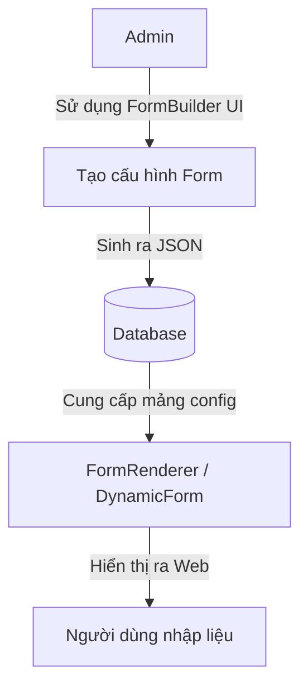

# Dynamic Form Architecture

Thư mục này chứa các thành phần cốt lõi của hệ thống Form động (Dynamic Form) được xây dựng dựa trên `react-hook-form` và `zod`.

## Naming Convention & Thuật Ngữ

Để tránh nhầm lẫn (đặc biệt khi dự án phát triển thêm tính năng "Form Builder kéo thả" dành cho Admin), chúng ta thống nhất thuật ngữ như sau:

### 1. FormRenderer (Render kết quả)
- **Tên File**: `FormRenderer.tsx` (trước đây là `FormBuilder.tsx`), `DynamicForm.tsx`, `DynamicField.tsx`.
- **Nhiệm vụ**: Đóng vai trò "đọc" một mảng cấu hình JSON (`FieldDefinition[]`) và render ra giao diện Form cuối cùng cho người dùng (End-User) nhập liệu.
- **Thành phần tham gia**: `FieldRegistry` (để biết render Component nào tương ứng với chuỗi `type`).

### 2. FormBuilder / FormDesigner (Cấu hình / Thiết kế)
- **Nhiệm vụ**: Đây là tương lai của dự án. Giao diện dành riêng cho Admin/Developer kéo thả, tinh chỉnh các thuộc tính (Meta-config) để sinh ra được cái cấu hình JSON bên trên. 
- **Cách thức hoạt động**: Lúc này, mỗi Form Component sẽ cần đăng ký thêm một `BuilderConfig` (hoặc Meta Schema) - là tập hợp các field quy định cách cấu hình nó (ví dụ FormSelect sẽ có thêm field `options` kiểu TagsInput để admin nhập mảng lựa chọn).

### Luồng dữ liệu (Data Flow)


## Cách tạo mới Form Control
Nhờ vào cơ chế auto-scan của `FieldRegistry`, để thêm một field mới (Ví dụ `UserSelect`), bạn chỉ cần tạo Component tại bất kỳ tính năng nào và đăng ký ở cuối file đó:

```tsx
declare module "@/lib/field-registry" {
    interface GlobalFieldRegistry {
        "user-select": ExtractConfig<UserSelectProps<any>>
    }
}
registerField({
    type: "user-select",
    component: UserSelect
});
```
